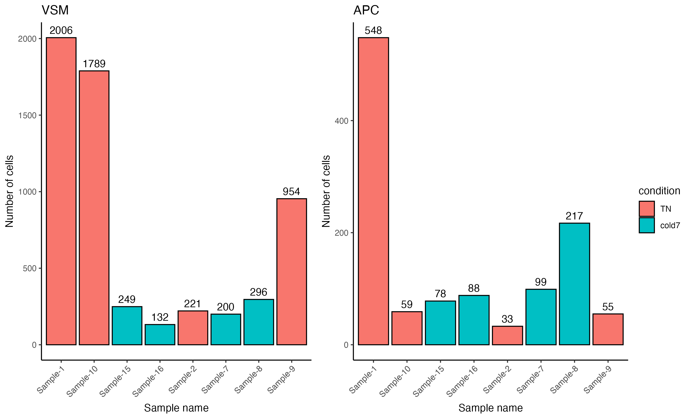
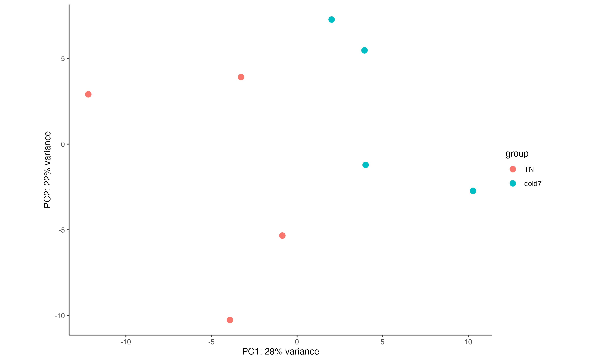
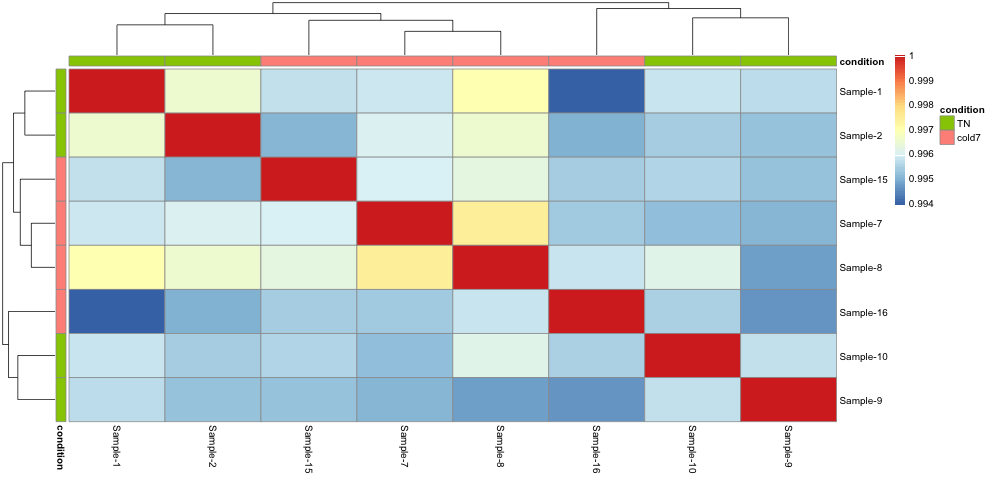
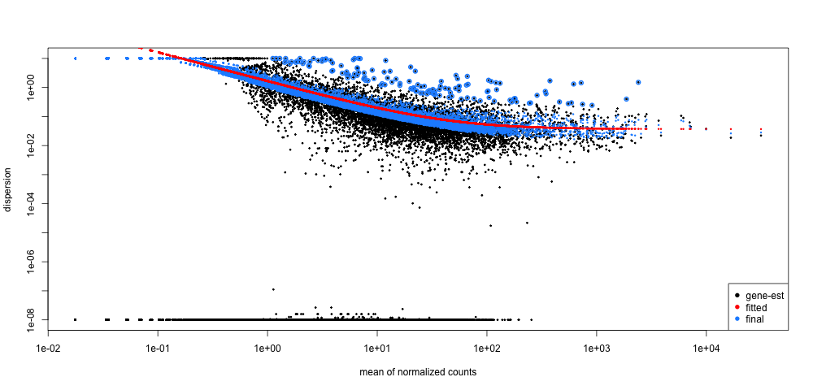

# Day 1 Answer key

## Aggregating counts by celltype using pseudobulk approach

**1. Another cell type in this dataset that was particularly interesting to the authors were the Pdgfr α+ adipose progentior cells (APCs).**
**Subset the bulk object to isolate only adipose progenitor cells for the TN and cold7 conditions. Assign it to variable called bulk_APC.** _Hint: You may need to review celltypes to determine what this cell type is called in our data._

```
celltypes
# Compare TN vs cold7 in APC cells
bulk_APC <- subset(bulk, subset = (celltype == "AP")  & (condition %in% c("TN", "cold7")))
```

**2. Plot the cell number distribution across samples. How do the numbers compare to VSM cells?**

```
# Visualize number of cells per condition
ggplot(bulk_APC@meta.data, aes(x = sample, y = n_cells, fill = condition)) +
  geom_bar(stat = "identity", color = "black") +
  theme_classic() +
  theme(axis.text.x = element_text(angle = 45, vjust = 1, hjust = 1)) +
  labs(x = "Sample name", y = "Number of cells") +
  geom_text(aes(label = n_cells), vjust = -0.5)
```

<p align="center">

</p>

> NOTE: The exercise only required you to plot one figure. Both VSM and APC Pdgfr α+ data areplotted here side-by-side for ease of comparison.

<details>
	<summary><b><i>Click here for code to plot the two barplots side-by-side</i></b></summary>
	<br>Note that this R code below uses the ggpubr library. In order to run this you will need to first install the package and then load the library.<br>
<pre>bash
# Plot VSM and APC side by side
plot_cell_number_vsm <- ggplot(bulk_vsm@meta.data, aes(x = sample, y = n_cells, fill = condition)) +
  geom_bar(stat = "identity", color = "black") +
  theme_classic() +
  theme(axis.text.x = element_text(angle = 45, vjust = 1, hjust = 1)) +
  labs(x = "Sample name", y = "Number of cells") +
  geom_text(aes(label = n_cells), vjust = -0.5) +
  ggtitle("VSM")
plot_cell_number_APC <- ggplot(bulk_APC@meta.data, aes(x = sample, y = n_cells, fill = condition)) +
  geom_bar(stat = "identity", color = "black") +
  theme_classic() +
  theme(axis.text.x = element_text(angle = 45, vjust = 1, hjust = 1)) +
  labs(x = "Sample name", y = "Number of cells") +
  geom_text(aes(label = n_cells), vjust = -0.5) +
  ggtitle("APC")
ggpubr::ggarrange(plot_cell_number_vsm, plot_cell_number_APC, nrow = 1,
                  common.legend = TRUE, legend = "right")
</pre>
 </details>

Overall we see far fewer cells, by an order of magnitude (scale goes to 2,000 for VSM but only 600 for APC).
There is also a different distribution: the counts for Sample-10 and Sample-9 go down relative to other samples, while Sample-8 goes up.

**3. Using the code below, create a DESeq2 object for the Pdgfr α+ APCs data.** There is nothing to submit for this exercise, but please run the code as you will need dds_APC for future exercises.

```
# Get count matrix
APC_counts <- FetchData(bulk_APC, layer = "counts", vars = rownames(bulk_APC))

# Create DESeq2 object
# transpose it to get genes as rows
dds_APC <- DESeqDataSetFromMatrix(t(APC_counts),
                                  colData = bulk_APC@meta.data,
                                  design = ~ condition)
dds
```

## DE analysis of pseudobulk data using DESeq2

**4. Use the dds_APC object to compute the rlog transformed counts for the Pdgfr α+ APCs.**

```
# Transform counts for data visualization
rld_APC <- rlog(dds_APC, blind = TRUE)
```

**5. Create a PCA plot for the Pdgfr α+ APCs, coloring points by condition. Do samples segregate by condition? Is there more or less variability within group than observed with the VSM cells?**

```
# Plot PCA
plotPCA(rld_APC, intgroup = c("condition")) + theme_classic()
```

<p align="center">

</p>

Samples still segregate by TN/cold7 but there is greater variability than in VSM cells.

**6. Evaluate the sample similarity using a correlation heatmap. How does this compare with the trends observed in the PCA plot?**

```
# Calculate sample correlation
rld_APC_mat <- assay(rld_APC)
rld_APC_cor <- cor(rld_APC_mat)
# Change sample names to original values
# For nicer plots
rename_samples <- bulk_APC$sample
colnames(rld_APC_cor) <- str_replace_all(colnames(rld_APC_cor), rename_samples)
rownames(rld_APC_cor) <- str_replace_all(rownames(rld_APC_cor), rename_samples)
# Plot heatmap
anno <- bulk_APC@meta.data %>%
  select(sample, condition) %>% 
  remove_rownames() %>% 
  column_to_rownames("sample")
pheatmap(rld_APC_cor, annotation_col = anno, annotation_row = anno)
```

<p align="center">

</p>

Unfortunately, the samples do not neatly separate by condition in this celltype. As shown in the PCA plot, three cold7 samples (7,8,15) are closely related on PC1, while the last cold7 sample (16) is more distant and groups with two TN samples (9,10) on PC2.

**7. Using the code below, run DESeq2 for the Pdgfr α+ APCs data. Following that draw the dispersion plot. Based on this plot do you think there is a reasonable fit to the model?**

```
# Run DESeq2 differential expression analysis
dds_APC <- DESeq(dds_APC)
# Plot gene-wise dispersion estimates to check model fit
plotDispEsts(dds_APC)
```

<p align="center">

</p>

We do see an inverse relationship between mean and dispersion (line slopes downward from left to right). This indicates that our data is a good fit for the model.

**8. Generate results for the Pdgfr α+ APCs and save it to a variable called res_APC.** There is nothing to submit for this exercise, but please run the code as you will need res_APC for future exercises.

```
# Results of Wald test
res_APC <- results(dds_APC, 
                   contrast = contrast,
                   alpha = 0.05)
# Shrink the log2 fold changes to be more appropriate using the apeglm method
res_APC <- lfcShrink(dds_APC,
                     coef = "condition_cold7_vs_TN",
                     res  = res_APC,
                     type = "apeglm")
```
