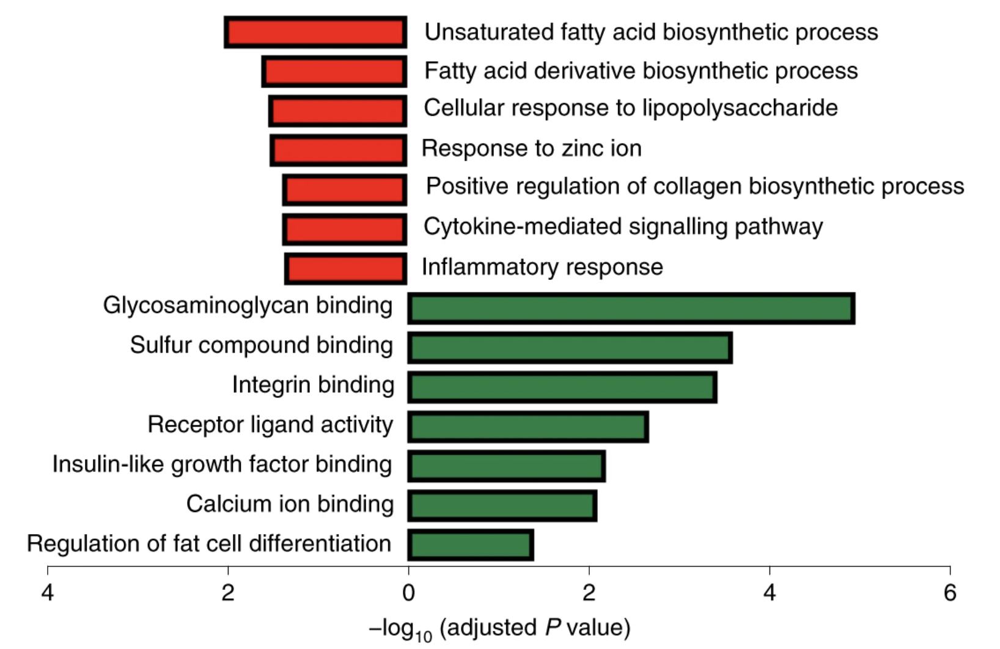
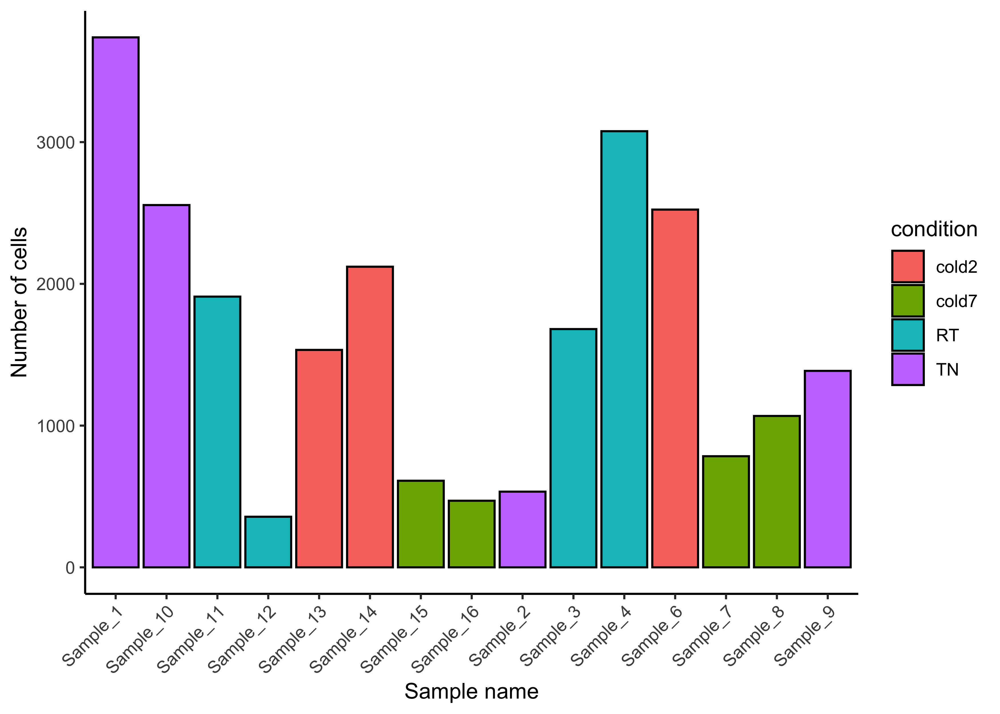
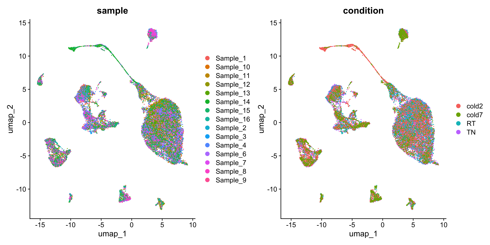
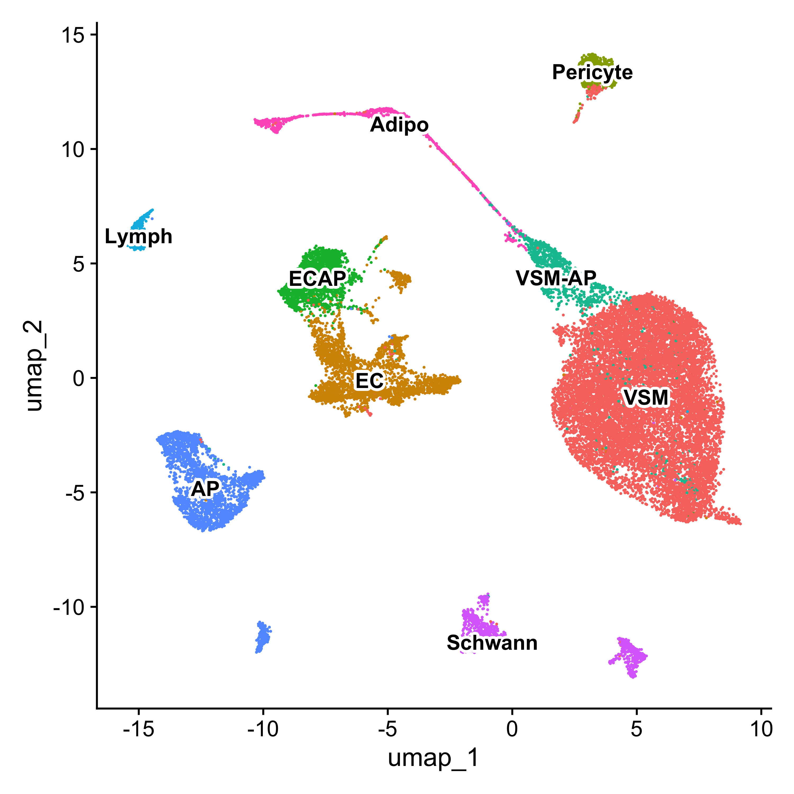
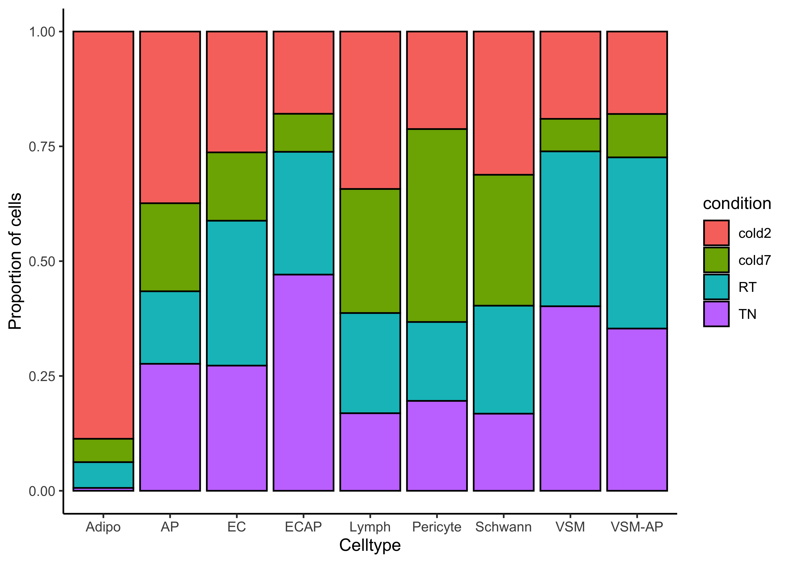

# Single-cell RNA-seq data - counts to annotated clusters

## Learning Objectives

* Introduce the dataset and begin setup by loading data 

## Set up

For this workshop, we will be working within an RStudio project. In order to follow along you should have **downloaded the R project**.

> If you haven't done this already, the project can be accessed using [this link](TODO).

Once downloaded, you should see a file called `TODO` on your computer (likely, in your `Downloads` folder). 

1. Unzip this file. It will result in a folder of the same name. 
2. **Move the folder to the location on your computer where you would like to perform the analysis.**
3. Open up the folder. The contents will look like the screenshot below. 
4. **Locate the `.Rproj file` and double-click on it.** This will open up RStudio with the "DGE_scRNA" project loaded. 

TODO: image of file explorer

## Project organization

One of the most important parts of research that involves large amounts of data, is how best to manage it. We tend to prioritize the analysis, but there are many other important aspects of **data management that are often overlooked** in the excitement to get a first look at new data. The [HMS Data Management Working Group](https://datamanagement.hms.harvard.edu/), discusses in-depth some things to consider beyond the data creation and analysis.

One important aspect of data management is organization. For each experiment you work on and analyze data for, it is considered best practice to get organized by creating **a planned storage space (directory structure)**. We will do that for our single-cell analysis. 

Look inside your project space and you will find that a directory structure has been setup for you:

```
DGE_scRNA/
├── data
├── results
└── figures
```

> **NOTE FOR WINDOWS OS users** - When you open the project folder after unzipping, please check if you have a `data` folder with a sub folder also called `data`. If this is the case, please move all the files from the subfolder into the parent `data` folder.


## Exploring the example dataset

To interpret the results generated from running a differential gene expression (DGE) analysis, we first need to understand our dataset. We will be using the single-cell RNA-seq dataset from [Shamsi et al (2021)](https://www.nature.com/articles/s42255-021-00373-z).

The primary focus of this project was to evaluate the changes in brown adipose tissue (BAT) at different temperatures. Prolonged exposure to the cold results in increased populations of brown adipocytes.

<p align="center" style="display:flex">
    
    
</p>

For this workshop, we will be using the output of DGE using a variety of tools to identify differentially expressed genes between conditions by celltype.

### Relevant metadata

In addition to the counts matrix, we also need to collect information about the data; this is known as metadata. There is often a temptation to just start exploring the data, but it is not very meaningful if we know nothing about the samples that this data originated from.

Some relevant metadata for our dataset is provided below:

**scRNA protocol used:**

- Data generated with the 10x chromium Single Cell 3′ version 3 reagent kit
- Sequenced on the NovaSeq S2 flow cell (Illumina, 100 cycles)
- Processed with Cell Ranger 3.0.1

**Sample processing:**

- Cells isolated from stromal vascular fraction of brown adipose tissue
- Mice were housed in 4 different temperature conditions:
    - TN: 30 °C for 1 week
    - RT: 22 °C
    - cold2: 5 °C for 2 days
    - cold7: 5 °C for 7 days
- 4 replicates per condition, except cold2 which has 3 replicates

**Final annotation:**

- After removing hematopoietic cells, ~24,000 cells remained
- 8 major non-immune cell types
    1. Pdgfra+ adipose preogenitors
    2. Vasculat endothelial
    3. Lymphatic endothelial
    4. Vascular smooth muscle cells
    5. Pericytes
    6. Adipocytes
    7. Myelinating Schwann cells
    8. Non-myelinating Schwann cells

## Loading single-cell RNA-seq count data 

### New script

Next, open a new Rscript file, and start with some comments to indicate what this file is going to contain:

```r
# September 2024
# HBC single-cell RNA-seq DGE workshop

# Single-cell RNA-seq analysis - metadata
```

Save the Rscript as `metadata.R`. Your working directory should look something like this:

TODO: image of file explorer

### Loading libraries 

Next, we can load the necessary libraries:

```r
# Load libraries
library(Seurat)
library(tidyverse)
library(ggalluvial)
```

### Load seurat object

We generated this seurat object using the using the files that were deposited to GEO. More details on how this seurat object is detailed in another [lesson](00_gen_seurat_object.md) for more clarity on what parameters were used for normalization, integration, and clustering. 

Here we can begin looking at what metadata is stored in the seurat object, paying close attention to sample identities and celltype annotations.

```r
seurat <- readRDS("data/BAT_GSE160585.rds")
colnames(seurat@meta.data)
```

```
 [1] "orig.ident"             "nCount_RNA"             "nFeature_RNA"          
 [4] "sample"                 "log10GenesPerUMI"       "mitoRatio"             
 [7] "condition"              "S.Score"                "G2M.Score"             
[10] "Phase"                  "CC.Difference"          "nCount_SCT"            
[13] "nFeature_SCT"           "integrated_snn_res.1.2" "celltype"              
[16] "seurat_clusters"   
```

Before diving into a DGE analysis, let's visualize what is going on with the data.

### Sample distribution

Barplot showing the number of cells for each replicate, coloring each sample by the temperature condition the mice were subjected to.

```r
ggplot(seurat@meta.data) +
    geom_bar(aes(x=sample, fill=condition),
             stat="count", color="black") +
    theme_classic() +
    theme(axis.text.x = element_text(angle=45, vjust=1, hjust=1)) +
    labs(x="Sample name", y="Number of cells")
```

<p align="center">
    
</p>

We can also see the distribution of cells across the UMAP for each replicate and sample.

```r
DimPlot(seurat, group.by=c("sample", "condition"))
```

<p align="center">
    
</p>


### Celltype annotation

A resolution of 1.2 was used to cluster cells together. Celltypes were then assigned based upon these grouping after using a variety of marker genes. The mapping of cluster to celltype annotation is being represented here as an alluvial plot.

```r
ggplot(seurat@meta.data,
        aes(axis1 = seurat_clusters,
            axis2 = celltype,
            fill = celltype)) +
    geom_alluvium() +
    geom_stratum() +
    geom_text(stat = "stratum",
        aes(label=after_stat(stratum))) +
    theme_void() +
    NoLegend() +
    coord_flip()
```

<p align="center">
    
</p>

With celltype labels, we can also see how they distribute on the UMAP. We can also identify celltypes that could be interesting based upon the proportion of conditions found in each celltype.

```r
# UMAP celltype
Idents(seurat) <- "celltype"
p <- DimPlot(seurat) + NoLegend()
LabelClusters(p, id = "ident",  fontface = "bold", size = 4,
              bg.colour = "white", bg.r = .2, force = 0)


# Barplot sample proportion by celltype 
ggplot(seurat@meta.data) +
    geom_bar(aes(x=celltype, fill=condition), 
                 position=position_fill(), color="black") +
    theme_classic() +
    labs(x="Cluster", y="Proportion of cells")
```

<p align="center" style="display:flex">
    
    
</p>


***

*This lesson has been developed by members of the teaching team at the [Harvard Chan Bioinformatics Core (HBC)](http://bioinformatics.sph.harvard.edu/). These are open access materials distributed under the terms of the [Creative Commons Attribution license](https://creativecommons.org/licenses/by/4.0/) (CC BY 4.0), which permits unrestricted use, distribution, and reproduction in any medium, provided the original author and source are credited.*

