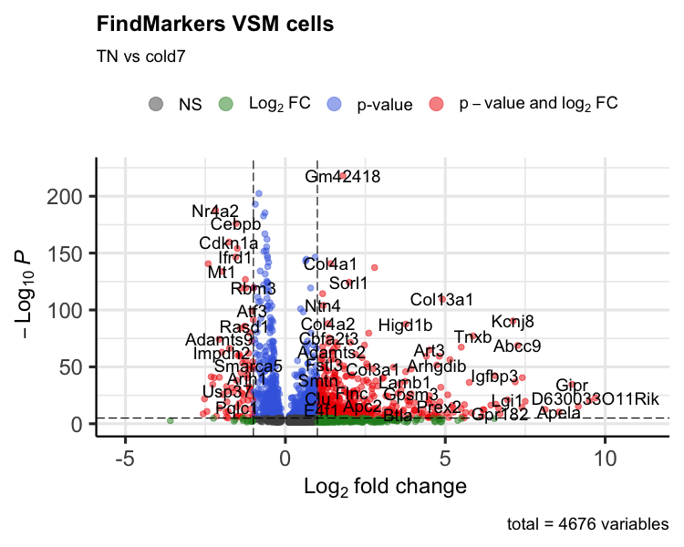
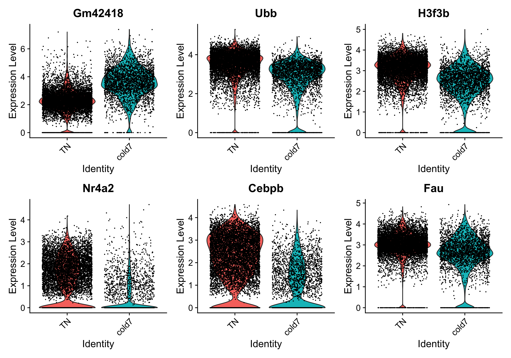
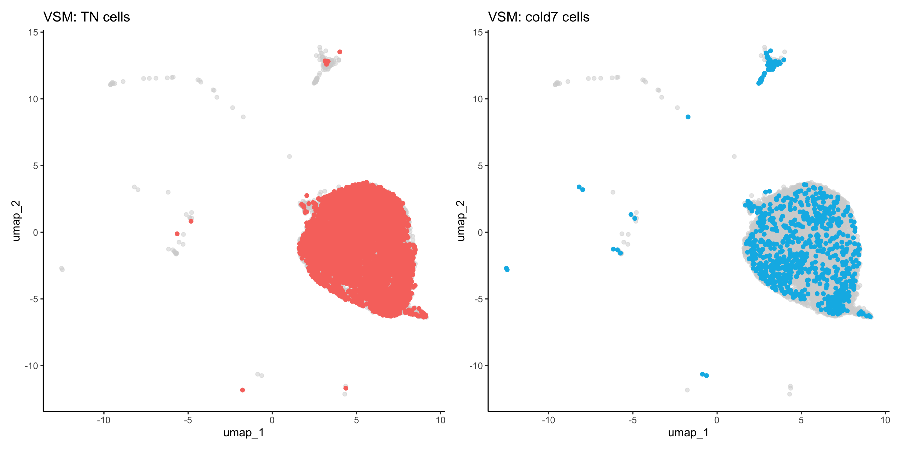
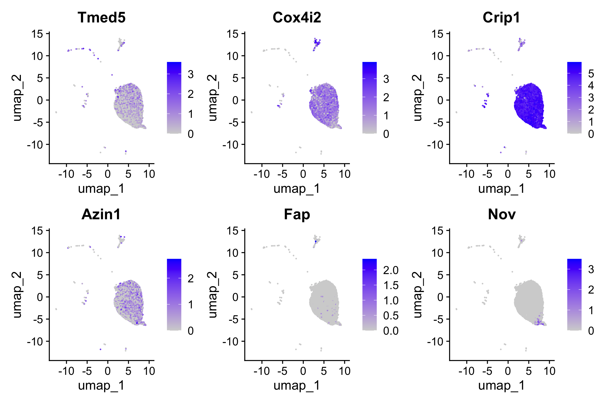

Approximate time: 75 minutes

## Learning Objectives:

* Evaluate differential gene expression between conditions using a Wilcoxon rank sum test
* Create visualizations for differentially expressed genes
* Discuss other statistical tests for differential expression analysis


## Differential expression between conditions using FindMarkers()

In our current UMAP, we have merged samples across the different conditions and used integration to align cells of the same celltype across samples. Now, what of we were interested in a particular celltype and **understanding how gene expression changes across the different conditions?**

The `FindMarkers()` function in the Seurat package is used to perform differential expression analysis between groups of cells. We provide arguments to specify `ident.1` and `ident.2` the two groups of cells we are interested in comparing. Typically, this function is used to compare two different clusters of cells and resulting gene lists are used to help determine the celltype annotation. 

<p align="center">
    
</p>


We can use this same function to compare two groups of cells which represent differnt conditions by modifying the `ident` values provided. The `FindMarkers()` function has **several important arguments** we can modify when running it. To view what these parameters are, we can access the help page on this function:

```r
?FindMarkers
```

Below we have described in more detail what each of these arguments mean :

- `logfc.threshold`: minimum log2 fold change for average expression of gene in group relative to the average expression in all other groups combined. Default is 0.25.
- `min.diff.pct`: minimum percent difference between the percent of cells expressing the gene in the group and the percent of cells expressing gene in all other groups combined.
- `min.pct`: only test genes that are detected in a minimum fraction of cells in either of the two populations. Meant to speed up the function by not testing genes that are very infrequently expressed. Default is 0.1.
- `ident.1`: this function only evaluates one group at a time; here you would specify the group of interest. These values must be set in the `Idents()`.
- `ident.2`: here you would specify the group you want to compare `ident.1` against.


## Setting up 
Open up a new Rscript file, and start with some comments to indicate what this file is going to contain:

```
# Single-cell RNA-seq DE analysis - FindMarkers
```
Save the Rscript as findMarkers.R. 

### Load libraries
Now let's load the required libraries for this analysis:

```r
# Load libraries
library(Seurat)
library(tidyverse)
library(EnhancedVolcano)
```

## FindMarkers()

To use the function to look for a DE genes betwenn conditions, there are two things we need to do:

1. Subset the Seurat object to our celltype of interest
2. Set our active Idents to be the metadata column which specifies what condition each cell is
   
In our example we are focusing on vascular smooth muscle (`VSM`) cells. The comparison we will be making is `TN` vs. `cold7`.

```r
# Subset the object
seurat_vsm <- subset(seurat, subset = (celltype == "VSM"))

# Set the idents
Idents(seurat_vsm) <- "condition"
```

Before we make our comparisons we will explicitly set our default assay, we want to use the **normalized data, not the integrated data**.

```r
# Set default assay
DefaultAssay(seurat_vsm) <- "RNA"
```

The default assay should have already been `RNA`, but we encourage you to run this line of code above to be absolutely sure in case the active slot was changed somewhere upstream in your analysis. 

> #### Why don't we use SCT normalized data?
> Note that the raw and normalized counts are stored in the `counts` and `data` slots of `RNA` assay, respectively. By default, the functions for finding markers will use normalized data if RNA is the DefaultAssay. The number of features in the `RNA` assay corresponds to all genes in our dataset.
>
> Now if we consider the `SCT` assay, functions for finding markers would use the `scale.data` slot which is the pearson residuals that come out of regularized NB regression. Differential expression on these values can be difficult interpret. Additionally, only the variable features are represented in this assay and so we may not have data for some of our marker genes.

Now we can run `FindMarkers()`:

```r
# Determine differentiating markers for TN and cold7
dge_vsm <- FindMarkers(seurat_vsm,
                       ident.1="cold7",
                       ident.2="TN"
                       )

```

Now let's take a quick look at the results:

```r
# View results 
dge_vsm %>% head()
```

```r
                p_val avg_log2FC pct.1 pct.2     p_val_adj
Gm42418 4.492261e-223  1.8013603 0.999 0.986 8.881650e-219
Ubb     1.801612e-207 -0.8274973 0.982 0.999 3.561968e-203
H3f3b   6.044423e-198 -0.9395566 0.975 0.998 1.195043e-193
Nr4a2   9.607598e-193 -2.1841673 0.503 0.855 1.899518e-188
Rpl21   2.319987e-190 -0.6377144 0.967 0.998 4.586847e-186
Rpl9    1.249444e-187 -0.6824496 0.954 0.999 2.470276e-183
```

**The output from the `FindMarkers()` function** is a matrix containing a ranked list of differentialy expressed genes listed by gene ID and associated statistics. We describe some of these columns below:

- **gene:** gene symbol
- **p_val:** p-value not adjusted for multiple test correction for condition
- **avg_logFC:** average log fold change for condition. Positive values indicate that the gene is more highly expressed in the group.	
- **pct.1:** percentage of cells where the gene is detected in the group for condition		
- **pct.2:** percentage of cells where the gene is detected on average in the other groups for condition
- **p_val_adj:** adjusted p-value for condition, based on bonferroni correction using all genes in the dataset, used to determine significance

>**NOTE:** These tests treat each cell as an independent replicate and ignore inherent correlations between cells originating from the same sample. This results in highly **inflated p-values** for each gene. Studies have been shown to find a large number of false positive associations with these results.

When looking at the output, **we suggest looking for markers with large differences in expression between `pct.1` and `pct.2` and larger fold changes**. For instance if `pct.1` = 0.90 and `pct.2` = 0.80, it may not be as exciting of a marker. However, if `pct.2` = 0.1 instead, the bigger difference would be more convincing. Also of interest is whether the majority of cells expressing the marker are in your group of interest. If `pct.1` is low, such as 0.3, it may not be as interesting. Both of these are also possible parameters to include when running the function, as described above.

This is a great spot to pause and save your results!

```r
write.csv(dge_vsm, "results/findmarkers_vsm_cold7_vs_TN.csv")
```


## Significant genes

We want to subset our results to show just our significant genes so we can begin visualizaing and analysing the results. To do this, we filter out rows based upon the `p_val_adj` column and subsetting any genes that do not meet our multiple testing-corrected significance threshold of 0.05.

```r
# Subset significant genes
dge_vsm_sig <- dge_vsm %>% subset(p_val_adj < 0.05)
dge_vsm_sig %>% head()
```

```
                p_val avg_log2FC pct.1 pct.2     p_val_adj
Gm42418 4.492261e-223  1.8013603 0.999 0.986 8.881650e-219
Ubb     1.801612e-207 -0.8274973 0.982 0.999 3.561968e-203
H3f3b   6.044423e-198 -0.9395566 0.975 0.998 1.195043e-193
Nr4a2   9.607598e-193 -2.1841673 0.503 0.855 1.899518e-188
Rpl21   2.319987e-190 -0.6377144 0.967 0.998 4.586847e-186
Rpl9    1.249444e-187 -0.6824496 0.954 0.999 2.470276e-183
```

### Volcano plot

To get a first look at the genes that are retained, we can generated a volcano plot using the `EnhancedVolcano()` function. This is a visualization that allows us to quickly see trends in the significant genes. The x-axis here represents the average log2 fold change value, showing the degree of difference between the two conditions. On the y-axis, we see our `p_val_adj` column represented after a negative log10 transformation is applied to better see the spread of our p-values.  

Volcano plots show us a great **overview of which genes are up-regulated (positive on the x-axis) or down-regulated (negative on the x-axis)**.

```r
# Volcano plot
p_fm <- EnhancedVolcano(dge_vsm_sig,
        row.names(dge_vsm_sig),
        x="avg_log2FC",
        y="p_val_adj",
       title="FindMarkers VSM cells",
       subtitle="TN vs cold7")

print(p_fm)
```

<p align="center">
    
</p>

### Violin plots

While looking at the overall trends in the data is a great starting point, we can also start looking at genes that have large differences between `TN` and `cold7`. To do this, we can take a look at the top 6 genes with the smallest p-values. We additionally disregard the ribsomal genes in this visualization step.

```r
# Get the gene names and get the first 6 values
# Ignore ribosomal genes
genes <- dge_vsm_sig %>%
  rownames_to_column(var="gene") %>%
  filter(!str_detect(gene, "Rpl|Rps")) %>% 
  head(6)
genes <- genes$gene
genes
```

```
[1] "Gm42418" "Ubb"     "H3f3b"   "Nr4a2"   "Cebpb"   "Fau"    
```

With these genes selected, we can now being to visualize the distribution of expression across our two conditions using the `VlnPlot()` function.

```r
# Set Idents and draw Violin plots for top 6 genes
Idents(seurat_vsm) <- "condition"
VlnPlot(seurat_vsm, genes, ncol=3, idents=c("TN", "cold7"))
```

<p align="center">
    
</p>

### UMAP plots

When comparing two different conditions, we recommend creating a UMAP that clearly shows where the cells exist for each condition. To do so, we first need to get the UMAP coordinates for every cell of interest. When creating the scatterplot, the first thing we do is put a layer of light gray points that show the entire dataset to understand where all the cells fall. Then, we take the UMAP coordinates of the condition (`TN` or `cold7` in our example) and plot those on top with a color to clearly indicate where those cells are located. 

> NOTE: This sometime works better on the non-integrated data, so you observe a true separation of cells by condition.

```r
# Grab the umap coordinates and condition information for each cell
df <- FetchData(seurat_vsm, c("umap_1", "umap_2", "condition"))
df_tn <- df %>% subset(condition == "TN")
df_cold7 <- df %>% subset(condition == "cold7")

# Scatterplot of TN cells
p_tn <- ggplot() +
  geom_point(data=df, aes(x=umap_1, y=umap_2), color="lightgray", alpha=0.5) +
  geom_point(data=df_tn, aes(x=umap_1, y=umap_2), color="#F8766D") +
  theme_classic() +
  ggtitle("VSM: TN cells")

# Scatterplot of cold7 cells
p_cold7 <- ggplot() +
  geom_point(data=df, aes(x=umap_1, y=umap_2), color="lightgray", alpha=0.5) +
  geom_point(data=df_cold7, aes(x=umap_1, y=umap_2), color="#00B8E7") +
  theme_classic() +
  ggtitle("VSM: cold7 cells")

# TN and cold7 UMAPs side by side
p_tn + p_cold7
```

<p align="center">
    
</p>

This allows us to better understand our results when we look at any follow-up information on our UMAP. For example, we can begin to look at distribution of gene expression for each of the top 6 genes with a better understanding of where the cells for each condition lie:

```r
FeaturePlot(seurat_vsm, genes, ncol=3)
```

<p align="center">
    
</p>


## Other statistical tests

When we looked at the extra explanations for the `FindMarkers()` function, there was a parameter called `test.use`. By default, the method for calculating differentially expressed genes will be a Wilcoxon Rank sum test. This is a fairly simple statistical approach, and there a multitude of different algorithms that can be specified. These other options are documented on the `FindMarkers()` [documentation page](https://www.rdocumentation.org/packages/Seurat/versions/5.0.3/topics/FindMarkers). For this workshop we want to highlight a few of these methods:


### Wilcoxon Rank Sum test

* Often described as the non-parametric version of the two-sample t-test. 
* Beneficial because it can reduce the impact of outliers, which can skew the results of parametric testing.
* It ranks the data and compares the sum of ranks within each group, to identify significant differences.
 

### DESeq2

* Identifies differentially expressed genes between two groups of cells based on a model using DESeq2 which uses a negative binomial distribution (Love et al, Genome Biology, 2014). More information on DESeq2 will be provided in an upcoming lesson in this workshop.
* This test option does not support pre-filtering of genes based on average difference (or percent detection rate) between cell groups. However, genes may be pre-filtered based on their minimum detection rate (min.pct) across both cell groups.

> **NOTE:** The creators of the Seurat package [no longer recommend](https://github.com/satijalab/seurat/issues/2938) using the `FindMarkers()` implementation of DESeq2.
 
 
 ### MAST

* Implements an approach that accounts for the stochastic dropout and characteristic bimodal expression distributions in which expression is either strongly non-zero or non-detectable.
    *  A two-part, generalized linear model for such bimodal data that parameterizes both of these features    
* Also allows for estimation and control of the “cellular detection rate” (CDR) while simultaneously estimating treatment effects. This addresses the fact that cells scale transcript copy number with cell volume. 
* Permits the analysis of complex experiments, such as repeated single-cell measurements under various treatments or longitudinal sampling of single cells from multiple subjects with a variety of background characteristics (e.g., sex, age), because it can easily be extended to accommodate random effects.


> **NOTE:** Instead of using the `FindMarkers()` implementation, we recommend directly using the [MAST](https://genomebiology.biomedcentral.com/articles/10.1186/s13059-015-0844-5) algorithm from the package itself for the best results.
>
> If you are interested in exploring code to run MAST on this dataset directly using the package, please see the script at the link below. We recommend including the sample in the model to improve results by taking into account biological variability. Please note that this is a **computationally intensive** calculation and may take **a long time to run**.
> <details>
>	<summary><b><i>Click here for code to run MAST on this dataset side-by-side</i></b></summary>
>	<br>Note that this R code below uses the <b>MAST library</b>. In order to run this you will need to first install the required packagea and then > load the libraries.
> <pre>
> library(Seurat)
> library(dplyr)
> library(SingleCellExperiment)
> library(MAST)
>
> &#35; Seurat to SingleCellExperiment
> DefaultAssay(seurat_vsm) &lt;- "RNA"
> sce <- as.SingleCellExperiment(seurat_vsm)
> &#35; Apply log transformation
> assay(sce, "logcounts") &lt;- log2(counts(sce) + 1)
>
> &#35; Create new sce object (with only 'logcounts' matrix)
> sce_1 &lt;- SingleCellExperiment(assays = list(logcounts = assay(sce, "logcounts")))
> colData(sce_1) &lt;- colData(sce)
> 
> &#35; Change to SingleCellAssay
> sca <- SceToSingleCellAssay(sce_1)
> 
> &#35; Calculate number of genes expressed per cell and scale the value
> cdr2 &lt;- colSums(SummarizedExperiment::assay(sca) &gt; 0)
> colData(sca)$cngeneson &lt;- scale(cdr2)
> 
> &#35; Takes a long time to calculate!
> &#35; Here our model includes:
> &#9;&#35; The number of genes expressed (ngeneson)
> &#9;&#35; Experimental condition (condition)
> &#9;&#35; Sample as a random variable ((1 | sample))
>
> zlmCond <- zlm(~condition + cngeneson + (1 | sample), 
>                sca, method="glmer", ebayes=FALSE)
> 
> &#35; Only test the condition coefficient.
> summaryCond &lt;- summary(zlmCond, doLRT='conditionTN') 
> 
> &#35; Some data wranging of the results
> summaryDt &lt;- summaryCond$datatable
> fcHurdle &lt;- merge(summaryDt[contrast=='conditionTN' & component=='H',.(primerid, `Pr(>Chisq)`)], #hurdle P values
>                  summaryDt[contrast=='conditionTN' & component=='logFC', 
>                            .(primerid, coef, ci.hi, ci.lo)], by='primerid') #logFC coefficients
>
> fcHurdle[,fdr:=p.adjust(`Pr(>Chisq)`, 'fdr')]
> </pre>
> </details>


***


*This lesson has been developed by members of the teaching team at the [Harvard Chan Bioinformatics Core (HBC)](http://bioinformatics.sph.harvard.edu/). These are open access materials distributed under the terms of the [Creative Commons Attribution license](https://creativecommons.org/licenses/by/4.0/) (CC BY 4.0), which permits unrestricted use, distribution, and reproduction in any medium, provided the original author and source are credited.*
