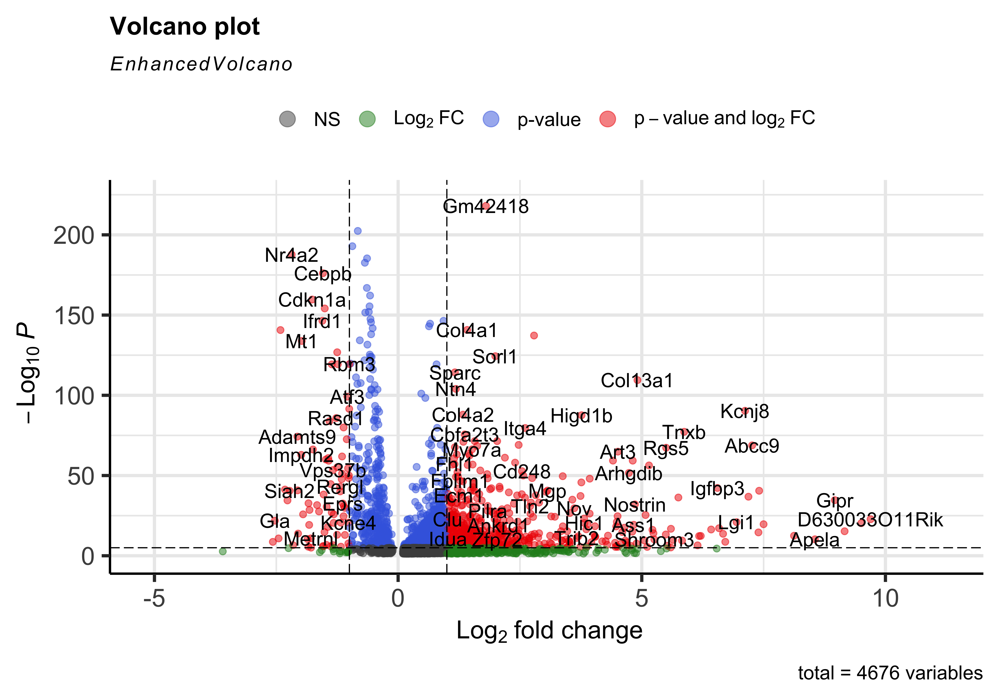

Approximate time: 75 minutes

## Learning Objectives:

* Evaluate differential gene expression using a wilcox test

_**Challenges:**_
 
 - _Over-interpretation of the results_

_**Recommendations:**_
 
 - _Think of the results as hypotheses that need verification. Inflated p-values can lead to over-interpretation of results (essentially each cell is used as a replicate). Top markers are most trustworthy._

## Load libraries

```r
library(Seurat)
library(tidyverse)
library(EnhancedVolcano)
```

## FindMarkers()

One option to identify biologically meaningful differences would be to use the **`FindMarkers()` function to determine the genes that are differentially expressed between two specific groups**. 

> **NOTE:** The default is a Wilcoxon Rank Sum test, but there are other options available that we will discuess later in this lesson. 

<p align="center">
    
</p>

The `FindMarkers()` function has **several important arguments** which provide thresholds for determining whether a gene is a marker and identify which cells to compare. To view what these parameters are, we can access the help page on this function:

```r
?FindMarkers
```

We have described in more detail what each of these arguments mean as well as some notes on what to consider when running the function:

- `logfc.threshold`: minimum log2 fold change for average expression of gene in group relative to the average expression in all other groups combined. Default is 0.25.
	- **Cons:** 
		- could miss those cell markers that are expressed in a small fraction of cells within the group of interest, but not in the other groups, if the average logfc doesn't meet the threshold
		- could return a lot of metabolic/ribosomal genes due to slight differences in metabolic output by different cell types, which are not as useful to distinguish cell type identities
- `min.diff.pct`: minimum percent difference between the percent of cells expressing the gene in the group and the percent of cells expressing gene in all other groups combined.
	- **Cons:** could miss those cell markers that are expressed in all cells, but are highly up-regulated in this specific cell type
- `min.pct`: only test genes that are detected in a minimum fraction of cells in either of the two populations. Meant to speed up the function by not testing genes that are very infrequently expressed. Default is 0.1.
	- **Cons:** if set to a very high value could incur many false negatives due to the fact that not all genes are detected in all cells (even if it is expressed) 
- `ident.1`: this function only evaluates one group at a time; here you would specify the group of interest. These values must be set in the `Idents()`.
- `ident.2`: here you would specify the group you want to compare `ident.1` against.

You could use any combination of these arguments depending on how stringent/lenient you want to be. 

Before we start our comparisons we will explicitly set our default assay, we want to use the **normalized data, not the integrated data**.

```r
DefaultAssay(seurat) <- "RNA"
```

The default assay should have already been `RNA`, but we encourage you to run this line of code above to be absolutely sure in case the active slot was changed somewhere upstream in your analysis. 

> #### Why don't we use SCT normalized data?
> Note that the raw and normalized counts are stored in the `counts` and `data` slots of `RNA` assay, respectively. By default, the functions for finding markers will use normalized data if RNA is the DefaultAssay. The number of features in the `RNA` assay corresponds to all genes in our dataset.
>
> Now if we consider the `SCT` assay, functions for finding markers would use the `scale.data` slot which is the pearson residuals that come out of regularized NB regression. Differential expression on these values can be difficult interpret. Additionally, only the variable features are represented in this assay and so we may not have data for some of our marker genes.

For this lesson, we are focusing on `VSM` cells. So step one would be subsetting our cells to our celltype of interest. Then we can actually run the `FindMarkers()` function on the subsetted seurat object.

The comparison we will be running is `TN` vs. `cold7`.

```r
seurat_vsm <- subset(seurat, subset = (celltype == "VSM"))

Idents(seurat_vsm) <- "condition"
# Determine differentiating markers for TN and cold7
dge_vsm <- FindMarkers(seurat_vsm,
                       ident.1="cold7",
                       ident.2="TN"
                       )

dge_vsm %>% head()
```

```r
                p_val avg_log2FC pct.1 pct.2     p_val_adj
Gm42418 4.492261e-223  1.8013603 0.999 0.986 8.881650e-219
Ubb     1.801612e-207 -0.8274973 0.982 0.999 3.561968e-203
H3f3b   6.044423e-198 -0.9395566 0.975 0.998 1.195043e-193
Nr4a2   9.607598e-193 -2.1841673 0.503 0.855 1.899518e-188
Rpl21   2.319987e-190 -0.6377144 0.967 0.998 4.586847e-186
Rpl9    1.249444e-187 -0.6824496 0.954 0.999 2.470276e-183
```

**The output from the `FindMarkers()` function** is a matrix containing a ranked list of putative markers listed by gene ID for the group we specified, and associated statistics. Note that the same set of statistics are computed for each group (in our case, `cold7` and `TN`). We describe some of these columns below:

- **gene:** gene symbol
- **p_val:** p-value not adjusted for multiple test correction for condition
- **avg_logFC:** average log fold change for condition. Positive values indicate that the gene is more highly expressed in the group.	
- **pct.1:** percentage of cells where the gene is detected in the group for condition		
- **pct.2:** percentage of cells where the gene is detected on average in the other groups for condition
- **p_val_adj:** adjusted p-value for condition, based on bonferroni correction using all genes in the dataset, used to determine significance

>**NOTE:** Since each cell is being treated as a replicate, this will result in inflated p-values within each group! A gene may have an incredibly low p-value < 1e-50, but that doesn't translate as a highly reliable marker gene. 

When looking at the output, **we suggest looking for markers with large differences in expression between `pct.1` and `pct.2` and larger fold changes**. For instance if `pct.1` = 0.90 and `pct.2` = 0.80, it may not be as exciting of a marker. However, if `pct.2` = 0.1 instead, the bigger difference would be more convincing. Also of interest is whether the majority of cells expressing the marker are in your group of interest. If `pct.1` is low, such as 0.3, it may not be as interesting. Both of these are also possible parameters to include when running the function, as described above.

This is a great spot to pause and save your results!

```r
write.csv(dge_vsm, "results/findmarkers_vsm.csv")
```

### Significant genes

We want to subset our results to show just our significant genes so we can begin visualizating and analysing the results. To do this, we filter out rows based upon the `p_val_adj` column and subsetting any genes that do not meet our multiple testing-corrected significance threshold of 0.05.

```r
dge_vsm_sig <- dge_vsm %>% subset(p_val_adj < 0.05)
dge_vsm_sig %>% head()
```

```
                p_val avg_log2FC pct.1 pct.2     p_val_adj
Gm42418 4.492261e-223  1.8013603 0.999 0.986 8.881650e-219
Ubb     1.801612e-207 -0.8274973 0.982 0.999 3.561968e-203
H3f3b   6.044423e-198 -0.9395566 0.975 0.998 1.195043e-193
Nr4a2   9.607598e-193 -2.1841673 0.503 0.855 1.899518e-188
Rpl21   2.319987e-190 -0.6377144 0.967 0.998 4.586847e-186
Rpl9    1.249444e-187 -0.6824496 0.954 0.999 2.470276e-183
```

#### Volcano plot

To get a first look at the genes that are retained, we can generated a volcano plot using the `EnhancedVolcano()` function. This is a visualization that allows us to quickly see trends in the significant genes. The x-axis here represents the average log2 fold change value, showing the degree of difference between the two conditions. On the y-axis, we see our `p_val_adj` column represented after a negative log10 transformation is applied to better see the spread of our p-values.  

Volcano plots show us a great overview of which genes are up-regulated (positive on the x-axis) or down-regulated (negative on the x-axis).

```r
EnhancedVolcano(dge_vsm_sig,
        row.names(dge_vsm_sig),
        x="avg_log2FC",
        y="p_val_adj"
)
```

<p align="center">
    
</p>

#### Violin plots

While looking at the overall trends in the data is a great starting point, we can also start looking at genes that have large differences between `TN` and `cold7`. To do this, we can take a look at the top 6 genes with the smallest p-values. We additionally disregard the ribsomal genes in this visualization step.

```r
# Get the gene names and get the first 6 values
# Ignore ribosomal genes
genes <- dge_vsm_sig %>%
  rownames_to_column(var="gene") %>%
  filter(!str_detect(gene, "Rpl|Rps")) %>% 
  head(6)
genes <- genes$gene
genes
```

```
[1] "Gm42418" "Ubb"     "H3f3b"   "Nr4a2"   "Cebpb"   "Fau"    
```

With these genes selected, we can now being to visualize the distribution of expression across our two conditions using the `VlnPlot()` function.

```r
Idents(seurat_vsm) <- "condition"
VlnPlot(seurat_vsm, genes, ncol=3, idents=c("TN", "cold7"))
```

<p align="center">
    
</p>

#### UMAP plots

When comparing two different conditions, we recommend creating a UMAP that clearly shows where the cells fall for each condition. To do so, we first need to get the UMAP coordinates for every cell of interest. When creating the scatterplot, the first thing we do is put a layer of light gray points that show the entire dataset to understand where all the cells fall. Then, we take the UMAP coordinates of the condition (`TN` or `cold7` in our example) and plot those on top with a color to clearly indicate where those cells are located. 

```r
# Grab the umap coordinates and condition information for each cell
df <- FetchData(seurat_vsm, c("umap_1", "umap_2", "condition"))
df_tn <- df %>% subset(condition == "TN")
df_cold7 <- df %>% subset(condition == "cold7")

# Scatterplot of TN cells
p_tn <- ggplot() +
  geom_point(data=df, aes(x=umap_1, y=umap_2), color="lightgray", alpha=0.5) +
  geom_point(data=df_tn, aes(x=umap_1, y=umap_2), color="#F8766D") +
  theme_classic() +
  ggtitle("VSM: TN cells")

# Scatterplot of cold7 cells
p_cold7 <- ggplot() +
  geom_point(data=df, aes(x=umap_1, y=umap_2), color="lightgray", alpha=0.5) +
  geom_point(data=df_cold7, aes(x=umap_1, y=umap_2), color="#00B8E7") +
  theme_classic() +
  ggtitle("VSM: cold7 cells")

# TN and cold7 UMAPs side by side
p_tn + p_cold7
```

<p align="center">
    
</p>

This allows us to better understand our results when we look at any follow-up information on our UMAP. For example, we can begin to look at distribution of gene expression for each of the top 6 genes with a better understanding of where the cells for each condition lie:

```r
FeaturePlot(seurat_vsm, genes, ncol=3)
```

<p align="center">
    
</p>


### FindMarkers methods

You'll recall that when we looked at the extra explanations for the `FindMarkers()` function, there was a parameter called `test.use`. By default, the method for calculating DGEs will be a wilcox test, which is what we ran above. There a multitude of different algorithms that can be used to call DGEs, which are documented on the FindMarkers [documentation page](https://www.rdocumentation.org/packages/Seurat/versions/5.0.3/topics/FindMarkers). For this workshop we want to highlight a few of these methods:

* `wilcox` : Identifies differentially expressed genes between two groups of cells using a Wilcoxon Rank Sum test (default)
* `MAST` : Identifies differentially expressed genes between two groups of cells using a hurdle model tailored to scRNA-seq data. Utilizes the MAST package to run the DE testing.

> **NOTE:** Instead of using the FindMarkers implementation, we recommend directly using the [MAST](https://genomebiology.biomedcentral.com/articles/10.1186/s13059-015-0844-5) algorithm from the package itself for the best results.

Here we show an example script of how to run MAST directly using the package. We recommend including the sample in the model to improve results by taking into account biological variability. Please note that this is a computationally intensive calculation and may take a long time to run.

```r
library(Seurat)
library(dplyr)
library(SingleCellExperiment)
library(MAST)


# Seurat to SingleCellExperiment
DefaultAssay(seurat_vsm) <- "RNA"
sce <- as.SingleCellExperiment(seurat_vsm)

# Apply log transformation
assay(sce, "logcounts") <- log2(counts(sce) + 1)

# Create new sce object (with only 'logcounts' matrix)
sce_1 <- SingleCellExperiment(assays = list(logcounts = assay(sce, "logcounts")))
colData(sce_1) <- colData(sce)

# Change to SingleCellAssay
sca <- SceToSingleCellAssay(sce_1)

# Calculate number of genes expressed per cell and scale the value
cdr2 <- colSums(SummarizedExperiment::assay(sca) > 0)
colData(sca)$cngeneson <- scale(cdr2)

# Takes a long time to calculate!
# Here our model includes:
	# the number of genes epxressed (ngeneson)
	# experimental condition (condition) 
	# sample as a random variable ((1 | sample))
zlmCond <- zlm(~condition + cngeneson + (1 | sample), 
               sca, method="glmer", ebayes=FALSE)

# Only test the condition coefficient.
summaryCond <- summary(zlmCond, doLRT='conditionTN') 

# Some data wranging of the results
summaryDt <- summaryCond$datatable
fcHurdle <- merge(summaryDt[contrast=='conditionTN' & component=='H',.(primerid, `Pr(>Chisq)`)], #hurdle P values
                  summaryDt[contrast=='conditionTN' & component=='logFC', 
                            .(primerid, coef, ci.hi, ci.lo)], by='primerid') #logFC coefficients

fcHurdle[,fdr:=p.adjust(`Pr(>Chisq)`, 'fdr')]
```

* `DESeq2` : Identifies differentially expressed genes between two groups of cells based on a model using DESeq2 which uses a negative binomial distribution (Love et al, Genome Biology, 2014). This test does not support pre-filtering of genes based on average difference (or percent detection rate) between cell groups. However, genes may be pre-filtered based on their minimum detection rate (min.pct) across both cell groups.

> **NOTE:** The creators of the Seurat package [no longer recommend](https://github.com/satijalab/seurat/issues/2938) using the FindMarkers() implementation of DESeq2.

***


*This lesson has been developed by members of the teaching team at the [Harvard Chan Bioinformatics Core (HBC)](http://bioinformatics.sph.harvard.edu/). These are open access materials distributed under the terms of the [Creative Commons Attribution license](https://creativecommons.org/licenses/by/4.0/) (CC BY 4.0), which permits unrestricted use, distribution, and reproduction in any medium, provided the original author and source are credited.*
