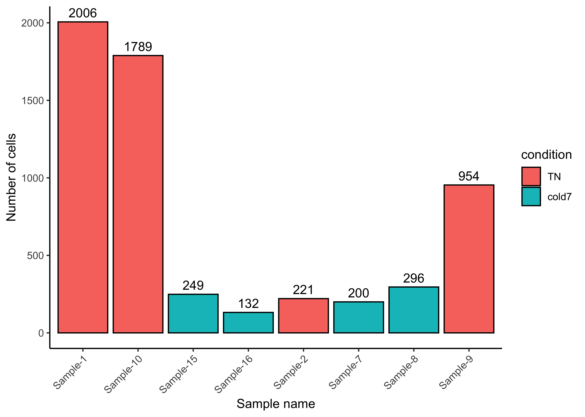

Approximate time: 40 minutes

## Learning Objectives:

* Understand how to prepare single-cell RNA-seq raw count data for pseudobulk differential expression analysis
* Create a DESeq2 object for differential expression analysis on a specific cell type cluster

## Pseudobulk differential expression analysis

In the previous lesson we demonstrated how to perform a differential expression analysis using the `FindMarkers()` function in Seurat. The major limitation of this approach is that it treats each individual cell as a replicate, which inflates the p-value, resulting in many false positives. In this lesson we introduce you to the pseudobulk approach, in which cells belonging to a cluster are aggregated within each sample to create a gene by sample count matrix. This count matrix resembles the input we use for bulk RNA-seq, and we use a similar workflow to idenitfy differentially expressed genes.

**CREATE A FIGURE TO DEMONSTRATE THE AGGREGATION**

Forming pseudobulk samples is important to perform accurate differential expression analysis. Cells from the same sample/individual are more similar to each other than to cells from another individual. This means treating each cell as an independent sample leads to underestimation of the variance and misleadingly small p-values. Working on the level of pseudobulk ensures reliable statistical tests because the samples correspond to the units of replication.

Using a pseudobulk approach involves the following steps:

1. Subsetting to the cells for the cell type(s) of interest to perform the DE analysis;
2. Extracting the raw counts after QC filtering of cells to be used for the DE analysis;
3. Aggregating the counts and metadata to the sample level; 
4. Performing the DE analysis (you need at least two biological replicates per condition to perform the analysis, but more replicates are recommended).

## Setting up

Let's begin by opening a new Rscript file, and include a commentheader line:

```r
# Single-cell RNA-seq analysis - Pseudobulk DE analysis with DESeq2
```

Save the Rscript as `DE_analysis_scrnaseq.R`.


### Load libraries

Next, let's load the libraries that we will be using for the analysis:

```r
# Load libraries
library(Seurat)
library(tidyverse)
library(DESeq2)
library(pheatmap)
library(EnhancedVolcano)
library(RColorBrewer)
library(cowplot)
library(dplyr)
```

### Create metadata

We will want to create a dataframe with all of the sample-level metadata, this will be used during the aggregation step but also later with differential expression analysis.

> _**NOTE:** Other relevant metadata for a pseudobulk differential expression analysis include information about the individuals that will be contrasted (age, sex, clinical presentation, etc.). The more information you can collect about your study samples, the better!_


```r
meta_columns <- c("sample", "condition")
meta <- seurat@meta.data %>%
            select(meta_columns) %>%
            unique() %>%
            remove_rownames()

meta
```

```
      sample condition
1   Sample_1        TN
2   Sample_2        TN
3   Sample_9        TN
4  Sample_10        TN
5   Sample_3        RT
6   Sample_4        RT
7  Sample_11        RT
8  Sample_12        RT
9   Sample_6     cold2
10 Sample_13     cold2
11 Sample_14     cold2
12  Sample_7     cold7
13  Sample_8     cold7
14 Sample_15     cold7
15 Sample_16     cold7
```

## Aggregate counts for pseudobulk analysis
Now, before we transform our single-cell level dataset into one sample-level dataset per cell type (cluster), there are a few data wrangling steps involved. We know that we want to aggregate cells of a particular celltype and that we want to collapse them down by sample.

To aggregate the counts, we will **use the `AggregateExpression()` function from Seurat**. It will take as input a Seurat object, and return summed counts ("pseudobulk") for each identity class. The default is to return a matrix with genes as rows, and identity classes as columns. We have set `return.seurat` to  `TRUE`, which means rather than a matrix we will get an object of class Seurat. We have also specified which factors to aggregate on, using the `group.by` argument.

```r
bulk <- AggregateExpression(
            seurat,
            return.seurat = T,
            assays = "RNA",
            group.by = c("celltype", "sample", "condition")
)
```

Now our Seurat object has 'cells' that correspond to aggregated counts. We will see that the samples have the name "{celltype}\_{sample}\_{condition}" to show that we are grouping together counts based on sample, celltype, and condition. The metadata columns that were used as input are included in this new Seurat object as well.

```r
# each 'cell' is a sample-condition-celltype pseudobulk profile
tail(Cells(bulk))
```

Now would be the time to add to your metadata any other information you have on the samples. For example, adding the number of cells we aggregated on is useful information to include.

```r
# Number of cells by sample and celltype
n_cells <- seurat@meta.data %>% 
              dplyr::count(sample, celltype) %>% 
              rename("n"="n_cells")
n_cells$sample <- str_replace(n_cells$sample, "_", "-")

meta_bulk <- left_join(bulk@meta.data, n_cells)
rownames(meta_bulk) <- meta_bulk$orig.ident
bulk@meta.data <- meta_bulk

# Turn condition into a factor
bulk$condition <- factor(bulk$condition, levels=c("TN", "RT", "cold2", "cold7"))

bulk@meta.data %>% head()
```

```
                                 orig.ident celltype    sample condition  n_cells
Adipo_Sample-1_TN         Adipo_Sample-1_TN    Adipo  Sample-1        TN       5
Adipo_Sample-11_RT       Adipo_Sample-11_RT    Adipo Sample-11        RT       7
Adipo_Sample-12_RT       Adipo_Sample-12_RT    Adipo Sample-12        RT      43
Adipo_Sample-13_cold2 Adipo_Sample-13_cold2    Adipo Sample-13     cold2      28
Adipo_Sample-14_cold2 Adipo_Sample-14_cold2    Adipo Sample-14     cold2     491
Adipo_Sample-15_cold7 Adipo_Sample-15_cold7    Adipo Sample-15     cold7      15
```

The output of this aggregation is a sparse matrix and, when we take a quick look, we can see that it is a gene by celltype-sample matrix.

```r
bulk[["RNA"]]$counts[1:5, 1:5]
```

```
5 x 5 sparse Matrix of class "dgCMatrix"
       Adipo_Sample-1_TN Adipo_Sample-11_RT Adipo_Sample-12_RT
Xkr4                   1                  .                  .
Gm1992                 .                  .                  .
Rp1                    .                  .                  .
Sox17                  .                  .                  .
Mrpl15                 5                 23                106
       Adipo_Sample-13_cold2 Adipo_Sample-14_cold2
Xkr4                       .                     .
Gm1992                     .                     .
Rp1                        .                     .
Sox17                      .                     .
Mrpl15                   135                  2037
```

### Aggregating counts for multiple celltypes

One of the many advantages of using R is the ability to automate processes that we want to repeat multiple times. For example, if we wanted to pseudobulk on each celltype in the dataset, we can utilize a for loop to run the aggregation step on each group. 

First, we create a vector of unique celltypes in our data so that we can iterate over each one of them.

```r
celltype <- sort(unique(seurat@meta.data[["celltype"]]))
celltypes
```

```
[1] "Adipo"    "AP"       "EC"       "ECAP"     "Lymph"    "Pericyte" "Schwann" 
[8] "VSM"      "VSM-AP"  
```

Next, we want to store the aggregated, pseudobulked expression for each celltype as a list of Seurat objects. Therefore we are going to use the same steps we ran above with the `AggregateExpression()` function and adding the number of cells in each group as a metadata column. 

```r
pb_list <- list()
for (ct in celltypes) {
  
  # Subset cells to one celltype
  seurat_ct <- subset(seurat, subset=(celltype == ct))
  
  # Aggregate to get pseudobulk
  bulk_ct <- AggregateExpression(
              seurat_ct,
              return.seurat = T,
              assays = "RNA",
              group.by = c("celltype", "sample", "condition")
            )
  
  # Add number of cells per sample
  n_cells <- seurat_ct@meta.data %>% 
                dplyr::count(sample, celltype) %>% 
                rename("n"="n_cells")
  n_cells$sample <- str_replace(n_cells$sample, "_", "-")
  meta_bulk_ct <- left_join(bulk_ct@meta.data, n_cells)
  rownames(meta_bulk_ct) <- meta_bulk_ct$orig.ident
  bulk_ct@meta.data <- meta_bulk_ct
  
  pb_list[[ct]] <- bulk_ct
  
}
```

With this list of pseudobulked Seurat objects, we are able to run the following DESeq2 differential expression steps easily on every celltype as we have the aggregated counts handy.

## Differential gene expression with DESeq2

**We will be using [DESeq2](https://genomebiology.biomedcentral.com/articles/10.1186/s13059-014-0550-8) for the pseudobulk DE analysis, and the analysis steps with DESeq2 are shown in the flowchart below in green and blue**. DESeq2 first normalizes the count data to account for differences in library sizes and RNA composition between samples. Then, we will use the normalized counts to make some plots for QC at the gene and sample level. The final step is to use the appropriate functions from the DESeq2 package to perform the differential expression analysis. We will go into each of these steps briefly, but additional details and helpful suggestions regarding DESeq2 can be found in [our materials](https://hbctraining.github.io/DGE_workshop_salmon_online/schedule/links-to-lessons.html) detailing the workflow for bulk RNA-seq analysis, as well as in the [DESeq2 vignette](http://bioconductor.org/packages/devel/bioc/vignettes/DESeq2/inst/doc/DESeq2.html).

<p align="center">
  
</p>

## Creating a DESeq2 object

From the pseudobulk Seurat object, we can easily extract the information required for input to DESeq2. First, we need to do is decide which cell type we wish to focus on, and then retrieve the corresponding data from the object. We are going to look for differntially expressed genes between the `TN` and `cold7` condition for the **`VSM` cells**. 

We use the `subset()` function to get the data we need:

```r
bulk_vsm <- subset(bulk, subset= (celltype == "VSM") & (condition %in% c("TN", "cold7")))
```

### Number of cells

Before moving on to a pseudobulk DGE analysis, it is important to identify **how many cells we aggregated for each sample**. We need to make sure that we have enough cells per sample after subsetting to one celltype. We can see that with the exception of one sample, the TN group has many cells and the cold7 samples have much fewer cells.

```r
ggplot(bulk_vsm@meta.data) +
    geom_bar(aes(x=sample, y=n_cells, fill=condition), stat="identity", color="black") +
    theme_classic() +
    theme(axis.text.x = element_text(angle = 45, vjust = 1, hjust = 1)) +
    labs(x="Sample name", y="Number of cells") +
    geom_text(aes(label=n_cells), vjust=-0.5)
```

<p align="center">
  
</p>

Now we can create our DESeq2 object to prepare to run the DE analysis. We need to **include the counts, metadata, and design formula for our comparison of interest**. In the design formula we should also include any other columns in the metadata for which we want to regress out the variation (batch, sex, age, etc.). For this dataset, we only have our comparison of interest, which is stored as the `condition` in our metadata data frame.

More information about the DESeq2 workflow and design formulas can be found in our [DESeq2 materials](https://hbctraining.github.io/DGE_workshop_salmon_online/lessons/04a_design_formulas.html).

```r
# Get count matrix
cluster_counts <- FetchData(bulk_vsm, layer="counts", vars=rownames(bulk_vsm))

# Create DESeq2 object
# transpose it to get genes as rows
dds <- DESeqDataSetFromMatrix(t(cluster_counts),
                                colData = bulk_vsm@meta.data,
                                design = ~ condition)

dds
```

```
class: DESeqDataSet 
dim: 19771 8 
metadata(1): version
assays(1): counts
rownames(19771): Xkr4 Gm1992 ... CAAA01118383.1 CAAA01147332.1
rowData names(0):
colnames(8): VSM_Sample-1_TN VSM_Sample-10_TN ... VSM_Sample-8_cold7
  VSM_Sample-9_TN
colData names(5): orig.ident celltype sample condition n_cells
```

Now that the DESeq2 object is created, we are ready to continue with our analysis!

***

*This lesson has been developed by members of the teaching team at the [Harvard Chan Bioinformatics Core (HBC)](http://bioinformatics.sph.harvard.edu/). These are open access materials distributed under the terms of the [Creative Commons Attribution license](https://creativecommons.org/licenses/by/4.0/) (CC BY 4.0), which permits unrestricted use, distribution, and reproduction in any medium, provided the original author and source are credited.*

