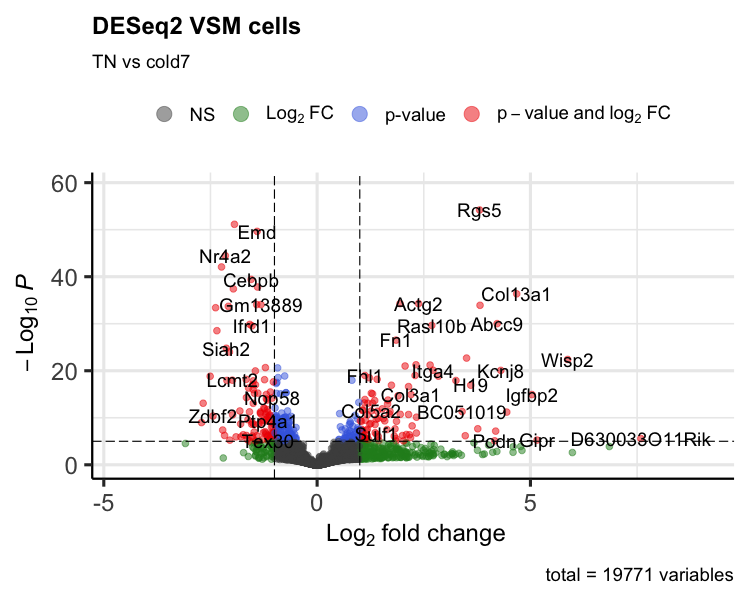

Approximate time: 40 minutes

## Learning Objectives:

* Explore visualization methods for interrogating significant genes from DESeq2
* Evaluate top genes to better understand the changes between conditions


## Visualization of differentially expressed genes

Visualization is a key step for understanding the results of our analysis. In particular, we want to focus on the significant genes that are differentially expressed between the two conditions of interest. In doing so, we can better understand patterns in gene expression and identify any outlier genes that may bring up further questions in a downstream analysis. Additionally, these visualizations are a great way to glocally evaluate the changes brought about due to an experimental condition.

### Identify significant genes

Now that we have a table of genes with their associated adjusted p-values and log-fold change scores, we need to **filter the results**. We are only interested in significantly differentially expressed genes that pass an **adjusted p-value threshold of 0.05**.

```r
# Set thresholds
padj.cutoff <- 0.05

# Turn the results object into a tibble for use with tidyverse functions
res_tbl <- res %>%
            data.frame() %>%
            rownames_to_column(var="gene") %>% 
            as_tibble()

# Subset the significant results
sig_res <- dplyr::filter(res_tbl, 
        padj < padj.cutoff)

# Look at top sig genes
sig_res %>% head()
```

```
  gene   baseMean log2FoldChange lfcSE        pvalue        padj
  <chr>     <dbl>          <dbl> <dbl>         <dbl>       <dbl>
1 Lypla1   152.            0.448 0.160 0.00121       0.0133     
2 Rrs1      68.3          -0.479 0.221 0.00560       0.0442     
3 Prex2      9.82          2.24  0.578 0.00000500    0.000131   
4 Sulf1     90.8           1.39  0.259 0.00000000531 0.000000295
5 Rpl7    3814.           -0.430 0.115 0.0000468     0.000906   
6 Mcm3      19.9           1.20  0.494 0.000682      0.00835    
```

We will take these results and use them as input to a few different visualization techniques to explore the changes in gene expression. 

### Volcano plot 

To get a first look at the significant genes compared to all genes tested, we can generated a volcano plot using the `EnhancedVolcano()` function. This is a visualization that allows us to quickly see trends in the significant genes. The x-axis here represents the average log2-fold change value, showing the degree of difference between the two conditions. On the y-axis, we see our adjusted p-value to which a negative log10 transformation is applied to better see the spread of our p-values.

Volcano plots show us a great overview of which genes are up-regulated (positive on the x-axis) or down-regulated (negative on the x-axis).

```r
p_deseq2 <- EnhancedVolcano(sig_res,
        sig_res$gene,
        x="log2FoldChange",
        y="padj",
        title="DESeq2 VSM cells",
                subtitle="TN vs cold7")
print(p_deseq2)
```

<p align="center">

</p>


### Heatmap of differntialy expressed genes

Another way to look at global patterns of gene expression is to take our normalized expression matrix for our significant genes and generate a heatmap. The rows correspond to significant genes, columns are samples, and each value is the normalized expression from the pseudobulk aggregation. 

Using the `pheatmap()` function, we can also cluster samples and genes together based upon their similarity. From the heatmap below we can clearly see that samples are clustering together based upon which experimental condition they belong to (`TN` and `cold7`). Similarly, the genes are being grouped together based upon their expression values, where we can see which genes are up- and down-regulated in each condition.

```r
# Extract normalized expression for significant genes from the samples
normalized_counts <- counts(dds, normalized=TRUE) %>% as.data.frame()
norm_sig <- normalized_counts %>% 
              dplyr::filter(row.names(normalized_counts) %in% sig_res$gene)

# Set a color palette
heat_colors <- brewer.pal(6, "YlOrRd")

# Run pheatmap using the metadata data frame for the annotation
anno <- colData(dds) %>% 
            as.data.frame() %>% 
            select(condition, celltype)
pheatmap(norm_sig,
    color = heat_colors,
    cluster_rows = TRUE,
    show_rownames = FALSE,
    annotation = anno,
    border_color = NA,
    fontsize = 10,
    scale = "row", 
    fontsize_row = 10, 
    height = 20)
```

<p align="center">

</p>


### Top 6 genes

It is important to take a look at some of the top genes that show up. Alternatively, you could choose to use this plot to explore some of your candidate genes where you anticipated changes in gene expression between groups. This is a great way to evaluate why these genes showed up in the results.

Rather than just taking the top genes based on adjusted p-value, we can apply a fold change threshold. In our example below, we are using `abs(log2FoldChange) > 0.6` which translates to a ~50% increase or decrease in gene expression as additional criteria for subsetting.


```r
genes <- sig_res %>% 
            arrange(padj) %>% 
            subset(abs(log2FoldChange) > 0.6) %>% 
            head(6)
genes <- genes$gene
genes
```

```
[1] "Rgs5"  "Mt1"   "Emd"   "Nr4a2" "Cwc25" "Cebpb"
```


Now that we have identified the significant genes that we will look at, we can use a scatterplot to look at the expression values for each sample in both groups. This plot is also a good sanity check to make sure that we are interpreting our fold change values correctly, as well.

Each point represents a sample with the y-axis representing the  normalized expression. Ideally we should see a clear shift in expression between our two conditions. As this is a helpful metric for assessing the pseudobulk results, we will create a function to make repeated use of this type of visualization.

```r
# pseudobulk scatterpot of normalized expression
plot_pb_count <- function(dds, gene) {
  
  # returnData to get normalized counts for each sample for a gene
  d <- plotCounts(dds, gene=gene, intgroup="condition", returnData=TRUE)
  # Keep the order TN then cold7
  d$condition <- factor(d$condition, levels = c("TN", "cold7"))
  
  # Plot the normalized counts for each sample
  p <- ggplot(d, aes(x = condition, 
                     y = count, 
                     color = condition)) + 
    geom_point(position=position_jitter(w = 0.1, h = 0)) +
    theme_bw() + NoLegend() +
    ggtitle(gene)
  
  return(p)
}
```

```r
plot_list <- list()
for (gene in genes) {
  plot_list[[gene]] <- plot_pb_count(dds, gene)
}

plot_grid(plotlist=plot_list)
```

<p align="center">

</p>


Finally, it is also a good exercise to evaluate the gene expression at a single-cell level. The results we have been visualizing so far represent the sample averages of gene expression across all VSM cells in each sample. Therefore it is prudent to go back to the cellular level to see what these same results look like for each individual cell. To do so, we will make use of our original seurat object `seurat_vsm`.

**We see that generally the trends are consistent with pseudobulk expression scatterplots, but in some cases the change is not as proncounced.**

```r
DefaultAssay(seurat_vsm) <- "RNA"
Idents(seurat_vsm) <- "condition"
VlnPlot(seurat_vsm, genes, idents=c("cold7", "TN"))
```

<p align="center">

</p>

In the next lesson, we will continue with additional visualizations for the DESeq2 results while comparing and contrasting with results from the `FindMarkers()` analysis.


***

*This lesson has been developed by members of the teaching team at the [Harvard Chan Bioinformatics Core (HBC)](http://bioinformatics.sph.harvard.edu/). These are open access materials distributed under the terms of the [Creative Commons Attribution license](https://creativecommons.org/licenses/by/4.0/) (CC BY 4.0), which permits unrestricted use, distribution, and reproduction in any medium, provided the original author and source are credited.*
