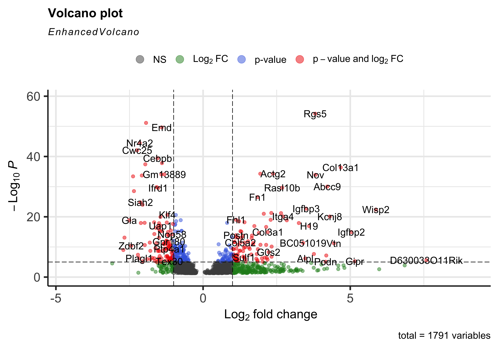
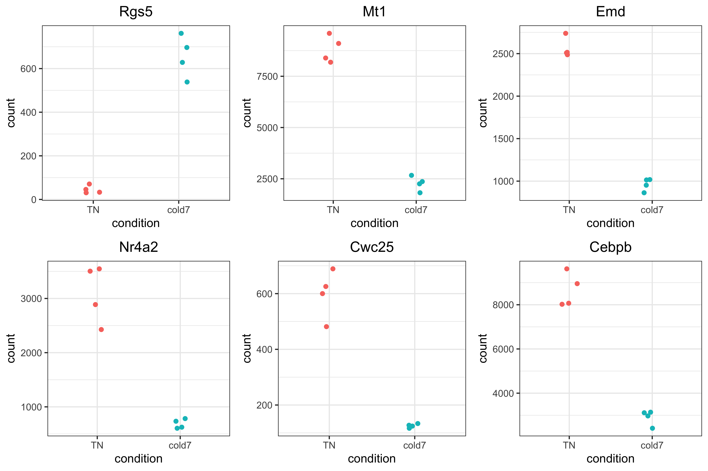
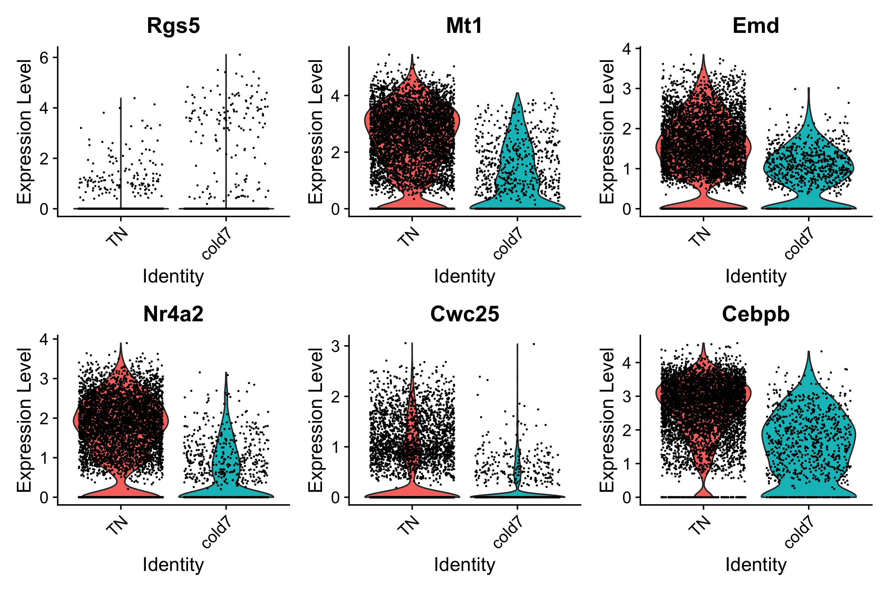
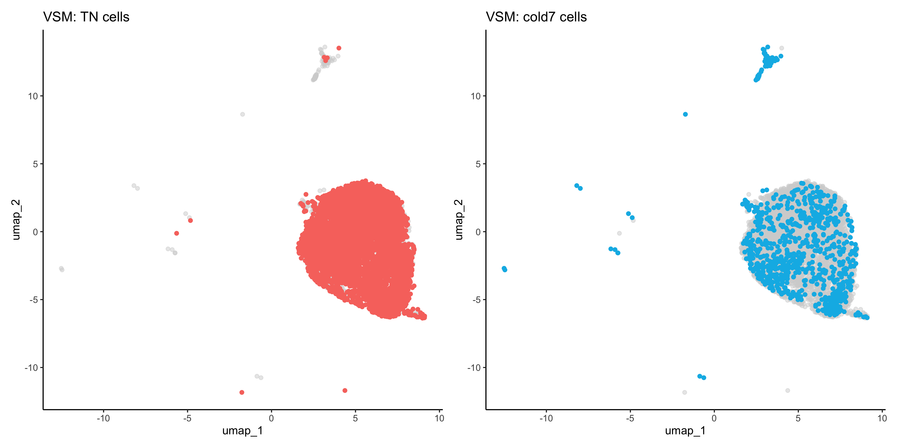
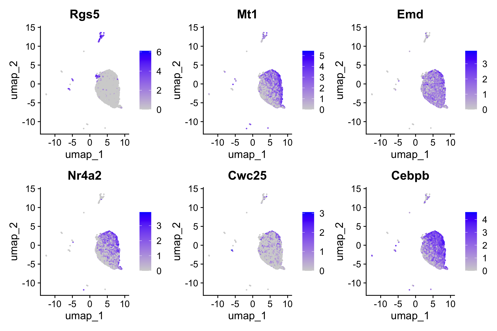

Approximate time: 40 minutes

## Learning Objectives:

* Subset DESeq2 results to significant genes
* Investigate top genes to better understand the changes between conditions
* Visualize expression at both the pseudobulked and single-cell level


## Visualization of differentially expressed genes

Visualization is a key step for understanding the results of our analysis. In particular, we want to focus on the significant genes that are differential between the two conditions of interest. In doing so, we can better understand patterns in gene expression and any outlier genes that may bring up further questions in a downstream analysis. Additionally, these visualizations are a great way to quickly demonstrate the changes brough about due to an experimental condition to others.

### Identify significant genes

Now that we have a table of genes with their associated p-values and log-fold-change scores, we need to filter the results. In particular, we are are only interest in significant differential genes that pass a p-adjusted threshold of 0.05.

```r
# Set thresholds
padj.cutoff <- 0.05

# Turn the results object into a tibble for use with tidyverse functions
res_tbl <- res %>%
            data.frame() %>%
            rownames_to_column(var="gene") %>% 
            as_tibble()

# Subset the significant results
sig_res <- dplyr::filter(res_tbl, 
        padj < padj.cutoff)

sig_res %>% head()
```

```
  gene   baseMean log2FoldChange lfcSE        pvalue        padj
  <chr>     <dbl>          <dbl> <dbl>         <dbl>       <dbl>
1 Lypla1   152.            0.448 0.160 0.00121       0.0133     
2 Rrs1      68.3          -0.479 0.221 0.00560       0.0442     
3 Prex2      9.82          2.24  0.578 0.00000500    0.000131   
4 Sulf1     90.8           1.39  0.259 0.00000000531 0.000000295
5 Rpl7    3814.           -0.430 0.115 0.0000468     0.000906   
6 Mcm3      19.9           1.20  0.494 0.000682      0.00835    
```

With these results we can use a few different visualization techniques to explore our results:

- Volcano plot of significant genes
- Heatmap of expression for all significant genes
- Scatterplot of normalized expression of top genes

#### Volcano plot 

To get a first look at the genes that are retained, we can generated a volcano plot using the `EnhancedVolcano()` function. This is a visualization that allows us to quickly see trends in the significant genes. The x-axis here represents the average log2 fold change value, showing the degree of difference between the two conditions. On the y-axis, we see our p_val_adj column represented after a negative log10 transformation is applied to better see the spread of our p-values.

Volcano plots show us a great overview of which genes are up-regulated (positive on the x-axis) or down-regulated (negative on the x-axis).

```r
EnhancedVolcano(sig_res,
        sig_res$gene,
        x="log2FoldChange",
        y="padj"
    )
```

<p align="center">

</p>


#### Normalized pseudobulk counts heatmap

Another way to look at global patterns of gene expression on our pseudobulked normalized expression, we can generate a heatmap. The rows corresponds to a significant gene, columns are samples, and each value is the pseudobulked normalized expression. 

Using the `pheatmap()` function, we can also cluster samples and genes together based upon their similarity. We can clearly see that samples are clustering together based upon which experimental condition they belong to (`TN` and `cold7`). Similarly, the genes are being grouped together based upon their expression values, where we can see which genes are up and down-regulated in each condition.

```r
# Extract normalized expression for significant genes from the samples
normalized_counts <- counts(dds, normalized=T) %>% as.data.frame()
norm_sig <- normalized_counts %>% 
              dplyr::filter(row.names(normalized_counts) %in% sig_res$gene)

# Set a color palette
heat_colors <- brewer.pal(6, "YlOrRd")

anno <- colData(dds) %>% 
            as.data.frame() %>% 
            select(condition, celltype)

# Run pheatmap using the metadata data frame for the annotation
pheatmap(norm_sig,
    color = heat_colors,
    cluster_rows = T,
    show_rownames = F,
    annotation = anno,
    border_color = NA,
    fontsize = 10,
    scale = "row", 
    fontsize_row = 10, 
    height = 20)
```

<p align="center">

</p>


### Top 6 genes

It is important to take a look at some of the top genes that show up. In particular, it is important to evaluate why these genes showed up in the pseudobulked results and contrast it against the gene expression levels at a single-cell level as well.

We may also be interested in determining the total number of significantly upregulated or downregulated genes above a certain fold change threshold (for example log2 fold change (in absolute value) >0.58, which corresponds to a ~50% increase (or ~30% decrease) in gene expression.


```r
genes <- sig_res %>% 
            arrange(padj) %>% 
            subset(abs(log2FoldChange) > 0.6) %>% 
            head(6)
genes <- genes$gene
genes
```

```
[1] "Rgs5"  "Mt1"   "Emd"   "Nr4a2" "Cwc25" "Cebpb"
```

#### Normalized pseudobulk expression scatterplot

Now that we have identified the significant genes, we can plot a scatterplot of the top 6 significant genes. This plot is a good check to make sure that we are interpreting our fold change values correctly, as well.

Each point represents a sample with the y-axis representing the pseudobulked normalized expression. Ideally we should see a clear shift in expression between our two conditions.

```r
plot_list <- list()

for (gene in genes) {
    # Save plotcounts to a data frame object
    d <- plotCounts(dds, gene=gene, intgroup="condition", returnData=TRUE)
    d <- d %>% subset(condition %in% c("cold7", "TN"))

    # Plot the normalized counts for each sample
    p <- ggplot(d, aes(x = condition, y = count, color = condition)) + 
            geom_point(position=position_jitter(w = 0.1,h = 0)) +
            theme_bw() +
            ggtitle(gene) +
            theme(plot.title = element_text(hjust = 0.5)) +
            NoLegend()
    plot_list[[gene]] <- p
}

plot_grid(plotlist=plot_list)
```

<p align="center">

</p>


#### Single-cell normalized expression violin plot

Ultimately, we want to evaluate the gene expression at a single-cell level. The results we have been visualizing so far represent the sample averages for gene expression. Therefore it is prudent to go back to the cellular level to see what these same results look like for each individual cell. To do so, we will make use of our original seurat object `seurat_vsm`.

```r
DefaultAssay(seurat_vsm) <- "RNA"
Idents(seurat_vsm) <- "condition"
VlnPlot(seurat_vsm, genes, idents=c("cold7", "TN"))
```

<p align="center">

</p>

#### UMAP

When comparing two different conditions, we recommend creating a UMAP that clearly shows where the cells fall for each condition. To do so, we first need to get the UMAP coordinates for every cell of interest. When creating the scatterplot, the first thing we do is put a layer of light gray points that show the entire dataset to understand where all the cells fall. Then, we take the UMAP coordinates of the condition (`TN` or `cold7` in our example) and plot those on top with a color to clearly indicate where those cells are located.

```r
# Grab the umap coordinates and condition information for each cell
df <- FetchData(seurat_vsm, c("umap_1", "umap_2", "condition"))
df_tn <- df %>% subset(condition == "TN")
df_cold7 <- df %>% subset(condition == "cold7")

p_tn <- ggplot() +
        geom_point(data=df, aes(x=umap_1, y=umap_2), color="lightgray", alpha=0.5) +
        geom_point(data=df_tn, aes(x=umap_1, y=umap_2), color="#F8766D") +
        theme_classic() +
        ggtitle("VSM: TN cells")

p_cold7 <- ggplot() +
        geom_point(data=df, aes(x=umap_1, y=umap_2), color="lightgray", alpha=0.5) +
        geom_point(data=df_cold7, aes(x=umap_1, y=umap_2), color="#00B8E7") +
        theme_classic() +
        ggtitle("VSM: cold7 cells")

p_tn + p_cold7
```

<p align="center">

</p>

This allows us to better understand our results when we look at any follow-up information on our UMAP. For example, we can begin to look at distribution of gene expression for each of the top 6 genes with a better understanding of where the cells for each condition lay:

```r
FeaturePlot(seurat_vsm, genes, ncol=3)
```

<p align="center">

</p>

By now, you may have noticed that the top genes from DESeq2 are different from the ones we identified with FindMarkers. In the next lesson we can compare the results to better evaluate why these differences exist.

***

*This lesson has been developed by members of the teaching team at the [Harvard Chan Bioinformatics Core (HBC)](http://bioinformatics.sph.harvard.edu/). These are open access materials distributed under the terms of the [Creative Commons Attribution license](https://creativecommons.org/licenses/by/4.0/) (CC BY 4.0), which permits unrestricted use, distribution, and reproduction in any medium, provided the original author and source are credited.*
