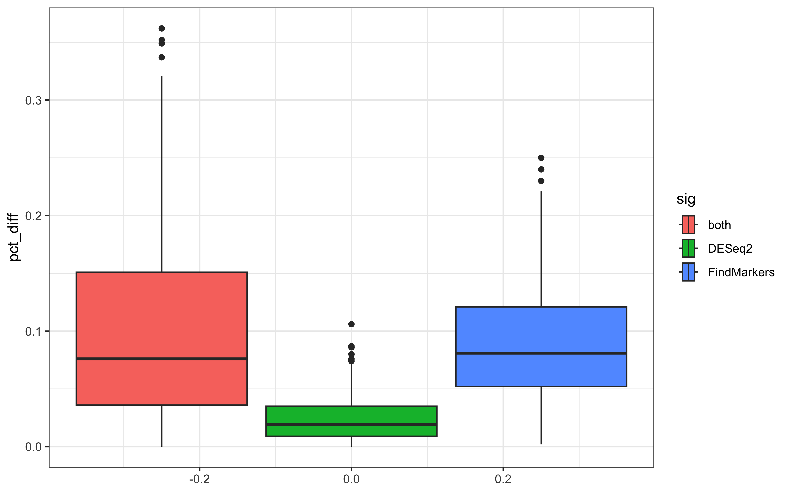
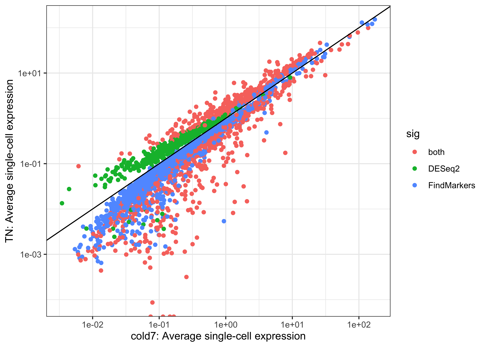
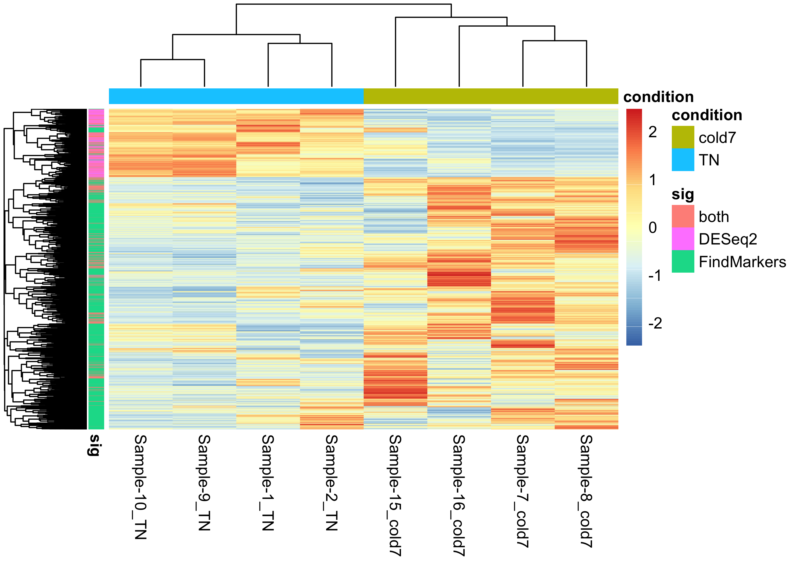

## Comparing results from different DE approaches

Approximate time: 40 minutes

## Learning Objectives:

* Compare and contrast results from `DESeq2` and `FindMarkers`
* Evaluate why there are differences in results

## Studies benchmarking methods

There have been many studies that test the difference between a variety of DGE methods for single-cell experiments. First we must ask ourselves what we must consider when contrasting the results for each method:

1. DESeq2 takes into account biological variability between samples, while the Wilcox test does not
2. Pseudo-bulking the count matrix reduces the sparsity of the data
3. 

Bearing all of these changes in mind, it has been shown that including variability between 

> Accounting for this variability dictates the biological accuracy of statistical methods. 


## Comparing DGE results


As usual, let's open a new Rscript file, and start with some comments to indicate what this file is going to contain:

```r
# September 2024
# HBC single-cell RNA-seq DGE workshop

# Single-cell RNA-seq analysis - compare DGE results
```

Next we will load the necessary libraries as well.

```r
library(Seurat)
library(tidyverse)
# install.packages("ggvenn")
library("ggvenn")
library(pheatmap)
```

### Load previous results

To start, let us load the results from the the DESeq2 and FindMarkers lessons.

```r
dge_fm <- read.csv("results/findmarkers_vsm.csv")
dge_deseq2 <- read.csv("results/DESeq2_vsm.csv")
```

### Common significant genes

We can visualize how many genes can be found in commmon or are unique to each method by representing the significant genes as a venn diagram.

```r
# Subset to significant genes
sig_fm <- dge_fm %>% subset(p_val_adj < 0.05)
sig_deseq2 <- dge_deseq2 %>% subset(padj < 0.05)

# Create list of just significant gene names 
sig_genes <- list(
  FindMarkers = sig_fm$X,
  DESeq2 = sig_deseq2$X
)

# Create venn diagram
ggvenn(sig_genes)
```

<p align="center">
  
</p>

For a more conservative approach, we could continue our downstream analysis by using just the conserved significant genes for both conditions. For now though, let us try to understand why these differences in results exist at all. To begin, let us clean our dataset to better understand the results.

```r
# Merge FindMarkers and DESeq2 results together
dge <- merge(dge_fm, dge_deseq2, by="X")

# Rename columns to easily understand where results came from
# Remove columns we will not be using
dge <- dge %>% rename("gene"="X") %>%
            rename("padj_fm"="p_val_adj", "padj_deseq2"="padj") %>%
            rename("log2FC_fm"="avg_log2FC", "log2FC_deseq2"="log2FoldChange") %>%
            select(-c("p_val", "baseMean", "lfcSE", "pvalue"))

# Create a column called sig
# Identifies which methods a gene is significant in
dge <- mutate(dge, sig = case_when(
                  ((padj_fm < 0.05) & (padj_deseq2 < 0.05)) ~ "both",
                  (padj_fm < 0.05) ~ "FindMarkers",
                  (padj_deseq2 < 0.05) ~ "DESeq2",
                  ((padj_fm > 0.05) & (padj_deseq2 > 0.05)) ~ "Not Significant"))

dge %>% head()
```

```
           gene log2FC_fm pct.1 pct.2      padj_fm log2FC_deseq2 padj_deseq2
1 0610009B22Rik 0.4919641 0.238 0.138 6.745178e-07   0.178619741   0.5217744
2 0610009O20Rik 0.3421628 0.259 0.152 2.299513e-06   0.021075663   0.9539047
3 0610010K14Rik 0.3505411 0.163 0.088 1.093917e-05  -0.004912021   0.9819494
4 0610012D04Rik 1.1632519 0.033 0.010 3.048507e-03   0.610698014   0.1015138
5 0610012G03Rik 0.1019817 0.497 0.379 1.000000e+00   0.040974487   0.8935888
6 0610030E20Rik 0.6008081 0.147 0.077 6.292494e-06   0.058878725   0.8641972
```

We can again visualize how many genes are not significant and the number significant for each method. You'll notice that we have a few genes that listed `NA`, which is the result of DESeq2 giving an NA for the p-value.

```r
ggplot(dge, aes(x=sig, fill=sig)) +
  geom_bar(stat="count", color="black") +
  theme_classic() + NoLegend() +
  theme(axis.text.x = element_text(angle=45, vjust=1, hjust=1)) +
  labs(x="Significant", y="Number of genes") +
  geom_label(vjust=-1,stat="count", aes(label=format(after_stat(count))))
```

<p align="center">
  
</p>

With all of this information, we can begin comparing the p-values and average log2-fold changes from each method. To start, we will first remove the genes that are not significant in either method to more clearly see the differences.


```r
# Remove non-significant genes
dge <- dge %>% subset(sig != "Not Significant")

# Compare p-values
ggplot(dge, aes(x=padj_deseq2, y=padj_fm, color=sig)) +
  geom_point() +
  labs(x="DESeq2 Padj", y="FindMarkers Padj", title="Padj values") +
  geom_vline(xintercept = 0.05, color="black", linetype="dashed") +
  geom_hline(yintercept = 0.05, color="black", linetype="dashed") +
  theme_classic()
```

<p align="center">
  
</p>

```r
# Compare average log2-fold change value
  geom_point() +
  labs(x="DESeq2 LFC", y="FindMarkers LFC", 
        title="Average Log2-fold Change") +
  theme_classic()
```

<p align="center">
  
</p>


Next we might ask ourselves, what could be the cause of the differences in the results? If we think back to how we generated the pseudo-bulked results we can consider how the number of cells could effect the final results. There are a couple of different senarios to think of:

* A gene that is highly expressed in very few cells will have a high level of expression at the pseudo-bulk level
* 

Therefore, an important metric to consider is the number or percentage of cells that express the genes we are looking at. We have the columns `pct.1` and `pct.2` which represent the proportion of cells in our dataset that belong to `TN` and `cold7` respectively. So let us consider the data with this additional metric in mind.


```r
pct_1 <- ggplot(dge %>% arrange(pct.1), 
                aes(x=log2FC_deseq2, y=log2FC_fm, color=pct.1)) +
          geom_point() +
          labs(x="DESeq2 LFC", y="FindMarkers LFC", title="Average Log2-fold Change") +
          theme_classic()

pct_2 <- ggplot(dge %>% arrange(pct.2), 
                aes(x=log2FC_deseq2, y=log2FC_fm, color=pct.2)) +
  geom_point() +
  labs(x="DESeq2 LFC", y="FindMarkers LFC", title="Average Log2-fold Change") +
  theme_classic()

pct_1 + pct_2
```

<p align="center">
  
</p>


Now we can ask ourselves, is there one particular method where we see any trends with these percentage values. To most clearly identify these, let's create a boxplot of the percentage scores grouped by which method they were significant in. The clearest way to see the differences in the proportion of cells that express each gene within condition is to take the difference.


```r
# Percentage difference
dge$pct_diff <- abs(dge$pct.1 - dge$pct.2)

# Boxplot of percentage differences
ggplot(dge) +
  geom_boxplot(aes(x=pct_diff, fill=sig)) +
  theme_bw() + coord_flip()  
```

<p align="center">
  
</p>


Here we can see a pattern where `FindMakers()` finds more differential genes that have a larger difference in the proportion of cells. However, the analagous question can then be asked about what happens at different levels of expression? 

To address this question, we start by looking at the single-cell expression values for each 

```r
# Difference
avg_exp <- dge %>% select(gene, sig)

# pct.1 = cold7
seurat_1 <- subset(seurat_vsm, subset = (condition == "cold7"))
avg_cold7 <- AverageExpression(seurat_1, features=avg_exp$gene, assay="RNA") %>%
  data.frame() %>%
  rename("RNA"="avg_sc.1") %>%
  rownames_to_column("gene")

# pct.2 = TN
seurat_2 <- subset(seurat_vsm, subset = (condition == "TN"))
avg_TN <- AverageExpression(seurat_2, features=avg_exp$gene, assay="RNA") %>%
  data.frame() %>%
  rename("RNA"="avg_sc.2") %>%
  rownames_to_column("gene")

# Merge
avg_exp <- merge(avg_exp, merge(avg_cold7, avg_TN), by="gene")

ggplot(avg_exp, aes(x=avg_sc.1, y=avg_sc.2, color=sig)) +
  geom_point() +
  scale_x_log10() + scale_y_log10() + 
  theme_bw() + geom_abline(slope=1) +
  labs(x="cold7: Average single-cell expression",
       y="TN: Average single-cell expression")
```

<p align="center">
  
</p>


Here we can see that there is a clear divide between results significant in DESeq2 and FindMarkers based upon the expression values at the single-cell level. 

Now we can look the pseudo-bulked normalized expression values:

```r
### Code to recreate the DESeq2 object dds
# # Average pb expression
# # Aggregate count matrix by sample/celltype
# bulk_vsm <- AggregateExpression(
#   seurat_vsm,
#   return.seurat = T,
#   assays = "RNA",
#   group.by = c("celltype", "sample", "condition")
# )
# # Get count matrix
# cluster_counts <- FetchData(bulk_vsm, layer="counts", vars=rownames(bulk_vsm))

# # Create DESeq2 object
# # transpose it to get genes as rows
# dds <- DESeqDataSetFromMatrix(t(cluster_counts),
#                               colData = bulk_vsm@meta.data,
#                               design = ~ condition)
# dds <- estimateSizeFactors(dds)


# Extract normalized expression for significant genes from the samples
normalized_counts <- counts(dds, normalized=T) %>% as.data.frame()
norm_sig <- normalized_counts %>% 
  dplyr::filter(row.names(normalized_counts) %in% dge$gene)

# Cold7
idx <- endsWith(colnames(norm_sig), "_cold7")
avg_pb_cold7 <- norm_sig[idx] %>% 
  rowMeans() %>% 
  as.data.frame() %>% 
  rownames_to_column("gene") %>%
  rename("."="avg_pb.1")

# TN
idx <- endsWith(colnames(norm_sig), "_TN")
avg_pb_tn <- norm_sig[idx] %>% 
  rowMeans() %>% 
  as.data.frame() %>% 
  rownames_to_column("gene") %>%
  rename("."="avg_pb.2")


# Scatterplot
avg_exp <- merge(avg_exp, merge(avg_pb_cold7, avg_pb_tn))
ggplot(avg_exp, aes(x=avg_pb.1, y=avg_pb.2, color=sig)) +
  geom_point() +
  scale_x_log10() + scale_y_log10() + 
  theme_bw() + geom_abline(slope=1) +
  labs(x="cold7: Average pseudo-bulk expression",
       y="TN: Average pseudo-bulk expression")
```

<p align="center">
  
</p>


### DESeq2 

```r
# DESEq2
anno_col <- data.frame(sample=colnames(norm_sig), condition=NA)
idx <- endsWith(colnames(norm_sig), "_cold7")
anno_col[idx, "condition"] <- "cold7"
idx <- endsWith(colnames(norm_sig), "_TN")
anno_col[idx, "condition"] <- "TN"
anno_col <- anno_col %>% column_to_rownames("sample")

anno_row <- dge %>% select(gene, sig) %>% remove_rownames() %>% column_to_rownames("gene")
pheatmap(norm_sig, show_rownames=FALSE, annotation_row=anno_row, annotation_col=anno_col, scale="row")
```

  
</p>


### FindMarkers

> Instead, the most pronounced differences between pseudobulk and single-cell methods emerged among highly expressed genes.


### Conservative approach

If we were to go with the most conservative approach, we could make use of the significant genes found in common between both methods and continue any follow-up analysis with those results.

```r
dge_both <- dge %>% subset(sig == "both")
dge_both %>% head()
```

```
            gene log2FC_fm pct.1 pct.2      padj_fm log2FC_deseq2  padj_deseq2  sig pct_diff
26 1190005I06Rik 1.5945858 0.064 0.017 1.758535e-12    1.54078149 3.828017e-04 both    0.047
33 1600002K03Rik 0.9009812 0.117 0.042 2.555606e-14    0.69788439 2.542513e-02 both    0.075
63 1810011H11Rik 9.5035075 0.022 0.000 5.303901e-21    0.05955526 1.855213e-02 both    0.022
70 1810041L15Rik 3.0031918 0.018 0.002 2.519259e-08    2.03918404 1.719238e-02 both    0.016
80 2010300C02Rik 1.4785492 0.059 0.012 1.063096e-16    1.68576066 2.052197e-03 both    0.047
84 2200002D01Rik 1.2138988 0.470 0.258 9.323751e-34    1.40923201 4.064154e-12 both    0.212
```

***

*This lesson has been developed by members of the teaching team at the [Harvard Chan Bioinformatics Core (HBC)](http://bioinformatics.sph.harvard.edu/). These are open access materials distributed under the terms of the [Creative Commons Attribution license](https://creativecommons.org/licenses/by/4.0/) (CC BY 4.0), which permits unrestricted use, distribution, and reproduction in any medium, provided the original author and source are credited.*
