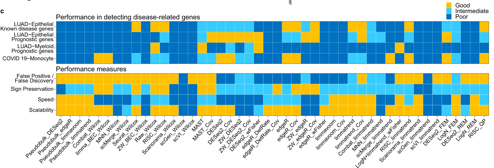
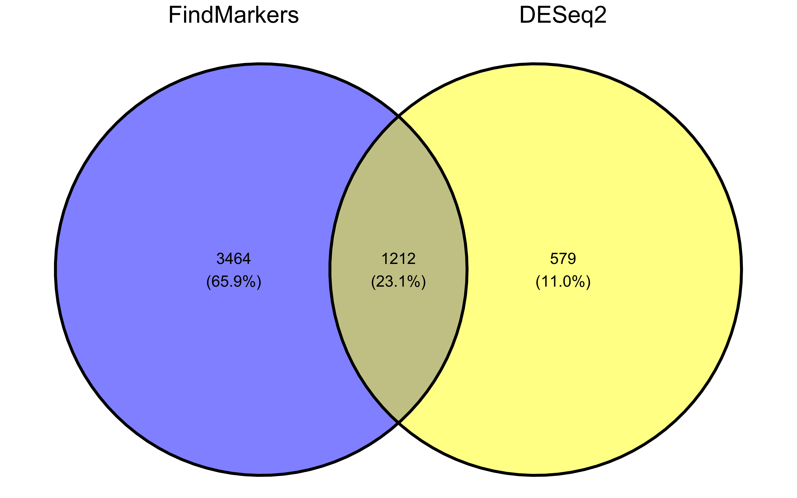
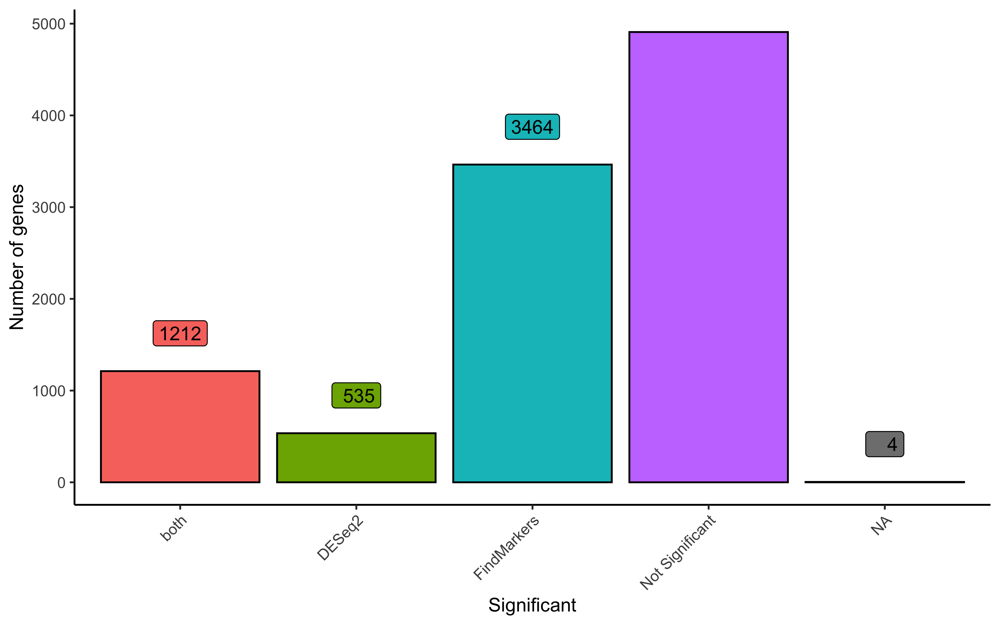
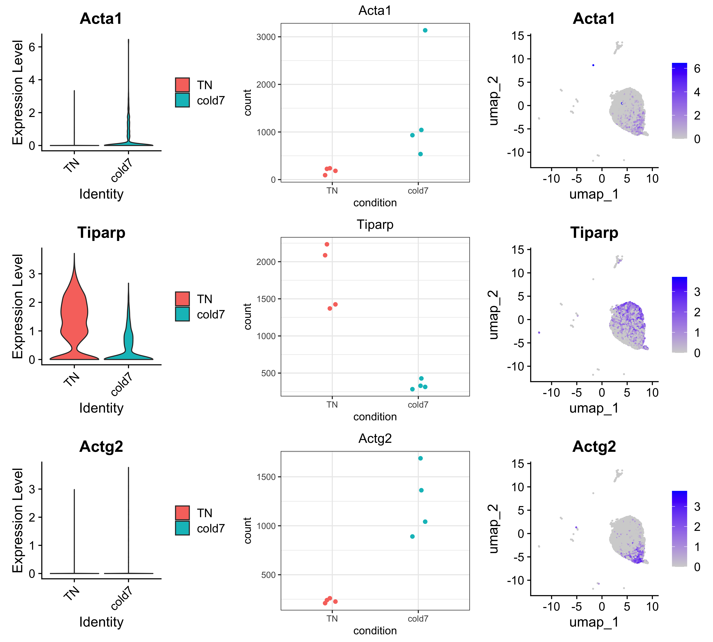
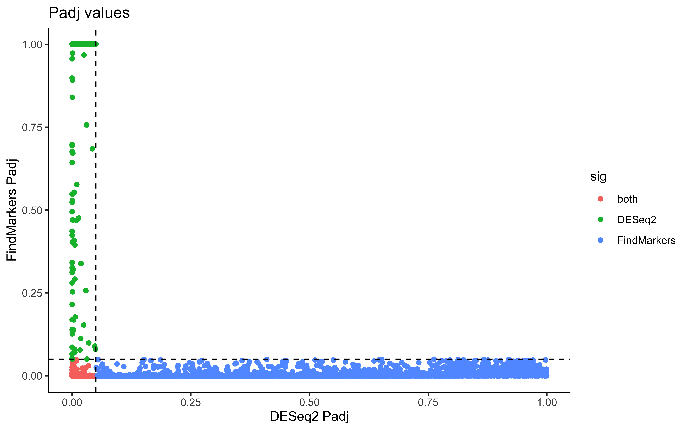
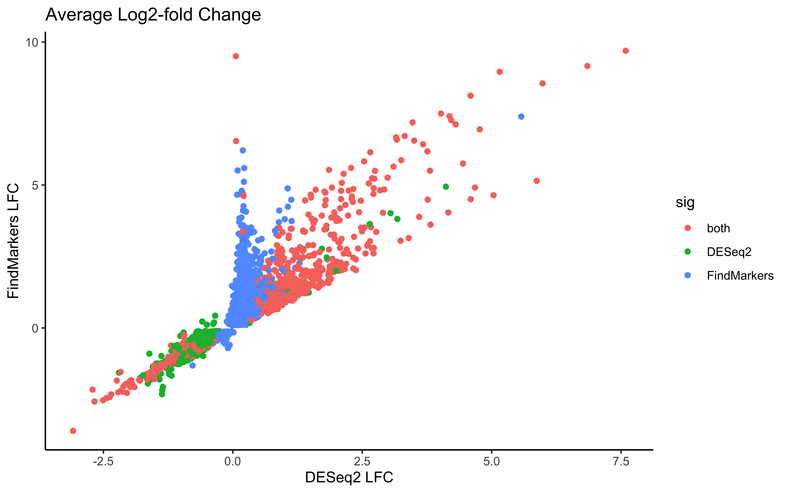
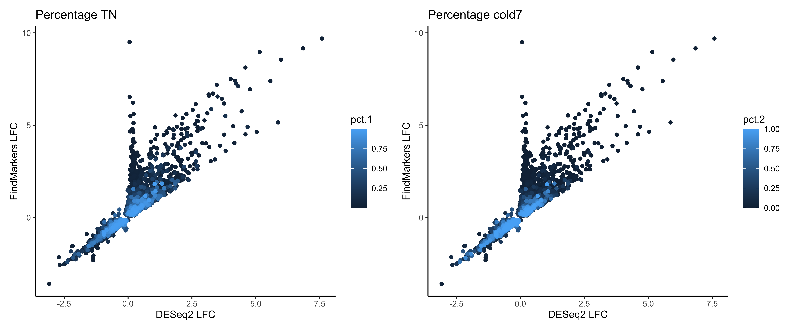
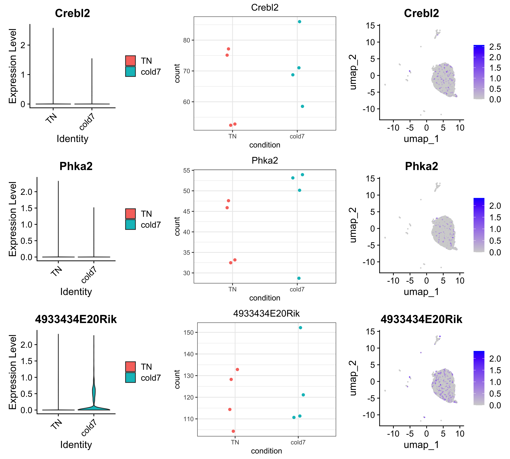
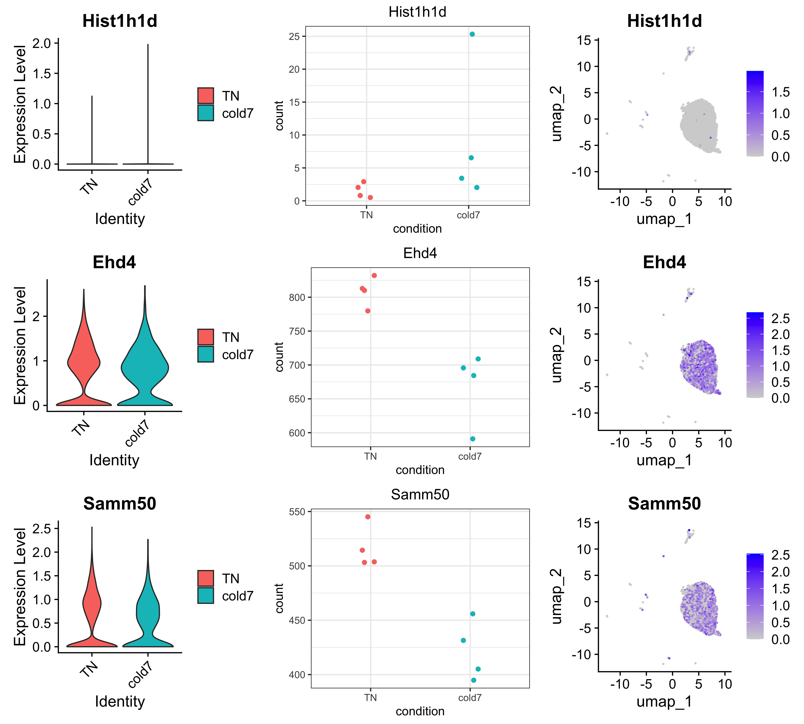

## Comparing results from different DE approaches

Approximate time: 40 minutes

## Learning Objectives:

* Compare and contrast results from `DESeq2` and `FindMarkers`
* Evaluate what is causing differences in results
* Understand the effect of how many cells express a gene has on DGE results

## Overarching trends in DGE methods

The different DGE methods can broadly be classified into the following categories:

1. Pseudobulk (DESeq2, limma, edgeR)
2. Mixed models (MAST)
3. Naive methods (Wilcox)

When running your own DGE analysis, there are several important questions to ask when selecting the appropriate method. Some important considerations:

1. Do you have enough cells to aggregate and do a pseudobulk analysis on?
2. Are there smaller cell states among the celltype that would be lost after pseudobulking and averaging expression?
3. Is there a latent variable that should be included in a design model?
4. Are there biological replicates that could be used to account for the variability in the data?

*** 

**Exercise**

Based on the data we have looked at so far, what do you think are the answers to the above questions for our VSM cells?

***

Another imporant aspect to consider is the amount of computational resources it takes to calculate the differential genes. The amount of time and computer cores necessary for an analysis will scale with the size of your dataset (number of cells and samples), but are important to factor when selecting the method you move forward with.


<p align="center">
  
</p>

Image credit: [Nguyen et al, Nat Communnications: Fig 7c](https://www.nature.com/articles/s41467-023-37126-3#Abs1)

Now, let us compare and contrast the results from `DESeq2` and `FindMarkers` to see the practical implications of the questions we answered above.


## Comparing DGE results


As usual, let's open a new Rscript file, and start with some comments to indicate what this file is going to contain:

```r
# September 2024
# HBC single-cell RNA-seq DGE workshop

# Single-cell RNA-seq analysis - compare DGE results
```

Next we will load the necessary libraries as well.

```r
library(Seurat)
library(tidyverse)
# install.packages("ggvenn")
library("ggvenn")
library(pheatmap)
library(cowplot)
```

### Load previous results

To start, let us load the results from the the DESeq2 and FindMarkers lessons.

```r
dge_fm <- read.csv("results/findmarkers_vsm.csv")
dge_deseq2 <- read.csv("results/DESeq2_vsm.csv")
```

Next, we will merge together the results into one dataframe to more easily make comparisons. Here, we will also change the column names to clearly define which results come from which method. Lastly, we will create a column called `sig` that identified if a gene was significant (adjusted p-values < 0.05) to categorize each row as: FindMarkers, DESeq2, both, or Not Significant. 

```r
# Merge FindMarkers and DESeq2 results together
dge <- merge(dge_fm, dge_deseq2, by="X")

# Rename columns to easily understand where results came from
# Remove columns we will not be using
dge <- dge %>% rename("gene"="X") %>%
            rename("padj_fm"="p_val_adj", "padj_deseq2"="padj") %>%
            rename("log2FC_fm"="avg_log2FC", "log2FC_deseq2"="log2FoldChange") %>%
            select(-c("p_val", "baseMean", "lfcSE", "pvalue"))

# Create a column called sig
# Identifies which methods a gene is significant in
dge <- mutate(dge, sig = case_when(
                  ((padj_fm < 0.05) & (padj_deseq2 < 0.05)) ~ "both",
                  (padj_fm < 0.05) ~ "FindMarkers",
                  (padj_deseq2 < 0.05) ~ "DESeq2",
                  ((padj_fm > 0.05) & (padj_deseq2 > 0.05)) ~ "Not Significant"))

dge %>% head()
```

```
           gene log2FC_fm pct.1 pct.2      padj_fm log2FC_deseq2 padj_deseq2             sig
1 0610009B22Rik 0.4919641 0.238 0.138 6.745178e-07   0.178619741   0.5217744     FindMarkers
2 0610009O20Rik 0.3421628 0.259 0.152 2.299513e-06   0.021075663   0.9539047     FindMarkers
3 0610010K14Rik 0.3505411 0.163 0.088 1.093917e-05  -0.004912021   0.9819494     FindMarkers
4 0610012D04Rik 1.1632519 0.033 0.010 3.048507e-03   0.610698014   0.1015138     FindMarkers
5 0610012G03Rik 0.1019817 0.497 0.379 1.000000e+00   0.040974487   0.8935888 Not Significant
6 0610030E20Rik 0.6008081 0.147 0.077 6.292494e-06   0.058878725   0.8641972     FindMarkers

```

With this simplified dataframe, we can being our evaluation.

### Common significant genes

First, let's  visualize how many genes can be found in commmon or are unique to each method by representing the significant genes as a venn diagram.

```r
# Subset to significant genes
sig_fm <- dge %>% subset(sig %in% c("FindMarkers", "both"))
sig_deseq2 <- dge %>% subset(sig %in% c("DESeq2", "both"))

# Create list of just significant gene names
sig_genes <- list(
  FindMarkers = sig_fm$gene,
  DESeq2 = sig_deseq2$gene
)

# Create venn diagram
ggvenn(sig_genes, auto_scale = TRUE)
```

<p align="center">
  
</p>


To include the number of genes that were found as Not Significant in any method, we could similarly make a barplot to represent the overlap in results. You may notice that we have a few genes that listed `NA`, which is the result of DESeq2 filtering genes as was [discussed earlier](https://hbctraining.github.io/DGE_analysis_scRNAseq/lessons/04_pseudobulk_DE_analysis.html).

```r
ggplot(dge, aes(x=sig, fill=sig)) +
  geom_bar(stat="count", color="black") +
  theme_classic() + NoLegend() +
  theme(axis.text.x = element_text(angle=45, vjust=1, hjust=1)) +
  labs(x="Significant", y="Number of genes") +
  geom_label(vjust=-1,stat="count", aes(label=format(after_stat(count))))
```

<p align="center">
  
</p>


### Conservative approach

If we were to go with the most conservative approach for this DGE, we could make use of the significant genes found in common between both methods and continue any follow-up analysis with those results. 

```r
# Conservative genes
# Sort on log2 fold-change to see the most differential genes
dge_both <- dge %>%
  subset(sig == "both") %>%
  arrange(desc(abs(log2FC_deseq2)),
          desc(abs(log2FC_fm)))

dge_both %>% head()
```

```
           gene log2FC_fm pct.1 pct.2      padj_fm log2FC_deseq2  padj_deseq2  sig
1 D630033O11Rik  9.695314 0.024 0.000 1.680808e-23      7.588727 2.647467e-06 both
2        Elmod1  9.161915 0.017 0.000 5.311867e-16      6.849549 1.306736e-04 both
3         Apela  8.552444 0.013 0.000 5.425402e-11      5.983377 2.473836e-03 both
4         Wisp2  5.148160 0.071 0.003 5.086053e-57      5.871715 3.958228e-23 both
5          Gipr  8.960588 0.038 0.000 2.261094e-35      5.155337 5.525229e-06 both
6        Igfbp2  4.642158 0.036 0.004 3.346486e-18      5.035339 1.163515e-15 both
```

We can clearly see that the highest log2-fold change come from genes that are present in one condition but not the other based upon the percentage columns. 


To visualize these results, we can pot the normalized expression of the top genes at both the pseudobulk and single-cell level for our data. As this is something we are going to do multiple times, we should create a custom function to quickly generate these plots.

```r
# # Create DESeq2 object
# # Average pb expression
# # Aggregate count matrix by sample/celltype
# bulk_vsm <- AggregateExpression(
#   seurat_vsm,
#   return.seurat = T,
#   assays = "RNA",
#   group.by = c("sample", "condition")
# )
# # Get count matrix
# cluster_counts <- FetchData(bulk_vsm, layer="counts", vars=rownames(bulk_vsm))
# 
# # transpose it to get genes as rows
# dds <- DESeqDataSetFromMatrix(t(cluster_counts),
#                               colData = bulk_vsm@meta.data,
#                               design = ~ condition)
# dds <- estimateSizeFactors(dds)


plot_genes <- function(seurat, dds, genes) {
  
  plot_list <- list()
  for (gene in genes) {
    
    # single-cell violin plot
    p1 <- VlnPlot(seurat, gene, pt.size = 0)
    
  
    # pseudobulk scatterpot
    # Save plotcounts to a data frame object
    d <- plotCounts(dds, gene=gene, intgroup="condition", returnData=TRUE)
    d$condition <- factor(d$condition, levels = c("TN", "cold7"))

    # Plot the normalized counts for each sample
    p2 <- ggplot(d, aes(x = condition, y = count, color = condition)) + 
      geom_point(position=position_jitter(w = 0.1, h = 0)) +
      theme_bw() +
      ggtitle(gene) +
      theme(plot.title = element_text(hjust = 0.5)) +
      NoLegend()
    
    # UMAP featureplot for extra visulization
    p3 <- FeaturePlot(seurat, gene)
    
    # Put all plots together horizontally
    p <- cowplot::plot_grid(plotlist=list(p1, p2, p3), ncol=3)
    plot_list[[gene]] <- p
  }
  
  # Put together plots for all genes
  p <- cowplot::plot_grid(plotlist=plot_list, ncol = 1)
  return(p)
}
```

**For visualization purposes**, we are removing genes that are only found in one condition but not the other. Now we can look at some of the top genes that were identified:

```r
dge_viz <- dge_both %>%
  subset(pct.1 > 0.1) %>%
  subset(pct.2 > 0.1)

genes <- dge_viz$gene[1:3]
plot_genes(seurat_vsm, dds, genes)
```

<p align="center">
  
</p>

As expected, given that we are looking at the more conservative approach, we see good concordence in expression values across both DESeq2 and wilcox results.

## Contrasting results

While we could have stopped with a more conservative approach, let us try to understand why these differences in results exist at all. 

To start, we can begin comparing the p-values and average log2-fold changes. First, we will remove the genes that are not significant in either method to more clearly see the differences.

```r
# Remove non-significant genes
dge_sig <- dge %>% subset(sig != "Not Significant")

# Compare p-values
ggplot(ddge_sigge, aes(x=padj_deseq2, y=padj_fm, color=sig)) +
  geom_point() +
  labs(x="DESeq2 Padj", y="FindMarkers Padj", title="Padj values") +
  geom_vline(xintercept = 0.05, color="black", linetype="dashed") +
  geom_hline(yintercept = 0.05, color="black", linetype="dashed") +
  theme_classic()
```

<p align="center">
  
</p>

```r
# Compare average log2-fold change value
ggplot(dge_sig, aes(x=log2FC_deseq2, y=log2FC_fm, color=sig)) +
  geom_point() +
  labs(x="DESeq2 LFC", y="FindMarkers LFC", 
        title="Average Log2-fold Change") +
  theme_classic()
```

<p align="center">
  
</p>


Next we might ask ourselves, what could be the cause of the differences in the results? If we think back to how we generated the pseudobulk results we should consider how the number of cells could effect the final results. The number of cells we aggregate on likely has a strong sway on the overall expression values for the DESeq2 results. Therefore, an important metric to consider is the number/percentage of cells that express the genes we are looking at. We have the columns `pct.1` and `pct.2` which represent the proportion of cells in our dataset that belong to `TN` and `cold7` respectively. So let us consider the data with this additional metric in mind.


```r
pct_1 <- ggplot(dge_sig %>% arrange(pct.1), 
                aes(x=log2FC_deseq2, y=log2FC_fm, color=pct.1)) +
          geom_point() +
          labs(x="DESeq2 LFC", y="FindMarkers LFC", title="Average Log2-fold Change") +
          theme_classic()

pct_2 <- ggplot(dge_sig %>% arrange(pct.2), 
                aes(x=log2FC_deseq2, y=log2FC_fm, color=pct.2)) +
  geom_point() +
  labs(x="DESeq2 LFC", y="FindMarkers LFC", title="Average Log2-fold Change") +
  theme_classic()

pct_1 + pct_2
```

<p align="center">
  
</p>


Now we can ask ourselves, is there one particular method where we see any trends with these percentage values. To most clearly identify these, let's create a boxplot of the percentage scores grouped by which method they were significant in. The clearest way to see the differences in the proportion of cells that express each gene within condition is to take the difference.

```r
# Percentage difference
dge_sig$pct_diff <- abs(dge_sig$pct.1 - dge_sig$pct.2)

# Boxplot of percentage differences
ggplot(dge) +
  geom_boxplot(aes(x=pct_diff, fill=sig)) +
  theme_bw() + coord_flip()  
```

Here we can see a pattern where `FindMakers()` finds more differential genes that have a larger difference in the proportion of cells. However, the analagous question can then be asked about what happens at different levels of expression? 


Since we can easily make a heatmap of expression values using the pseubulked normalized expressions, let us see if we can find any global patterns among the genes.

```r
# Extract normalized expression for significant genes from the samples
normalized_counts <- counts(dds, normalized=T) %>% as.data.frame()
norm_sig <- normalized_counts %>% 
  dplyr::filter(row.names(normalized_counts) %in% dge_sig$gene)

# Create dataframe annotating rows (genes) and columns (samples)
anno_col <- colData(dds) %>% data.frame() %>% select(condition)
anno_row <- dge_sig %>% 
              select(gene, sig, pct.1, pct.2) %>% 
              remove_rownames() %>% 
              column_to_rownames("gene")

# Create heatmap
pheatmap(norm_sig, 
         show_rownames=FALSE,
         show_colnames=FALSE,
         annotation_row=anno_row, 
         annotation_col=anno_col, 
         scale="row")
```

<p align="center">
  
</p>

Through this visualization, we can see that there is a clear separation in genes that are found significant by DESeq2 and FindMarkers based upon the percentage of cells that express a gene. We can a see that the more widely expressed significant genes are grouped together and belong to the DESeq2/both groups.

*** 

**Exercise**

Is there a clear seperation in the method a gene is found significant in based upon the percentage of cells from each condition with expression?

```r
ggplot(dge_sig, aes(x=pct.1, y=pct.2, color=sig)) +
  geom_point() +
  theme_classic()
```

***

There have been [studies]((https://www.nature.com/articles/s41467-023-37126-3#Abs1)) that indicate that accounting for biological variability with replicates strongly affects the accuracy of the final results. These considerations reduce the number of false negatives during a DGE analysis. If we consider just the number of significant genes, we know that in our dataset there are more significant genes when we consider the results from FindMarkers. Despite this, we need to consider the cases where perhaps a Wilcox test may be more sensitive to subtle shifts.

To test this, let us take a look at the top genes significant in only FindMarkers:

```r
dge_fm <- dge_sig %>% 
            subset(sig == "FindMarkers") %>%
            arrange(abs(log2FC_fm))

dge_fm %>% head()
```

```
           gene log2FC_fm pct.1 pct.2      padj_fm log2FC_deseq2 padj_deseq2         sig pct_diff
1        Crebl2 0.1004054 0.164 0.102 3.277797e-02   0.062939835   0.8488375 FindMarkers    0.062
2         Phka2 0.1005929 0.120 0.064 1.366848e-03   0.118218835   0.6945813 FindMarkers    0.056
3 4933434E20Rik 0.1016395 0.273 0.175 4.647805e-03   0.024728189   0.9416393 FindMarkers    0.098
4        Rabep1 0.1021577 0.369 0.255 4.365276e-02   0.049843141   0.8707988 FindMarkers    0.114
5      Srek1ip1 0.1036769 0.338 0.213 3.698229e-05   0.047126281   0.8871978 FindMarkers    0.125
6        Ranbp3 0.1056846 0.209 0.128 2.405941e-03  -0.007716223   0.9819494 FindMarkers    0.081
```

```r
genes <- dge_fm$gene[1:3]
plot_genes(seurat_vsm, dds, genes)
```

<p align="center">
  
</p>


The gene 4933434E20Rik shows us most clearly the importance of biological replicates in experimental design. We can clearly see in the pseudobulked expression, that this one cold7 replicate that has much higher expression for this gene as compared to the other replicates. This could potentially be a result of technical variation rather than biological shifts. In this case, being able to account for the variability among biological replicates would enhance the accuracy of these results.  

To continue assessing the difference, we can look at the top DESeq2 genes:

```r
dge_deseq2 <- dge_sig %>% 
  subset(sig == "DESeq2") %>%
  arrange(abs(log2FC_deseq2))

dge_deseq2 %>% head()
```

```
      gene  log2FC_fm pct.1 pct.2    padj_fm log2FC_deseq2 padj_deseq2    sig pct_diff
1 Hist1h1d  3.0856065 0.013 0.002 0.08019887     0.2272345  0.04911827 DESeq2    0.011
2     Ehd4 -0.2003720 0.715 0.668 1.00000000    -0.2440859  0.04490721 DESeq2    0.047
3   Samm50 -0.3184791 0.586 0.550 1.00000000    -0.2658683  0.03674810 DESeq2    0.036
4    Rbbp7 -0.1563588 0.615 0.551 1.00000000    -0.2680015  0.03416954 DESeq2    0.064
5   Sqstm1 -0.2278429 0.662 0.627 1.00000000    -0.2737176  0.02368730 DESeq2    0.035
6     Cdv3 -0.1285738 0.525 0.439 1.00000000    -0.2754577  0.04545363 DESeq2    0.086

```

```r
genes <- dge_deseq2$gene[1:3]
plot_genes(seurat_vsm, dds, genes)
```

<p align="center">
  
</p>


Notice for gene Hist1h1d, there appears to be similar expression for almost all cells with the exception of a handful of cells in a single sample which has much higher expression values. This is one pitfall of using pseudobulk methods, where the expression values of few cells can disproportionately affect the final results if the expression values are high enough.


At this point, you hopefully have become more comfortable visualizing and working with the results for a DGE analysis. There are many important considerations to keep in mind when choosing which algorithms to use - as we have have discussed throughout this lesson. Making informed decisions and filtering genes or your results can greatly enhance your understanding of what is actually differential between conditions.

***

*This lesson has been developed by members of the teaching team at the [Harvard Chan Bioinformatics Core (HBC)](http://bioinformatics.sph.harvard.edu/). These are open access materials distributed under the terms of the [Creative Commons Attribution license](https://creativecommons.org/licenses/by/4.0/) (CC BY 4.0), which permits unrestricted use, distribution, and reproduction in any medium, provided the original author and source are credited.*
