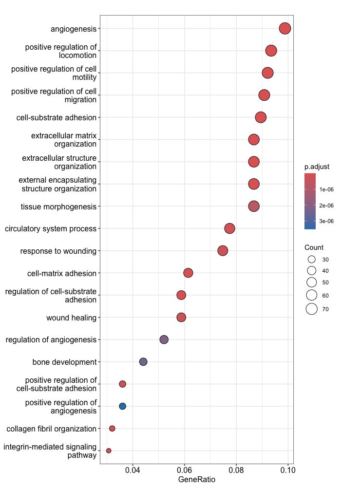
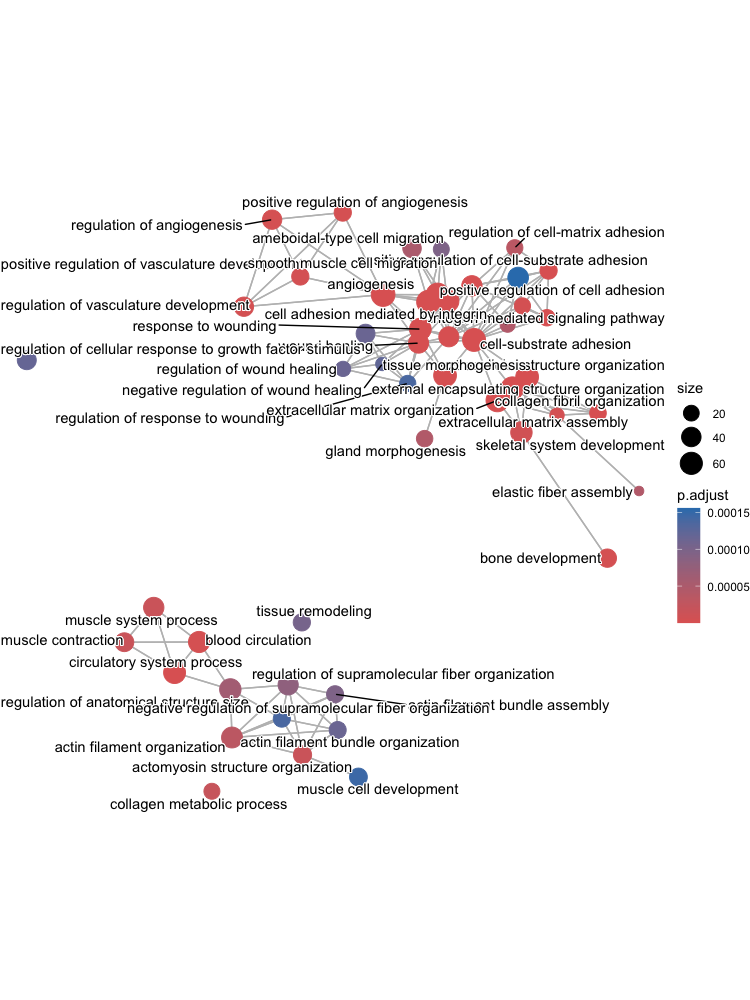

Approximate time: 40 minutes

## Learning Objectives:

*  Describe the theory of how functional enrichment tools yield statistically enriched functions or interactions
*  Discuss functional analysis using over-representation analysis, and functional class scoring
*  Run clusterProfiler on significant genes from pseudobulk DE analysis

## Functional analysis of pseudobulk differentially expressed genes
When it comes to functional analysis there are **various analyses** that can be done:

- Determine whether there is enrichment of known biological functions, interactions, or pathways
- Identify genes' involvement in novel pathways or networks by grouping genes together based on similar trends
- Use global changes in gene expression by visualizing all genes being significantly up- or down-regulated in the context of external interaction data

Generally for any differential expression analysis, it is useful to interpret the resulting gene lists using freely available web- and R-based tools.  While tools for functional analysis span a wide variety of techniques, they can loosely be categorized into three main types: over-representation analysis, functional class scoring, and pathway topology [[1](https://github.com/hbctraining/In-depth-NGS-Data-Analysis-Course/raw/master/resources/pathway_tools.pdf)]. 

<p align="center">

</p>

In this lesson, we will walk you through both an over-representation analysis and gene set enrichment analysis (GSEA) using an R Bioconductor package called [`clusterProfiler`](https://bioconductor.org/packages/release/bioc/vignettes/clusterProfiler/inst/doc/clusterProfiler.html)

## Over-representation analysis
Over-representation analysis (ORA) is used to determine which a priori defined gene sets are more present (over-represented) in a subset of “interesting” genes than what would be expected by chance [(Huang et al, 2009)](https://pmc.ncbi.nlm.nih.gov/articles/PMC2615629/). Most genes in the genome have some pre-existing annotation associated with it which has been compiled through a combination of manual curation and computational algorithms. There are a number of existing databases which define genes using a controlled vocabulary and then categorize genes into groups (gene sets) based on shared function, or involvement in a pathway, or presence in a specific cellular location etc. A very commonly used gene annotataion resource is the [Gene Ontology (GO) database](https://geneontology.org/), and is what we will use in our workflow.

We then use those categorizations to assess enrichment amongst our DE gene results and compare this to the enrichment observed in the larger universe of genes, to identify whether or not the enrichment observed is significant.

<p align="center">

</p>


### Hypergeometric test
The statistical test that will determine whether something is actually over-represented is the *Hypergeometric test*.

Hypergeometric distribution is a probability distribution that describes the probability of some number of genes (k) being associated with "Functional category 1", for all genes in our gene list (n=1000), compared to drawing some number of genes (K) associated with "Functional category 1" from a population of all of the genes in entire genome (N=13,000) [[2](https://en.wikipedia.org/wiki/Hypergeometric_distribution)].

The calculation of probability of k successes follows the formula:

<p align="center">  

</p>

This test will result in an adjusted p-value (after multiple test correction) for each category tested.

### Running ORA with clusterProfiler
Now that we know more about what ORA is doing, let's take our significant genes and see if there are any GO terms over-represented that align with what we expect to be happening in VSM cells with change of temperature.

In the workshop so far, we have run differential expression analysis using two different approaches: 

1. Using `FindMarkers()` and treating individual cells as replicates
2. Aggregating counts from all cells in sample to run pseudobulk DE

We will take **the results from the pseudobulk DE** and run different **functional analysis** methods to obtain some biological insight.

Open up a new R script and let's call it `functional-analysis.R`. The first thing we'll do is load the required libraries:

```r
# Load libraries
library(tidyverse)
library(clusterProfiler)
library(org.Mm.eg.db)
library(msigdbr)
```

Next, we will filter genes to remove any which have NA values in the padj column. These are genes that were not tested and so we do not want to consider them in our background set of genes. Once filtered, we create vectors containing our gene symbols for the background and query set of genes. We will query the up and down-regulated gene sets separately, but note that you can also use the entire significant list as input.

```r

## Untested genes have padj = NA, so let's keep genes with padj != NA
res_tbl_noNAs <- filter(res_tbl, padj != "NA" )

## Create background dataset for hypergeometric testing using all tested genes for significance in the results                 
all_genes <- as.character(res_tbl_noNAs$gene)

## Extract significant results for up-regulated
sigUp <- dplyr::filter(res_tbl_noNAs, padj < 0.05, log2FoldChange > 0)
sigUp_genes <- as.character(sigUp$gene)
```

Finally, we can perform the GO enrichment analysis and save the results:


```r
## Run GO enrichment analysis 
egoUp <- enrichGO(gene = sigUp_genes, 
                universe = all_genes,
                keyType = "SYMBOL",
                OrgDb = org.Mm.eg.db, 
                ont = "BP", 
                pAdjustMethod = "BH", 
                qvalueCutoff = 0.05, 
                readable = TRUE)
```


>**Note 1:** The different organisms with annotation databases available to use with for the `OrgDb` argument can be found [here](../img/orgdb_annotation_databases.png).
>
> **Note 2:** The `keyType` argument may be coded as `keytype` in different versions of clusterProfiler.
>
> **Note 3:**  The `ont` argument can accept either "BP" (Biological Process), "MF" (Molecular Function), and "CC" (Cellular Component) subontologies, or "ALL" for all three.

```r
## Output results from GO analysis to a table
cluster_summaryUp <- data.frame(egoUp)

write.csv(cluster_summaryUp, "results/clusterProfiler_VSM_TNvsCold7_upregulated.csv")
```          

> **NOTE:** Instead of saving just the results summary from the `ego` object, it might also be beneficial to save the object itself. The `save()` function enables you to save it as a `.rda` file, e.g. `save(ego, file="results/ego.rda")`. The statistsics stored in the object can be used for downstream visualization.
        

### Exploring results from over-representation analysis
Let's take a look at what terms are identified as over-represented in the genes up-regulated in cold conditions.

```r
View(cluster_summaryUp)
```

In the first few columns we see the GO identifier and the descriptive term name. In the next two columns that follow, we observe GeneRatio and BgRatio. These values allows us to compare the overlaps to the background.

* **BgRatio:** M/N
  * The total number of genes in the GO term gene set (_M_), divided by the total number of genes in universe (_N_)
* **GeneRatio**: k/n
  *  The total number of genes in our sig DE gene set which overlap with the GO term gene set (_k_), divided by the total number of genes in our sig DE gene set that overlap with the universe gene set (_n_)

Other columns of interest are the **p.adjust** column (by which results are ordered by default), and the **geneID** column which lists the gene symbols of the overlapping genes.

<p align="center">  

</p>


When cold induces a response in vascular smooth muscle cells (VSMCs), the primary transcriptional change observed is an up-regulation of genes related to vasoconstriction. Vasoconstriction is when the muscles around your blood vessels tighten to make the space inside smaller. In our results table we see **significant terms such as extracellular matrix organization, and cell proliferation** which makes sense because the cold temperatures will lead to a shift towards a more **contractile phenotype**. We also observe up-regulation of genes involved in **cell adhesion and tight junction formation**,  which are processes related to **maintaining vascular integrity**.

***

**Exercise:**

1. Using the code above as a template, run the over-reresentation analysis on the significantly down-regulated genes from the pseudobulk analysis.
   * How many significant terms do you find?
   * What are some of the prominent biological processes that are observed?
  
***

### Visualizing over-representation analysis results
`clusterProfiler` has a variety of options for viewing the over-represented GO terms. We will explore the dotplot and the enrichment plot in this lesson.

The **dotplot** shows statistics associated with a user-selected top number of significant terms. The color of the dots represent the p-adjusted values for these terms, and size of the dots corresponds to the total count of sig DE genes annotated with the GO term (count). This plot displays the top 20 GO terms ordered by gene ratio, not p-adjusted value.

```r
## Dotplot 
dotplot(ego, showCategory=20)
```

**To save the figure,** click on the `Export` button in the RStudio `Plots` tab and `Save as PDF...`. In the pop-up window, change:
- `Orientation:` to `Landscape`
- `PDF size` to `8 x 14` to give a figure of appropriate size for the text labels

<p align="center"> 

</p> 
  
The next plot is the **enrichment GO plot**, which shows the relationship between the top 50 most significantly enriched GO terms (padj.), by grouping similar terms together. Before creating the plot, we will need to obtain the similarity between terms using the `pairwise_termsim()` function ([instructions for emapplot](https://rdrr.io/github/GuangchuangYu/enrichplot/man/emapplot.html)). In the enrichment plot, the color represents the p-values relative to the other displayed terms (brighter red is more significant), and the size of the terms represents the number of genes that are significant from our list.

```r
## Add similarity matrix to the termsim slot of enrichment result
ego <- enrichplot::pairwise_termsim(ego)

## Enrichmap clusters the 50 most significant (by padj) GO terms to visualize relationships between terms
emapplot(ego, showCategory = 50)
```

**To save the figure,** click on the `Export` button in the RStudio `Plots` tab and `Save as PDF...`. In the pop-up window, change the `PDF size` to `12 x 14` to give a figure of appropriate size for the text labels.

<p align="center"> 

</p> 

## Gene Set Enrichment Analysis (GSEA)
While over-representation analysis is helpful and commonly used, it does require you to subset your gene list using an arbitrary threshold. There could very well be many genes that very narrowly miss this threshold and are therefore not considered in the functional analysis. To get around this there are there are **functional class scoring (FCS) methods** which can be helpful. For these methods the hypothesis is that **although large changes in individual genes can have significant effects on pathways (and will be detected via ORA methods), weaker but coordinated changes in sets of functionally related genes (i.e., pathways) can also have significant effects**. Thus, rather than setting a threshold to identify 'significant genes', all genes are considered in the analysis. The gene-level statistics from the dataset are aggregated to generate a single pathway-level statistic and statistical significance of each pathway is reported. This type of analysis can be particularly helpful if the differential expression analysis only outputs a small list of significant DE genes.

A commonly used example of an FCS method is GSEA [(Subramanium A. et al, 2005)](https://www.pnas.org/doi/10.1073/pnas.0506580102). Gene set enrichment analysis utilizes the gene-level statistics or log2 fold changes for all genes to look to see whether gene sets for particular biological pathways (i.e. derived from KEGG pathways, Gene Ontology terms, MSigDB etc) are enriched among the large positive or negative fold changes.

<p align="center"> 

</p>

_Image source: [(Subramanium A. et al, 2005)](https://www.pnas.org/doi/10.1073/pnas.0506580102)_

This image describes the theory of GSEA, with the 'gene set S' showing the metric used (in our case, ranked log2 fold changes) to determine enrichment of genes in the gene set. There are four main steps that are being performed:

1. **Rank genes**:
    * Genes in a data set are ranked based on the given statistic, which in our case is the log2 fold changes. 
2. **Calculate enrichment scores for each gene set**
   * This score reflects how often genes in the set appear at the top or bottom of the ranked list.
   * The score is calculated by walking down the list of log2 fold changes and increasing the running-sum statistic every time a gene in the gene set is encountered and decreasing it when genes are not part of the gene set.
   * Increase/decrease is determined by magnitude of fold change 
3. **Estimate statistical significance**
   *  A permutation test is used to calculate a null distribution for the enrichment score. This produces a p-value that represents the probability of observing a given enrichment score. 
4. Adjust for **multiple hypothesis testing**
   * Enrichment scores are normalized for the size of each gene set and a false discovery rate is calculated to prevent false positives

### Setting up for GSEA

The clusterProfiler package offers several functions to perform GSEA using different genes sets, including but not limited to GO, KEGG, and MSigDb. We will use the MSigDb gene sets in our example below. The Molecular Signatures Database (also known as [MSigDB](https://www.gsea-msigdb.org/gsea/msigdb/mouse/collections.jsp)) is a collection of annotated gene sets. It contains 8 major collections for mouse, and for our analysis we will use C5 which contains the Gene Ontology gene sets. We can see how this aligns with our ORA result.

First 


The KEGG gene sets are defined using the Entrez identifiers, thus to perform the analysis we will need to acquire the corresponding Entrez IDs for our genes. We will also need to remove any genes that do not have an Entrez ID (NA values) and any duplicates (due to gene ID conversion) that may exist:

```r
## Remove any NA values (reduces the data by quite a bit)
res_entrez <- dplyr::filter(res_ids, entrezid != "NA")

## Remove any Entrez duplicates
res_entrez <- res_entrez[which(duplicated(res_entrez$entrezid) == F), ]
```

GSEA will use the log2 fold changes obtained from the differential expression analysis for every gene, to perform the analysis. We will obtain a vector of fold changes for input to clusterProfiler, in addition to the associated Entrez IDs:

```r
## Extract the foldchanges
foldchanges <- res_entrez$log2FoldChange

## Name each fold change with the corresponding Entrez ID
names(foldchanges) <- res_entrez$entrezid
```

Next we need to order the fold changes in decreasing order. To do this we'll use the `sort()` function, which takes a vector as input. This is in contrast to Tidyverse's `arrange()`, which requires a data frame.

```r
## Sort fold changes in decreasing order
foldchanges <- sort(foldchanges, decreasing = TRUE)

head(foldchanges)
```


***

*This lesson has been developed by members of the teaching team at the [Harvard Chan Bioinformatics Core (HBC)](http://bioinformatics.sph.harvard.edu/). These are open access materials distributed under the terms of the [Creative Commons Attribution license](https://creativecommons.org/licenses/by/4.0/) (CC BY 4.0), which permits unrestricted use, distribution, and reproduction in any medium, provided the original author and source are credited.*
