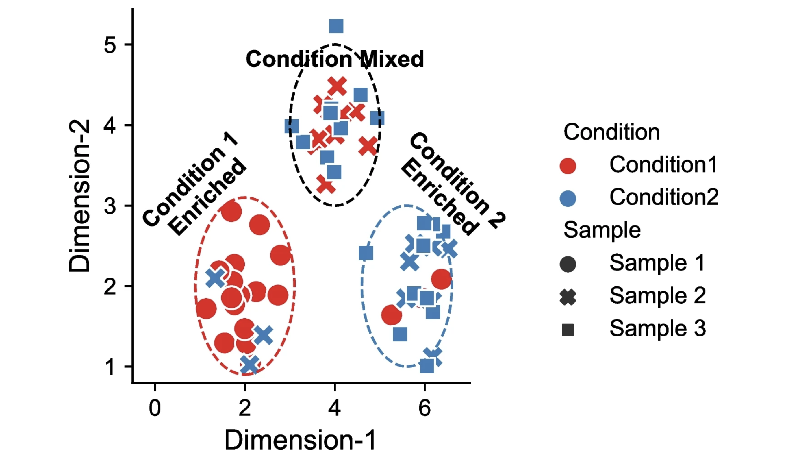

## Learning Objectives
* Describe current approaches for evaluating differences in cell proportions between groups
* Distinguish between cluster-based and cluster-free methods for DA analysis
* Run miloR for differential abundance analysis on VSM cells

## Differential abundance of celltypes
Differential abundance (DA) analysis is a method used to identify celltypes with statistically significant changes in abundance between different biological conditions.  The overall aim is to find sub-populations of cells in which the ratio of cells from the two conditions is significantly different from the ratios observed in the overall data. Methods for differential abundance have been successfully used in practice in both clinical and experimental settings. For example, these approaches highlighted an increased presence of granulocytes, monocytes, and B cells in fatal cases of COVID-19 ([1](https://www.nature.com/articles/nbt.2317)). 

The figure below is taken from a [2024 benchmarking study of DA approaches](https://genomebiology.biomedcentral.com/articles/10.1186/s13059-023-03143-0#Fig1), and nicely illustrates DA effects.


<p align="center">

</p>


### Cluster-based approaches for DA
These methods are dependent on having cells grouped into phenotypically similar cell populations, most classically aligning with specific cell types. Many single cell RNA-seq data analyses workflow produce a result with annotated sub-populations, making these tools very easy to implement as a next step. 

The **propellor method** is a function that is part of the [speckle R package]( https://github.com/phipsonlab/speckle), which uses cell level annotation information to calculate differential abundance estimates. First, cell type proportions are calculates for each sample. This results in matrix of proportions where the rows are the cell types, and the columns are the samples. The matrix is then transformed such that a linear modeling framework can be applied. If there are exactly two groups, moderated t-tests are implemented; if there are more than two groups, the option is a moderated ANOVA test. These tests are moderated using an empirical Bayes framework, borrowing information across all cells and finally false discovery rates are calculated.

<p align="center">

</p>

_Image source: [Phipson B. et al, 2022](https://academic.oup.com/bioinformatics/article/38/20/4720/6675456)_

While propellor and other approaches which are based on linear regression (i.e. scDC, diffcyt) transform the data to model data compositionality, they do not model the data count distribution.  Modeling single-cell compositional data as counts is important as small datasets and rare cell types are characterized by a high noise-to-signal ratio, and modeling counts enables the down-weighting of small cell-group proportions compared to larger ones ([Mangiola s. et al, 2023](https://www.pnas.org/doi/10.1073/pnas.2203828120)). The **[sccomp](https://github.com/MangiolaLaboratory/sccomp) package** is a generalized **method for differential composition and variability analyses based on sum-constrained independent Beta-binomial distributions**. The sccomp core algorithm, data integration, and visualization are outlined in the figure below. Two important features of this method includes outlier detection and differential variability analysis.

<p align="center">

</p>


### Cluster-free approaches
The clustering step can however be problematic, especially in cases **where the sub-populations most responsive to the biological state do not fall into well-defined separate clusters**. 

* For example, subpopulations that are differentially abundant between conditions may be distributed among several adjacent clusters or, alternatively, encompass only a part of a cluster.
* A requirement for clustering could also compromise results for continuous processes where no clear cluster structure exists, such as cell cycles or certain developmental programs. For the above scenarios, differential abundance at a cluster level may miss the important molecular mechanisms that differentiate between the states.
  
In this lesson, **we will explore the use of MiloR for differential abundance analysis**. This tool does not rely on clustering of cells into discrete groups and instead makes use of a : k-nearest neighbor (KNN) graphs, a common data structure that is embedded in many single-cell analyses ([Dann E. et al, 2021]( https://www-nature-com.ezp-prod1.hul.harvard.edu/articles/s41587-021-01033-z).) 

>**NOTE**: Although we present the code and workflow for MiloR in this lesson, this does not suggest this to be a conclusive best practice for DA analysis.   


## Differential abundance analysis with MiloR

Looking at single-cell datasets on a cluster/celltype level is a very common mode of analysis. However, perhaps you have questions on the more subtle shifts within a certain cell population. The tool [miloR](https://www.nature.com/articles/s41587-021-01033-z) allows you to look more deeply into smaller neighborhoods of cells by utilizng differential abundance testing on the k-nearest neighbor graph.

<p align="center">

</p>

The general method of this tool is to assign cells to neighborhhods based upon a latent space (typically PCA) and neighborhood graph. Ultimately, we generate a neighborhood by counts matrix. These counts are modelled with negative bionomical generalized linear model which is then put through hypothesis testing to identify significantally differential abundant neighborhoods with associated fold change values.


### Create new script

To start, open a new Rscript file, and start with some comments to indicate what this file is going to contain:

```r
# Single-cell RNA-seq analysis - differential abundance analysis with MiloR
```

Save the Rscript as `miloR_analysis_scrnaseq.R`.


### Load libraries

As usual, let us load the libraries needed at the beginning of our script.

```r
library(Seurat)
library(tidyverse)
library(SingleCellExperiment)
library(dplyr)
library(miloR)
library(EnhancedVolcano)
```

### Select cell subsets

For continuity, let us take a look at the VSM cells and look at the differences between the `TN` and `cold7` conditions. Here we are also going to set our seed so that we are all introducin the same randomness values in later steps.

```r
set.seed(2024)

# VSM cells
seurat_vsm <- subset(seurat, subset = (celltype == "VSM"))
seurat_vsm <- subset(seurat_vsm, subset = (condition %in% c("TN", "cold7")))
```

MiloR generates the neighborhoods based upon the UMAP coordinates supplied, so we will re-run the necessary steps from our seurat pipeline on this new subset. Since we have fewer cells than the larger datset, will use 30 PCA dimensions calculated from 2,000 highly variable genes. Following a typical seurat workflow, we then calculate UMAP coordinates, neighborhoods, and clusters for later comparisons. We are also supplying specific names for the graphs and cluster names to avoid overwriting the previous metadata.

```r
# HVG, PCA, UMAP, neighborhoods, calculate clusters
seurat_vsm <- FindVariableFeatures(seurat_vsm, verbose=FALSE, nfeatures=2000)
seurat_vsm <- ScaleData(seurat_vsm, verbose=FALSE)
seurat_vsm <- RunPCA(seurat_vsm, verbose = FALSE)
seurat_vsm <- RunUMAP(seurat_vsm, dims = 1:30, verbose=FALSE)
seurat_vsm <- FindNeighbors(seurat_vsm, dims = 1:30,
                           graph.name="vsm_graph", verbose=FALSE)

# Determine the clusters at resolution 0.4
seurat_vsm <- FindClusters(seurat_vsm, cluster.name="vsm_clusters",
                          resolution=0.4, graph.name="vsm_graph",
                          verbose=FALSE)

Idents(seurat_vsm) <- "condition"
DimPlot(seurat_vsm, group.by=c("condition", "vsm_clusters"))
```

<p align="center">
  
</p>

We see a distinct separation of cells based upon which sample the cells come from, which will allow us to clearly identify changes in our dataset by condition with MiloR.

### Creating single cell experiment

In order to make use of the MiloR package, we must format our datset in the correct way. There is another data structure known as `SingelCellExperiment` that is commonly used to analyze single-cell experiments. We will first convert our Seurat object and investigate the underlying structure so that we can easily use and modify the object according to our needs.

```r
# Create SingleCellExperiment object
DefaultAssay(seurat_vsm) <- "RNA"
sce_vsm <- as.SingleCellExperiment(seurat_vsm)
```

A SingleCellExperiment stores metadata, counts matrix, and reductions in the following way:

<p align="center">
  
</p>

_Image credit: [Amezquita, R.A., Lun, A.T.L., Becht, E. et al.](https://doi-org.ezp-prod1.hul.harvard.edu/10.1038/s41592-019-0654-x)_

We can use the functions from the SingleCellExperiment package to extract the different components. Let’s explore the counts and metadata for the experimental data.

```r
## Explore the raw counts for the dataset

# Check the assays present
assays(sce_vsm)

# Explore the raw counts for the dataset
dim(counts(sce_vsm))

# Access the first 6 genes and cells in the counts matrix
counts(sce_vsm)[1:6, 1:6]
```

```
6 x 6 sparse Matrix of class "dgCMatrix"
       AAACCCACAGCTATTG_1 AAACGAAAGGGCGAAG_1 AAACGAACATTCGATG_1 AAACGAAGTAGCTCGC_1 AAACGAAGTTGGCTAT_1 AAACGAATCTGATTCT_1
Xkr4                    .                  .                  .                  .                  .                  .
Gm1992                  .                  .                  .                  .                  .                  .
Rp1                     .                  .                  .                  .                  .                  .
Sox17                   .                  .                  .                  .                  .                  .
Mrpl15                  2                  2                  .                  1                  1                  .
Lypla1                  .                  .                  .                  .                  .                  .
```

We see the raw counts data is a cell by gene sparse matrix with the same genes (rows) and columns (cells) as in our seurat object.

Next, we can get an idea of how to access the metadata in our object by using the `colData()` function:

```r
## Explore the cellular metadata for the dataset
dim(colData(sce_vsm))

head(colData(sce_vsm))
```

### Creating Milo object

Now that we better understand how to use a SingleCellExperiment, we can convert it to a Milo object. While there are slight differences in this object, the basic idea of how to access metadata and counts information is consistent with a SingleCellExperiment. To avoid re-computing PCA and UMAP coordinates, we are going to store the Seurat generated values in the `Embeddings` slot of our Milo variable.

```r
# Create miloR object
milo_vsm <- Milo(sce_vsm)

# Store previously computed PCA and UMAP values
reducedDim(milo_vsm, "PCA") <- Embeddings(seurat_vsm, reduction="pca")
reducedDim(milo_vsm, "UMAP") <- Embeddings(seurat_vsm, reduction="umap")
milo_vsm
```

```
class: Milo 
dim: 19771 5847 
metadata(0):
assays(2): counts logcounts
rownames(19771): Xkr4 Gm1992 ... CAAA01118383.1 CAAA01147332.1
rowData names(0):
colnames(5847): AAACCCACAGCTATTG_1 AAACGAAAGGGCGAAG_1 ...
  TTTGACTAGGCTTCCG_16 TTTGTTGAGGGACAGG_16
colData names(18): orig.ident nCount_RNA ... vsm_clusters ident
reducedDimNames(2): PCA UMAP
mainExpName: RNA
altExpNames(0):
nhoods dimensions(2): 1 1
nhoodCounts dimensions(2): 1 1
nhoodDistances dimension(1): 0
graph names(0):
nhoodIndex names(1): 0
nhoodExpression dimension(2): 1 1
nhoodReducedDim names(0):
nhoodGraph names(0):
nhoodAdjacency dimension(2): 1 1
```

## Milo workflow

Now that we have our dataset in the correct format, we can begin utilizing the Milo workflow.


### Creating neighborhoods

Step one is to generate the k-nearest neighborhood graph with the `buildGraph()` function. The parameters include selected a `k` neighbors and `d` dimensions (PCs):

- `k`: An integer scalar that specifies the number of nearest-neighbours to consider for the graph building. Default is 10.
- `d`: The number of dimensions to use if the input is a matrix of cells. Deafult is 50.


```r
# Build the graph
traj_milo <- buildGraph(milo_vsm, k = 10, d = 30)
```

Afterwards we use the `makeNhoods()` function to define the neighborhoods based upon the graph calculated before. These neighborhoods are then refined further by evaluating the median PC values and vetrices to generate a minimal, but informative graph of the data. Relevant parameters for this function are:

- `prop`: A double scalar that defines what proportion of graph vertices to randomly sample. Must be 0 < `prop` < 1. Default is 0.1.
- `k`: An integer scalar - the same k used to construct the input graph. Default is 21.
- `d`: The number of dimensions to use if the input is a matrix of cells X reduced dimensions. Default is 30.

Once we generate these neighborhoods, we can visualize the number of cells that belong to each neighborhood as a histogram. If the number of cells in each neighborhood are too small for our given dataset, this could be an indication that we need to select a different value for `k`. 

```r
traj_milo <- makeNhoods(traj_milo, prop = 0.1, k = 10, d=30, refined = TRUE)

plotNhoodSizeHist(traj_milo)
```

<p align="center">
  
</p>


### Creating metadata

Now that we have identified which cells belong to which neighborhoods, we can quantify how many cells from each `sample` belong to each neighborhood. 

```r
# Count number of cells per neighborhood
traj_milo <- countCells(traj_milo,
                        meta.data = colData(traj_milo),
                        sample="sample")

nhoodCounts(traj_milo) %>% head()
```

```
6 x 8 sparse Matrix of class "dgCMatrix"
  Sample_1 Sample_2 Sample_9 Sample_10 Sample_7 Sample_8 Sample_15 Sample_16
1        .        .       12        18        .        .         .         .
2       16        2        .         .        1        .         .         .
3       28        2        .         2        .        .         1         .
4        3        .       13        19        .        .         .         .
5       17        3        .         1        .        .         .         .
6        3        .        9        23        .        .         .         .
```

In this way, we can account for technical variability across replicates. To define which samples belong to which condition, we next create a metdata dataframe. This table will contain all of the relevant pieces of information for the comparisons we want to run, including the sample names as well. In the case of this experiment, we need the columns `sample` and `condition`. 

```r
# Create metadata
# Subset to columns of importance
# Get distinct/unique values
# Set sample as the rownames
traj_design <- colData(traj_milo) %>%
                  data.frame() %>%
                  select(sample, condition) %>%
                  distinct() %>%
                  remove_rownames() %>%
                  column_to_rownames("sample")

# Reorder rownames to match columns of nhoodCounts()
order_rows <- colnames(nhoodCounts(traj_milo))
traj_design <- traj_design[order_rows, , drop=FALSE]

traj_design
```

```
          condition
Sample_1         TN
Sample_2         TN
Sample_9         TN
Sample_10        TN
Sample_7      cold7
Sample_8      cold7
Sample_15     cold7
Sample_16     cold7
```

Now we have all the relevant information to begin testing differential abundance!

### Run differential abundance

To test the differences in neighborhoods, we first calculate the Euclidean dsitances between nearest neighborhoods using the PCs that the graph was first constructed upon with the `calcNhoods()` function. With the distances computed for each neighborhood in our dataset, we can begin assessing the overlap in neighborhoods. This is accomplished with the Spatial FDR correction where each hypothesis test p-values are adjusted based upon the nearest neighbor distances. 

This step may take some time to run for a large dataset.


```r
# Calculate differential abundance
# This may take some time to run
traj_milo <- calcNhoodDistance(traj_milo, d=30) 
```

Now we can finally calculate the differential abundance across the neighborhoods with `testNhoods()`. We specify the `design`, or the model we want to use in the comparison. The columns used in design must be found within the `design.df` metadata dataframe. This results in a dataframe with the following [columns](https://rdrr.io/github/MarioniLab/miloR/man/testNhoods.html):

- `logFC`: Numeric, the log fold change between conditions, or for an ordered/continous variable the per-unit change in (normalized) cell counts per unit-change in experimental variable.
- `logCPM`: Numeric, the log counts per million (CPM), which equates to the average log normalized cell counts across all samples.
- `F`: Numeric, the F-test  statistic from the quali-likelihood F-test implemented in edgeR.
- `PValue`: Numeric, the unadjusted p-value from the quasi-likelihood F-test.
- `FDR`: Numeric, the Benjamini & Hochberg false discovery weight computed from p.adjust.
- `Nhood`: Numeric, a unique identifier corresponding to the specific graph neighbourhood.
- `SpatialFDR`: Numeric, the weighted FDR, computed to adjust for spatial graph overlaps between neighbourhoods. 


```r
da_results <- testNhoods(traj_milo, 
                         design = ~ condition, 
                         design.df = traj_design)

da_results %>% head()
```

```
      logFC   logCPM         F       PValue         FDR Nhood  SpatialFDR
1  5.383966 11.80962  3.997345 0.0456731668 0.150747056     1 0.147279465
2  5.439519 11.84264  4.145856 0.0418350534 0.150747056     2 0.147279465
3  3.514925 10.98646  1.607903 0.2048973695 0.252574320     3 0.249984729
4  5.353711 11.79050  3.950876 0.0469489658 0.150747056     4 0.147279465
5  5.063808 11.63182  3.576596 0.0587072653 0.150747056     5 0.147279465
6 -7.876050 13.52804 13.522319 0.0002403926 0.006379396     6 0.009554048
```

Now that we have our neighborhoods, we can add extra metadata to these results. For example, we can annotate these groups by the percentage of cells in the neighborhood belong to each condition using the `annotateNhoods()` function. Bear in mind that the `coldata_col` variable must be a column found in `colData()` of the milo object. This will create two new columns where `condition` represents what condition the majority of cells belong to, while `condition_fraction` represent the percent of cells annotated with that condition.

The developers of MiloR were cognicent of the fact that there may be neighborhoods of cells where there is a mix of two conditions. In their vignette, they recommend categorizing these neighborhoods as "Mixed".


```r
# Annotate neighborhoods by condition
da_results <- annotateNhoods(traj_milo, da_results, coldata_col = "condition")

# Categorize neighborhoods with < 70% of one condition as mixed
da_results$anno_condition <- ifelse(da_results$condition_fraction < 0.7,
                                    "Mixed",
                                    da_results$condition)

# Annotate neighborhoods by cluster
da_results <- annotateNhoods(traj_milo, da_results, coldata_col = "vsm_clusters")
```

The final piece of information is added to this dataframe of differential abundance results with the `groupNhoods()` function. This will run the louvain clustering algorithm to identify neighborhoods that are overlapping and similar to one another. This `max.lfc.delta` specifies a cutoff of fold change difference where two neighborhoods would not be considered a part of the same group. 

> Note that the exact number of groups may vary due to randomness in the model. Even if the results are not identical to what is displayed here, the general trends of the data should be similar. 

```r
# Find group structure of neighborhoods
da_results <- groupNhoods(traj_milo, da_results, max.lfc.delta = 2)

da_results %>% head()
```

```
     logFC   logCPM        F     PValue        FDR Nhood SpatialFDR condition condition_fraction vsm_clusters vsm_clusters_fraction NhoodGroup
1 5.445933 12.18821 5.450655 0.01963098 0.06029826     1 0.05838122        TN          1.0000000            0             1.0000000          1
2 2.702203 11.86498 1.615816 0.20378127 0.23482411     2 0.22899789        TN          0.9473684            1             0.5263158          1
3 3.278148 12.22262 2.626844 0.10518241 0.13154813     3 0.12837834        TN          0.9696970            0             0.8484848          1
4 5.641968 12.30574 5.958004 0.01471187 0.06029826     4 0.05838122        TN          1.0000000            2             0.9714286          2
5 4.978833 11.93259 4.434042 0.03531737 0.06930480     5 0.06660339        TN          1.0000000            1             0.9523810          3
6 5.564923 12.25916 5.783074 0.01624543 0.06029826     6 0.05838122        TN          1.0000000            2             0.4000000          4
```

## Visualization

Now, with all the information we have we can visualize the differential abundance results using the UMAP coordinates that we initially supplied. 

### Neighborhoods overlaid UMAP

Each dot represents a different neighborhood, with the size of the dot representing how many cells belong to that neighborhood. The color of the circle represent the log-fold change for that neighborhood, from the `da_results` object.

We can also represent the neighborhoods according to the group structure that was calculated with the `groupNhoods()` function. The expectation here would be that the group structure bears a resemblance the clusters calculated after subsetting the data. 


```r
traj_milo <- buildNhoodGraph(traj_milo)
p1 <- plotNhoodGraphDA(traj_milo, da_results, alpha=0.1)
p2 <- plotNhoodGroups(traj_milo, da_results) 

p1 + p2
```

<p align="center">
  
</p>


### Bee swarm plots

Another built in visualization can be accessed with the `plotDAbeeswarm()` function. In these visualizations, each point represents a neighborhood which are grouped together according to the `group.by` parameter. Along the x-axis, these neighborhoods are spread out according to their log fold change score. This clearly shows the distribution of significant fold changes across difference groups.

To begin, let's look at the change in neighborhood expression across our two conditions.

```r
plotDAbeeswarm(da_results, group.by = "condition")
```

<p align="center">
  
</p>


As expected, we see a clear FDR divide based upon condition as that was the `design` variable we computed the different neighborhoods on.


We can additionally take a look at the seurat clusters that were calculated earlier to see how the neighborhoods distribute across the clusters.


```r
plotDAbeeswarm(da_results, group.by = "vsm_clusters")
```

<p align="center">
  
</p>


Note that in cluster 4, there appears to be a mix of both cold7 and TN neighborhoods (as indicated by the fold change values). This is an indication that this cell state is one that is shared across both conditions and is not unique to the experimental design.


Finally, we can make the same visualization for the neighborhood groups. This will help us identify two different groups we may be interested in running a DGE analysis in the next step.


```r
plotDAbeeswarm(da_results, group.by = "NhoodGroup")
```

<p align="center">
  
</p>


## Neighborhood differential genes 

Within the Milo package, we can even run a DGE analysis between different groups in our `DA_results` dataframe. We can test one group vs. rest of cells (similar to the `FindAllMarkers()` function within Seurat) with the `findNhoodGroupMarkers()` function. Ultimately this function makes use of the `limma` package. In doing so, we will have a `LogFC_{group}` and `adj.P.Val_{group}` for every single gene we specifiy. For simplicity, we will use the 2,000 highly variable genes. Additionally, to take into account variability across replicates, we set the `aggregate.samples` parameter to be true and specify which metadata column (in `colData`) indicates which cell comes from which sample.

```r
# Use variable genes
hvgs <- VariableFeatures(seurat_vsm)
nhood_markers <- findNhoodGroupMarkers(traj_milo,
                                       da_results,
                                       subset.row = hvgs, 
                                       aggregate.samples = TRUE,
                                       sample_col = "sample")
```

If there are two neighborhoods groups of interest, instead we can run DE on just those two subsets with the `subset.nhoods` argument. As an example, let us look at neighborhood groups 1 and 3.

```r
# Compare group 1 and 3
nhood_markers <- findNhoodGroupMarkers(traj_milo,
                                       da_results,
                                       subset.row = hvgs,
                                       subset.nhoods = da_results$NhoodGroup %in% c('1', '3'),
                                       aggregate.samples = TRUE, sample_col = "sample")


nhood_markers %>% arrange(desc(abs(logFC_1))) %>% head()
```

```
    GeneID   logFC_1  adj.P.Val_1   logFC_3  adj.P.Val_3
1      Mt1  1.574481 0.0001022295 -1.574481 0.0001022295
2  Gm13889  1.122213 0.0026749159 -1.122213 0.0026749159
3      Fos -1.081121 0.0500258626  1.081121 0.0500258626
4    Cebpb  1.073674 0.0011078978 -1.073674 0.0011078978
5    Nr4a2  1.046689 0.0008368211 -1.046689 0.0008368211
6 Crispld2  1.013613 0.0341118238 -1.013613 0.0341118238
```

Same as we have been doing throughout the workshop, we can then create a volcano plot of the DGE results.

```r
EnhancedVolcano(nhood_markers,
                nhood_markers$GeneID,
                x = "logFC_1",
                y = "adj.P.Val_1",
                FCcutoff = 0.5,
                pCutoff = 0.01)
```

<p align="center">
  
</p>

We can even generate a heatmap of expression per-neighborhood with the `plotNhoodExpressionGroups()` function. First, we can identify the top 10 genes in neighborhood group 1 based upon the log-fold change value. We can then supply those genes into our function and again subset the groups to 1 and 3.

This visualization represents the averaged expression of each gene among the cells in each each neighborhood.

```r
# P-value < 0.01
# Make sure marker gene is in dataset
# Select LFC > 1
# Sort genes by LFC score
markers <- nhood_markers %>% 
              subset(adj.P.Val_1 < 0.01) %>%
              subset(logFC_1 > 0.5) %>%
              subset(GeneID %in% rownames(traj_milo)) %>%
              arrange(logFC_1)

# Top 10 markers
genes <- markers$GeneID[1:10]

# Heatmap of top 10 marker genes for groups 1 and 3
plotNhoodExpressionGroups(traj_milo,
                          da_results,
                          features=genes,
                          subset.nhoods = da_results$NhoodGroup %in% c('1','3'), 
                          scale=TRUE,
                          grid.space = "fixed",
                          cluster_features = TRUE)
```

<p align="center">
  
</p>


As we would expect, these genes are much more highly expressed in group 1 compared to group 3. This provides us with another, cluster-free alternative to looking at more subtle shifts in gene expression across smaller groups.

---

Now that you have reached the end of you analysis, make sure to output the versions of all tools used in the DE analysis:

```r
sessionInfo()
```


For better reproducibility, it can help to create RMarkdown reports, which save all code, results, and visualizations as nicely formatted html reports. We have a very basic example of a [report](https://www.dropbox.com/s/4bq0chxze6dogba/workshop-example.html?dl=0) linked here. To create these reports we have [additional materials](https://hbctraining.github.io/Training-modules/Rmarkdown/) available.


---

*This lesson has been developed by members of the teaching team at the [Harvard Chan Bioinformatics Core (HBC)](http://bioinformatics.sph.harvard.edu/). These are open access materials distributed under the terms of the [Creative Commons Attribution license](https://creativecommons.org/licenses/by/4.0/) (CC BY 4.0), which permits unrestricted use, distribution, and reproduction in any medium, provided the original author and source are credited.*
