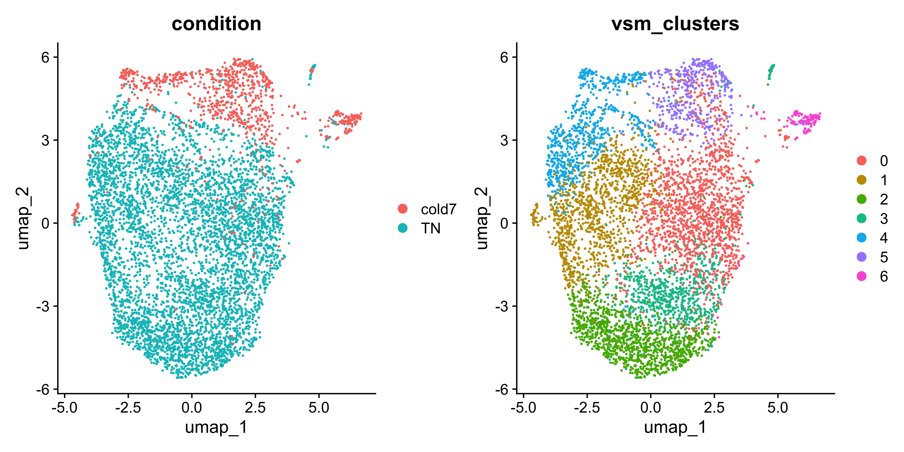
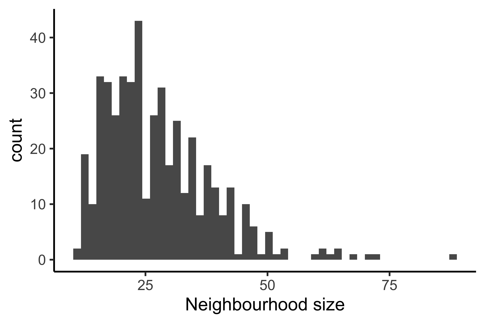
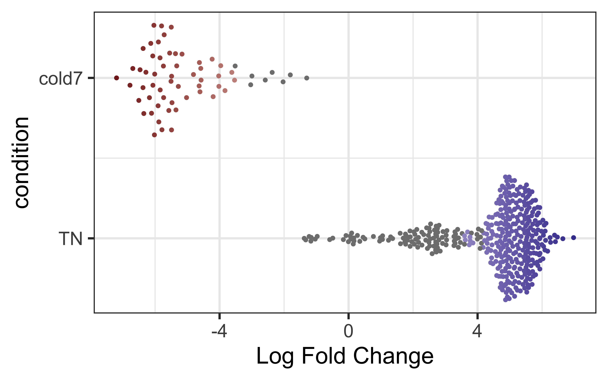
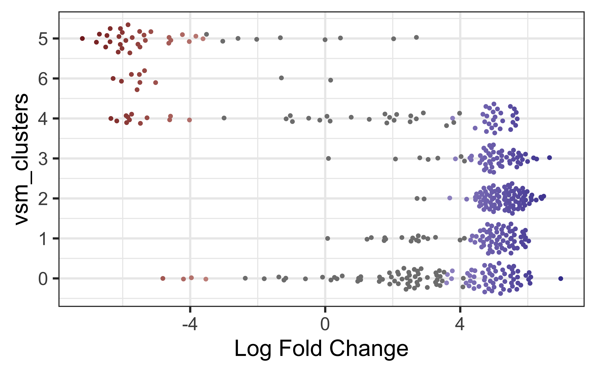
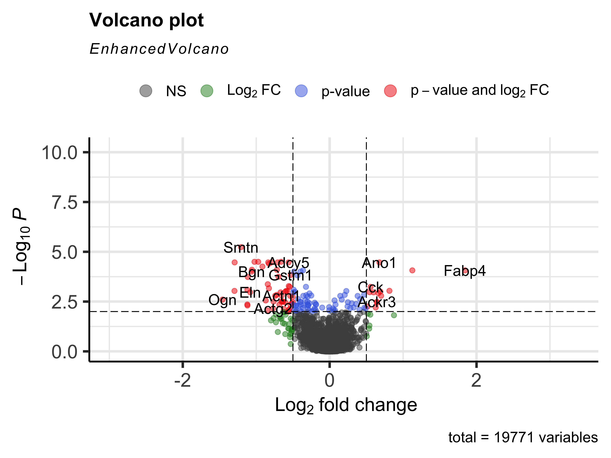
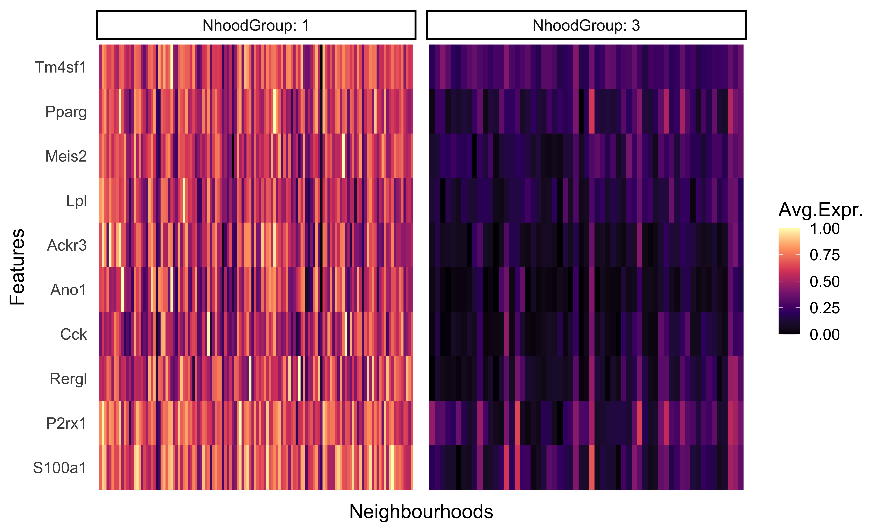

## Learning Objectives
* Describe current approaches for evaluating differences in cell proportions between groups
* Run miloR for differential abundance analysis on VSM cells

## Differential abundance of celltypes
Differential abundance (or proportion) analysis is a method used to identify cell types with statistically significant changes in abundance between different biological conditions. Some tools and methods for differential proportion analysis include:

* ...
* 

## MiloR

# Differential abundance analysis with MiloR

Looking at single-cell datasets on a cluster/celltype level is a very common mode of analysis. However, perhaps you have questions on the more subtle shifts within a certain cell population. The tool [miloR](https://www.nature.com/articles/s41587-021-01033-z) allows you to look more deeply into subtle shifts in smaller neighborhoods of cells by utilizng differential abundance testing on the k-nearest neighbor graph.

<p align="center">

</p>

# Creating Milo object

## Create new script

Next, open a new Rscript file, and start with some comments to indicate what this file is going to contain:

```r
# Single-cell RNA-seq analysis - differential abundance analysis with MiloR
```

Save the Rscript as `miloR_analysis_scrnaseq.R`.


## Load libraries

As usual, let us load the libraries needed at the beginning of our script.

```r
library(Seurat)
library(tidyverse)
library(SingleCellExperiment)
library(dplyr)
library(miloR)
library(EnhancedVolcano)
```

## Select cell subsets

For continuity, let us take a look at the VSM cells and look at the differences between the `TN` and `cold7` conditions.

```r
seurat_vsm <- subset(seurat, subset = (celltype == "VSM"))
seurat_vsm <- subset(seurat_vsm, subset = (condition %in% c("TN", "cold7")))
```

MiloR generates the neighborhoods based upon the UMAP coordinates supplied, so we will re-run the necessary steps from our seurat pipeline on this new subset.

```r
# HVG, PCA, UMAP, neighborhoods, calculate clusters
seurat_vsm <- FindVariableFeatures(seurat_vsm, verbose=FALSE, nfeatures=2000)
seurat_vsm <- ScaleData(seurat_vsm, verbose=FALSE)
seurat_vsm <- RunPCA(seurat_vsm, verbose = FALSE)
seurat_vsm <- RunUMAP(seurat_vsm, dims = 1:30, verbose=FALSE)
seurat_vsm <- FindNeighbors(seurat_vsm, dims = 1:30,
                           graph.name="vsm_graph", verbose=FALSE)

# Determine the clusters at resolution 0.4
seurat_vsm <- FindClusters(seurat_vsm, cluster.name="vsm_clusters",
                          resolution=0.4, graph.name="vsm_graph",
                          verbose=FALSE)

Idents(seurat_vsm) <- "condition"
DimPlot(seurat_vsm, group.by=c("condition", "vsm_clusters"))
```

<p align="center">
  
</p>


## Creating single cell experiment

Seurat is not the only format with which we can load in single-cell data. There is another data structure known as `SingelCellExperiment` which MiloR makes use of. 

```r
# Create miloR object
DefaultAssay(seurat_vsm) <- "RNA"
sce_vsm <- as.SingleCellExperiment(seurat_vsm)
```

These objects have the following structure:

<p align="center">
  
</p>

Image credit: (Amezquita, R.A., Lun, A.T.L., Becht, E. et al.)[https://doi-org.ezp-prod1.hul.harvard.edu/10.1038/s41592-019-0654-x]

We can use the functions from the SingleCellExperiment package to extract the different components. Let’s explore the counts and metadata for the experimental data.

```r
# Explore the raw counts for the dataset

## Check the assays present
assays(sce_vsm)

## Explore the raw counts for the dataset
dim(counts(sce_vsm))

counts(sce_vsm)[1:6, 1:6]
```

```
6 x 6 sparse Matrix of class "dgCMatrix"
       AAACCCACAGCTATTG_1 AAACGAAAGGGCGAAG_1 AAACGAACATTCGATG_1 AAACGAAGTAGCTCGC_1 AAACGAAGTTGGCTAT_1 AAACGAATCTGATTCT_1
Xkr4                    .                  .                  .                  .                  .                  .
Gm1992                  .                  .                  .                  .                  .                  .
Rp1                     .                  .                  .                  .                  .                  .
Sox17                   .                  .                  .                  .                  .                  .
Mrpl15                  2                  2                  .                  1                  1                  .
Lypla1                  .                  .                  .                  .                  .                  .
```

We see the raw counts data is a cell by gene sparse matrix with the same genes (rows) and columns (cells) as in our seurat object.

Next, we can get an idea of how to access the metadata in our object by using the `colData()` function:

```r
## Explore the cellular metadata for the dataset
dim(colData(sce_vsm))

head(colData(sce_vsm))
```

```
DataFrame with 6 rows and 17 columns
                    orig.ident nCount_RNA nFeature_RNA      sample log10GenesPerUMI mitoRatio   condition    S.Score   G2M.Score       Phase
                   <character>  <numeric>    <integer> <character>        <numeric> <numeric> <character>  <numeric>   <numeric> <character>
AAACCCACAGCTATTG_1   GSE160585      21744         4226    Sample_1         0.835980 0.0775846          TN -0.0357201 -0.04712786          G1
AAACGAAAGGGCGAAG_1   GSE160585       9727         3016    Sample_1         0.872506 0.0352590          TN -0.0435373 -0.04958206          G1
AAACGAACATTCGATG_1   GSE160585       7927         2319    Sample_1         0.863095 0.0586603          TN  0.0252971 -0.00971574           S
AAACGAAGTAGCTCGC_1   GSE160585      10858         2874    Sample_1         0.856963 0.0751520          TN -0.0367748 -0.02159758          G1
AAACGAAGTTGGCTAT_1   GSE160585       8131         2648    Sample_1         0.875394 0.0558357          TN -0.0354849 -0.00630089          G1
AAACGAATCTGATTCT_1   GSE160585       6899         2543    Sample_1         0.887089 0.0610233          TN -0.0366306 -0.02140319          G1
                   CC.Difference nCount_SCT nFeature_SCT integrated_snn_res.1.2    celltype seurat_clusters    ident
                       <numeric>  <numeric>    <integer>              <integer> <character>     <character> <factor>
AAACCCACAGCTATTG_1    0.01140775       6658         2106                      2         VSM               2       TN
AAACGAAAGGGCGAAG_1    0.00604473       7433         3006                      3         VSM               3       TN
AAACGAACATTCGATG_1    0.03501286       7175         2319                      3         VSM               3       TN
AAACGAAGTAGCTCGC_1   -0.01517724       7443         2823                      3         VSM               3       TN
AAACGAAGTTGGCTAT_1   -0.02918406       7264         2648                      3         VSM               3       TN
AAACGAATCTGATTCT_1   -0.01522739       6873         2543                      1         VSM               1       TN
```

## Creating Milo object

Now that we better understand how to use a SingleCellExperiment, we can convert it to a Milo object. While there are slight differences in this object, the basic idea of how to access metadata and counts information is consistent with a SingleCellExperiment.

```r
# Create miloR object
milo_vsm <- Milo(sce_vsm)

# Store previously computed PCA and UMAP values
reducedDim(milo_vsm, "PCA") <- Embeddings(seurat_vsm, reduction="pca")
reducedDim(milo_vsm, "UMAP") <- Embeddings(seurat_vsm, reduction="umap")
milo_vsm
```

```
class: Milo 
dim: 19771 5847 
metadata(0):
assays(2): counts logcounts
rownames(19771): Xkr4 Gm1992 ... CAAA01118383.1 CAAA01147332.1
rowData names(0):
colnames(5847): AAACCCACAGCTATTG_1 AAACGAAAGGGCGAAG_1 ...
  TTTGACTAGGCTTCCG_16 TTTGTTGAGGGACAGG_16
colData names(18): orig.ident nCount_RNA ... vsm_clusters ident
reducedDimNames(2): PCA UMAP
mainExpName: RNA
altExpNames(0):
nhoods dimensions(2): 1 1
nhoodCounts dimensions(2): 1 1
nhoodDistances dimension(1): 0
graph names(0):
nhoodIndex names(1): 0
nhoodExpression dimension(2): 1 1
nhoodReducedDim names(0):
nhoodGraph names(0):
nhoodAdjacency dimension(2): 1 1
```

# Milo workflow

Now that we have our dataset in the correct format, we can begin utilize the Milo workflow.


## Creating neighborhoods

Step one is to generate the k-nearest neighborhood graph with the `buildGraph()` function. The parameters include selected a `k` neighbors and `d` dimension values:

- `k`: An integer scalar that specifies the number of nearest-neighbours to consider for the graph building. Default is 10.
- `d`: The number of dimensions to use if the input is a matrix of cells. Deafult is 50.

Note that building the k-nearest neighbor graph may take some time.

```r
# Build the graph
traj_milo <- buildGraph(milo_vsm, k = 10, d = 30)
```

Afterwards we use the `makeNhoods()` function to define the neighborhoods themselves. To do so, the function randomly samples graph vertices, then refines them to collapse down the number of neighbourhoods to be tested.

- `prop`: A double scalar that defines what proportion of graph vertices to randomly sample. Must be 0 < `prop` < 1. Default is 0.1.
- `k`: An integer scalar - the same k used to construct the input graph. Default is 21.
- `d`: The number of dimensions to use if the input is a matrix of cells X reduced dimensions. Default is 30.

We additionally want to visualize how many cells belong to each neighborhood.

```r
traj_milo <- makeNhoods(traj_milo, prop = 0.1, k = 10, d=30, refined = TRUE)

plotNhoodSizeHist(traj_milo)
```

<p align="center">
  
</p>

Now that we have identified which cells belong to which neighborhoods, we can quantify how many cells from each `sample` belong to each neighborhood.

```r
# Count number of cells per neighborhood
traj_milo <- countCells(traj_milo,
                        meta.data = colData(traj_milo),
                        sample="sample")

nhoodCounts(traj_milo) %>% head()
```

```
6 x 8 sparse Matrix of class "dgCMatrix"
  Sample_1 Sample_2 Sample_9 Sample_10 Sample_7 Sample_8 Sample_15 Sample_16
1       31        1        .         8        .        .         .         .
2        3        .       14        26        .        .         .         .
3        .        .        .        12        .        .         .         .
4       33        2        .         .        .        .         .         .
5        1        1        5        26        .        .         .         .
6        .        .        .         .        7        8        16         4
```

## Creating metadata

Next we need to create a metadata dataframe with all of the relevant pieces of information for the comparisons we want to run, including the sample names as well. In the case of this experiment, we need the columns `sample` and `condition`. 

```r
# Create metadata
# Subset to columns of importance
# Get distinct/unique values
# Set sample as the rownames
traj_design <- colData(traj_milo) %>%
                  data.frame() %>%
                  select(sample, condition) %>%
                  distinct() %>%
                  remove_rownames() %>%
                  column_to_rownames("sample")

# Reorder rownames to match columns of nhoodCounts()
order_rows <- colnames(nhoodCounts(traj_milo))
traj_design <- traj_design[order_rows, , drop=FALSE]

traj_design
```

```
          condition
Sample_1         TN
Sample_2         TN
Sample_9         TN
Sample_10        TN
Sample_7      cold7
Sample_8      cold7
Sample_15     cold7
Sample_16     cold7
```

## Run differential abundance

Milo uses an adaptation of the Spatial FDR correction introduced by cydar, which accounts for the overlap between neighbourhoods. Specifically, each hypothesis test P-value is weighted by the reciprocal of the kth nearest neighbour distance. To use this statistic we first need to store the distances between nearest neighbors in the Milo object.

This calculates a Fold-change and corrected P-value for each neighbourhood, which indicates whether there is significant differential abundance between conditions. These results are stored as a dataframe with the following columns:

logFC:
Numeric, the log fold change between conditions, or for an ordered/continous variable the per-unit change in (normalized) cell counts per unit-change in experimental variable.

logCPM:
Numeric, the log counts per million (CPM), which equates to the average log normalized cell counts across all samples.


- Numeric, the F-test  statistic from the quali-likelihood F-test implemented in edgeR.
- PValue: Numeric, the unadjusted p-value from the quasi-likelihood F-test.
- FDR: Numeric, the Benjamini & Hochberg false discovery weight computed from p.adjust.
- Nhood: Numeric, a unique identifier corresponding to the specific graph neighbourhood.
- SpatialFDR: Numeric, the weighted FDR, computed to adjust for spatial graph overlaps between neighbourhoods. For details see graphSpatialFDR.


```r
# Calculate differential abundance
traj_milo <- calcNhoodDistance(traj_milo, d=30) # May take a few min to run
da_results <- testNhoods(traj_milo, 
                         design = ~ condition, 
                         design.df = traj_design)

da_results %>% head()
```

```
      logFC   logCPM         F       PValue         FDR Nhood  SpatialFDR
1  5.383966 11.80962  3.997345 0.0456731668 0.150747056     1 0.147279465
2  5.439519 11.84264  4.145856 0.0418350534 0.150747056     2 0.147279465
3  3.514925 10.98646  1.607903 0.2048973695 0.252574320     3 0.249984729
4  5.353711 11.79050  3.950876 0.0469489658 0.150747056     4 0.147279465
5  5.063808 11.63182  3.576596 0.0587072653 0.150747056     5 0.147279465
6 -7.876050 13.52804 13.522319 0.0002403926 0.006379396     6 0.009554048
```

Now that we have our neighborhoods, we can add extra metadata to these results. For example, we can annotate these groups by the percentage of cells in the neighborhood belong to each condition using the `annotateNhoods()` function. Bear in mind that the `coldata_col` variable must be a column found in `colData()` of the milo object. This will create two new columns where `condition` represents what condition the majority of cells belong to, while `condition_fraction` represent the percent of cells annotated with that condition.

The developers of MiloR were cognicent of the fact that there may be neighborhoods of cells where there is a mix of two conditions. In their vignette, they recommend categorizing these neighborhoods as "Mixed".


```r
# Annotate neighborhoods by condition
da_results <- annotateNhoods(traj_milo, da_results, coldata_col = "condition")

# Categorize neighborhoods with < 70% of one condition as mixed
da_results$anno_condition <- ifelse(da_results$condition_fraction < 0.7,
                                    "Mixed",
                                    da_results$condition)

# Annotate neighborhoods by cluster
da_results <- annotateNhoods(traj_milo, da_results, coldata_col = "vsm_clusters")
```

The final piece of information is added to this dataframe of differential abundance results with the `groupNhoods()` function. This will run the louvain clustering algorithm to identify neighborhoods that are overlapping and similar to one another. This `max.lfc.delta` specifies a cutoff of fold change difference where two neighborhoods would not be considered a part of the same group. 


```r
# Find group structure of neighborhoods
da_results <- groupNhoods(traj_milo, da_results, max.lfc.delta = 2)

da_results %>% head()
```

```
     logFC   logCPM        F     PValue        FDR Nhood SpatialFDR condition condition_fraction vsm_clusters vsm_clusters_fraction NhoodGroup
1 5.445933 12.18821 5.450655 0.01963098 0.06029826     1 0.05838122        TN          1.0000000            0             1.0000000          1
2 2.702203 11.86498 1.615816 0.20378127 0.23482411     2 0.22899789        TN          0.9473684            1             0.5263158          1
3 3.278148 12.22262 2.626844 0.10518241 0.13154813     3 0.12837834        TN          0.9696970            0             0.8484848          1
4 5.641968 12.30574 5.958004 0.01471187 0.06029826     4 0.05838122        TN          1.0000000            2             0.9714286          2
5 4.978833 11.93259 4.434042 0.03531737 0.06930480     5 0.06660339        TN          1.0000000            1             0.9523810          3
6 5.564923 12.25916 5.783074 0.01624543 0.06029826     6 0.05838122        TN          1.0000000            2             0.4000000          4
```

## Visualization

Now, with all the information we have we can visualize the differential abundance results using the UMAP coordinates that we initially supplied. 

### Neighborhoods overlaid UMAP

Each dot represents a different neighborhood, with the size of the dot representing how many cells belong to that neighborhood. The color of the circle represent the log-fold change for that neighborhood, from the `da_results` object.

We can also represent the neighborhoods according to the group structure that was calculated with the `groupNhoods()` function. The expectation here would be that the group structure bears a resemblance the clusters calculated after subsetting the data. 


```r
traj_milo <- buildNhoodGraph(traj_milo)
p1 <- plotNhoodGraphDA(traj_milo, da_results, alpha=0.1)
p2 <- plotNhoodGroups(traj_milo, da_results) 

p1 + p2
```

<p align="center">
  
</p>


### Bee swarm plots

Another built in visualization can be accessed with the `plotDAbeeswarm()` function. In these visualizations, each point represents a neighborhood which are grouped together according to the `group.by` parameter. Along the x-axis, these neighborhoods are spread out according to their log fold change score.

To begin, let's look at the change in neighborhood expression across our two conditions.

```r
plotDAbeeswarm(da_results, group.by = "condition")
```

<p align="center">
  
</p>

TODO 

```r
plotDAbeeswarm(da_results, group.by = "vsm_clusters")
```

<p align="center">
  
</p>

TODO

```r
plotDAbeeswarm(da_results, group.by = "NhoodGroup")
```

<p align="center">
  
</p>


## Neighborhood differential genes 

TODO

> This function will perform differential gene expression analysis on groups of neighbourhoods. Adjacent and concordantly DA neighbourhoods can be defined using groupNhoods or by the user. Cells between these aggregated groups are compared. For differential gene experession based on an input design within DA neighbourhoods see testDiffExp.

Runs DE comparing NHoodGroup vs rest of neighborhoods

> aggregate.samples	
> logical indicating wheather the expression values for cells in the same sample and neighbourhood group should be merged for DGE testing. This allows to perform testing exploiting the replication structure in the experimental design, rather than treating single-cells as independent replicates. The function used for aggregation depends on the selected gene expression assay: if assay="counts" the expression values are summed, otherwise we take the mean.

`LogFC_{group}` and `adj.P.Val_{group}` for every single group found in the data.

```r
# Use variable genes
hvgs <- VariableFeatures(seurat_vsm)
nhood_markers <- findNhoodGroupMarkers(traj_milo,
                                       da_results,
                                       subset.row = hvgs, 
                                       aggregate.samples = TRUE,
                                       sample_col = "sample")
```

If there are two neighborhoods groups of interest, instead we can run DE on just those two subsets with the `subset.nhoods` argument.

```r
# Compare group 1 and 3
nhood_markers <- findNhoodGroupMarkers(traj_milo,
                                       da_results,
                                       subset.row = hvgs,
                                       subset.nhoods = da_results$NhoodGroup %in% c('1', '3'),
                                       aggregate.samples = TRUE, sample_col = "sample")

plotNhoodExpressionGroups(traj_milo,
                          da_results,
                          features=genes,
                          subset.nhoods = da_results$NhoodGroup %in% c('1','3'), 
                          scale=TRUE,
                          grid.space = "fixed",
                          cluster_features = TRUE)
```

<p align="center">
  
</p>

TODO

```r
# P-value < 0.01
# Make sure marker gene is in dataset
# Select LFC > 1
# Sort genes by LFC score
markers <- nhood_markers %>% 
              subset(adj.P.Val_1 < 0.01) %>%
              subset(logFC_1 > 0.5) %>%
              subset(GeneID %in% rownames(traj_milo)) %>%
              arrange(logFC_1)

# Top 10 markers
genes <- markers$GeneID[1:10]

# Heatmap of top 10 marker genes for groups 1 and 3
plotNhoodExpressionGroups(traj_milo,
                          da_results,
                          features=markers$GeneID[1:10],
                          subset.nhoods = da_results$NhoodGroup %in% c('1','3'), 
                          scale=TRUE,
                          grid.space = "fixed",
                          cluster_features = TRUE)
```

<p align="center">
  
</p>


---

*This lesson has been developed by members of the teaching team at the [Harvard Chan Bioinformatics Core (HBC)](http://bioinformatics.sph.harvard.edu/). These are open access materials distributed under the terms of the [Creative Commons Attribution license](https://creativecommons.org/licenses/by/4.0/) (CC BY 4.0), which permits unrestricted use, distribution, and reproduction in any medium, provided the original author and source are credited.*
