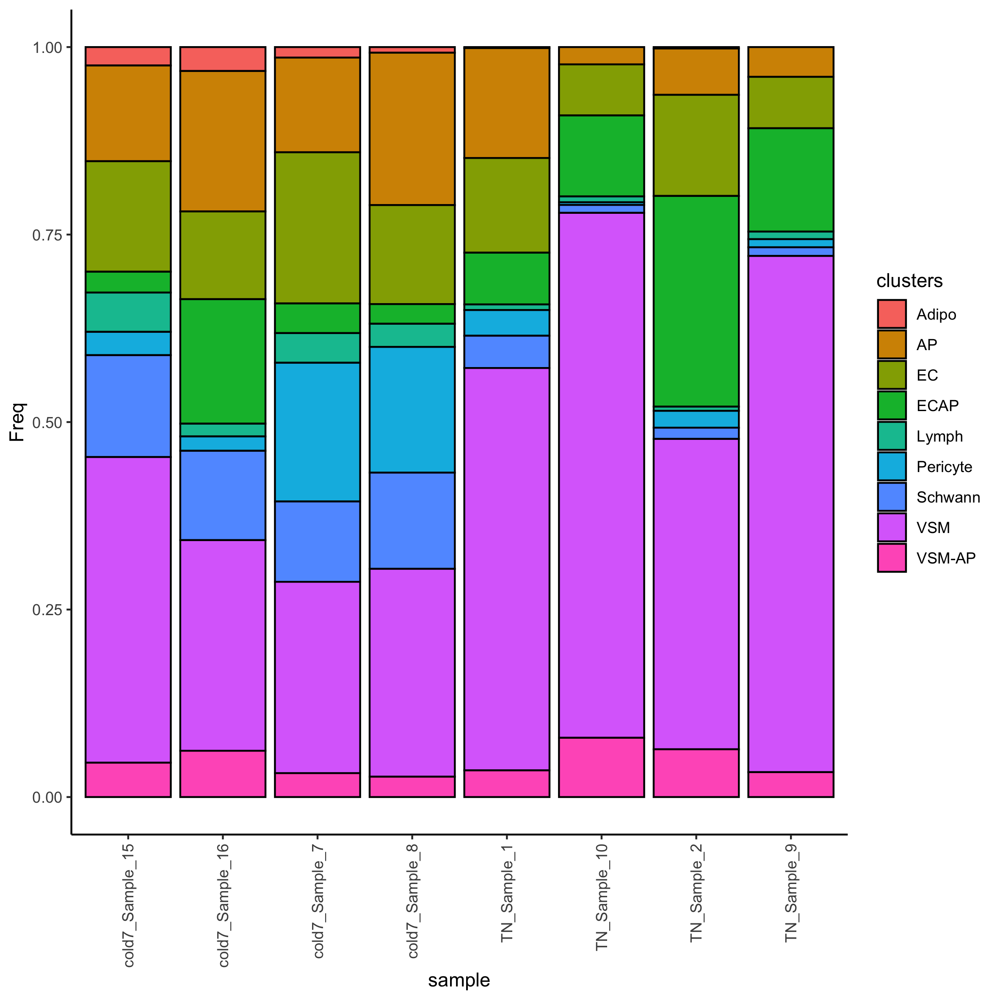

## Learning Objectives
* Describe current approaches for evaluating differences in cell proportions between groups
* Run cluster-based differential abundance analysis
* Distinguish between cluster-based and cluster-free methods for DA analysis

## Differential abundance of celltypes
Differential abundance (DA) analysis is a method used to identify celltypes with statistically significant changes in cell proportions between different biological conditions.  The overall aim is to find sub-populations of cells in which the ratio of cells from the two conditions is significantly different from the ratios observed in the overall data. Methods for differential abundance have been successfully used in practice in both clinical and experimental settings. For example, these approaches highlighted an increased presence of granulocytes, monocytes, and B cells in fatal cases of COVID-19 ([1](https://www.nature.com/articles/nbt.2317)). 

The figure below illustrates the aims of a differential abundance analysis. The different celltypes have different abundances and we would like to have a robust statistical approach to determine with these differences are significant.

<p align="center">

</p>

## Cluster-based approaches for DA
Methods which are dependent on having cells grouped into phenotypically similar cell populations, most classically aligning with specific cell types, are what we call cluster-based approaches. Many single cell RNA-seq data analysis workflows produce a result with annotated sub-populations, making these tools very easy to implement as a next step. 

### Propellor method
The **propellor method** is a function that is part of the [speckle R package](https://github.com/phipsonlab/speckle), which uses cell level annotation information to calculate differential abundance estimates. 

**How does it work?**
* First, cell type proportions are calculated for each sample. This results in matrix of proportions where the rows are the cell types and the columns are the samples. An example of this heterogeneity across samples can be observed in the plot below (left).
* The matrix is then transformed such that a linear modeling framework can be applied.
   * As can be seen in the plot below (right), the cell type proportions are over-dispersed compared to the variance estimated under a Binomial distribution.
   * To overcome this, two transformations are available: arcsin square root and logit
* Linear modeling is applied using an empirical Bayesian framework, allowing information to be borrowed across cell types to stabilize the cell type-specific variance estimates
   * For **two groups**, moderated t-tests are implemented;
   * For **more than two groups**, the option is a moderated ANOVA test. 
* Finally, false discovery rates are calculated.

<p align="center">

</p>

_Image source: [Phipson B. et al, 2022](https://academic.oup.com/bioinformatics/article/38/20/4720/6675456)_

### Running propellor

Let's make a R script to hold our analysis called `Differential_abundance.R`. We can provide the R script with this header:

```
# September 2024
# HBC single-cell RNA-seq DGE workshop
# Single-cell RNA-seq analysis - Differential abundance analysis
```

Next, we will need to load the required library:

```r
# BiocManager::install("speckle")
# devtools::install_github("MangiolaLaboratory/sccomp")

# Load libraries
library(tidyverse)
library(speckle)
library(sccomp)
```

To begin, we will create a subset of the Seurat data object in which we keep only **TN and cold7 samples**. We will also create an associated metadata dataframe will contain the celltype and sample ID for each cell.

```r
# Subset to keep only cells from TN and cold7
# seurat <- readRDS("data/BAT_GSE160585_final.rds") # This dataset was loaded in at the beginning of the workshop
seurat_sub <- subset(seurat, subset = (condition %in% c("TN", "cold7")))

# Create metadata df and factor celltype
meta_sub <- seurat_sub@meta.data
meta_sub$celltype <- factor(meta_sub$celltype)
```

Let's take a quick look at what the raw counts of celltypes look like within our dataset. Just by eye it looks like there are differences between groups!

```r
## Check count numbers of cells
meta_sub$condition_sample <- paste0(meta_sub$condition, "_", meta_sub$sample)
table(meta_sub$condition_sample, meta_sub$celltype)
```

```
                  Adipo   AP   EC ECAP Lymph Pericyte Schwann  VSM VSM-AP
  cold7_Sample_15    15   78   90   17    32       19      83  249     28
  cold7_Sample_16    15   88   55   78     8        9      56  132     29
  cold7_Sample_7     11   99  158   31    31      145      84  200     25
  cold7_Sample_8      8  217  141   28    33      179     137  296     29
  TN_Sample_1         5  548  472  258    28      128     161 2006    133
  TN_Sample_10        0   59  174  276    20        9      27 1789    202
  TN_Sample_2         1   33   72  150     3       12       8  221     34
  TN_Sample_9         0   55   95  191    14       15      16  954     46
```

To determine which celltypes are significantly different across our groups, we use the `propeller()` fuction. After supplying the seurat object as an argument, we then specify the sample IDs, celltypes, and experimental conditions:

```r
# Run differential proportion analysis
propres <- propeller(seurat_sub, 
                     sample=seurat_sub$sample,
                     clusters = seurat_sub$celltype,
                     group = seurat_sub$condition)


# Look at the results table
propres %>% View()
```

<p align="center">

</p>

As a final step, we run variance stablization and fit a linear model to our data to ultimately **create a dataframe of celltype proportions in each sample**. 

```r
props <- getTransformedProps(meta_sub$celltype, 
                                 meta_sub$condition_sample, 
                                 transform="logit")
```

Now that was have the transformed proportions, we can visualize the distribution of celltypes per sample.

```r
# Add a condition value to the dataframe
props_df <- props$Proportions %>%
  as.data.frame() %>%
  mutate(condition = str_split_i(sample, "_", 1))

# Proportion of celltypes per sample
ggplot(props_df) +
  geom_bar(aes(x=sample, y=Freq, fill=clusters), 
           stat="identity", color="black") +
  theme_classic() +
  theme(axis.text.x = element_text(angle = 90, vjust = 0.5, hjust=1)) +
  NoLegend()
```

<p align="center">

</p>

We can even assess how the `Frequency` changes across `TN` and `cold7` on average. As we have replicates we can also show the variability - with error bars representing the standard deviation.

```r
# Calculate average proportion and standard deviation
props_df_summary <- props_df %>%
  group_by(clusters, condition) %>% 
  summarise(mean = mean(Freq), sd = sd(Freq))

# Create barplot of mean proportions
# Add error bars = mean +/- sd
ggplot(props_df_summary) + 
    geom_bar(aes(x=clusters, y=mean, fill=condition),
             stat="identity", color="black", 
             position=position_dodge()) +
    geom_errorbar(aes(ymin=mean-sd, ymax=mean+sd), 
                  width=.2, position=position_dodge(.9)) +
    theme_classic()
```

<p align="center">

</p>

***

**Exercise**
1. Take a look at the results table `propres`. Which celltypes show a significant change in composition between TN and cold7?
2. Does this line up with what we observed in the counts table?

***

Keep these answers in mind as we compare these `propeller` results against another differential composition method called `sccomp`.

### Differential compostion analysis using `sccomp`

While propellor and other approaches based on linear regression (i.e., scDC, diffcyt) transform the data to model data compositionality, they do not model the actual data count distribution.  Modeling single-cell compositional data as counts is important as small datasets and rare cell types are characterized by a high noise-to-signal ratio, and **modeling counts enables the down-weighting of small cell-group proportions compared to larger ones** ([Mangiola s. et al, 2023](https://www.pnas.org/doi/10.1073/pnas.2203828120)). The **[sccomp](https://github.com/MangiolaLaboratory/sccomp)** core algorithm is outlined in the **grey-boxed panels** of the figure below. Additional panels of the figure highlight other features of sccomp, some of which are described in this lesson; and others (i.e simulation, benchmarking) are described more deeply in the [paper](https://www.pnas.org/doi/10.1073/pnas.2203828120). 

<p align="center">

</p>

**How does it work?**

1. **Fit the model onto the data, and estimate the coefficients**. `sccomp` can model changes in composition and variability. Here we provide the formula `~ condition`, indicating the cell-group variability is dependent on condition.
2. Optionally, `sccomp` can **identify outliers probabilistically** based on the model fit, and exclude them from the estimation.
3. **Hypothesis testing** is performed by calculating the posterior probability of the composition and variability effects being larger than a specified fold-change threshold
    * When only a few groups or samples are present it becomes challenging to estimate the mean–variability association. `sccomp` gains this prior knowledge from other datasets and incoporates it to stabilize estimates.


The code below will perform the step outlined above. The input is the subsetted Seurat object `seurat_sub` used in the previous section of this lesson.

```r
# Run the first three steps of sccomp
sccomp_result <- seurat_sub %>% 
  sccomp_estimate( 
    formula_composition = ~ condition, 
    .sample =  sample, 
    .cell_group = celltype, 
    bimodal_mean_variability_association = TRUE,
    cores = 1 
  ) %>% 
  sccomp_remove_outliers(cores = 1, verbose = FALSE) %>%  # Optional  
  sccomp_test()
```

> Note: It is recommended to follow the instructions for installing `sccomp` from the [GitHub page](https://github.com/MangiolaLaboratory/sccomp?tab=readme-ov-file#installation) under the **GitHub** section. Some people may run into issues compiling `cmdstanr`/`cmdstan`. We have found that specific versions of operating systems require extra steps for this compilation. 
> 
> Therefore, the next few lines will be a demo. However, we will provide the results of the `sccomp` method near the end so you can load the output yourself. 

The column of interest to us is the `c_FDR`, as it reports the false-discovery rate of the null hypothesis for a composition (c). At an FDR < 0.05, **all celltypes are significantly changing with the exception of EC.** Additionally, some celltypes are marginally significant (i.e. Lymph and Perictyes). Each of the columns in the output dataframe are described in more detail on the [sccomp documentation page](https://github.com/MangiolaLaboratory/sccomp?tab=readme-ov-file#from-counts).

```r
# Significant results FDR < 0.05
sccomp_result %>% 
  dplyr::filter(factor == "condition") %>% 
  dplyr::filter(c_FDR < 0.05) %>% 
  dplyr::select(celltype, c_FDR) %>% 
  View()
```

```
  celltype      c_FDR
1       AP 0.00081250
2    Adipo 0.01458333
3     ECAP 0.00000000
4    Lymph 0.02835714
5  Schwann 0.00000000
6      VSM 0.00000000
7   VSM-AP 0.00400000
```

We can view the fold changes and can see that for Lymph and Pericytes, while the fold change appears to be high, the composition levels within each group are on the lower end.

```r
# Fold change
sccomp_result %>% 
  sccomp_proportional_fold_change(
    formula_composition = ~  condition,
    from =  "TN", 
    to = "cold7"
  ) %>% 
  View()
```

<p align="center">

</p>

Finally, we can visualize the data using boxplots.

* The blue boxplots represent the posterior predictive check. The black boxplots represent the observed data.
* If the model is descriptively adequate for the data, the blue boxplots should roughly overlay the black boxplots.
* A box without coloring for both groups, indicates a celltype which was not significant (i.e. EC)


```r
# Boxplots
sccomp_result %>% 
  sccomp_boxplot(factor = "condition")
```

<p align="center">

</p>


### Comparing `propeller` and `sccomp` results

If we look at the significant results of each method side-by-side, we find there is concordance in the majority of the celltypes in which proportions of cells were significantly different between conditions. We also see that both methods report the endothelial cells (EC) are not changing in composition between TN and cold7. There is discrepancy in the Endothelial cell-derived progenitor cells (ECAP) and the VSM-derived adipocyte progenitor cells (VSM-AP), as propellor reports that these celltypes do not change in proportion. Looking at the underlying data for results identified by only one of the methods is not entirely convincing. **Best practice may be to run both methods and compare results.** The most conservative approach would be to take the intersection of the two methods.

> If you were not able to get `sccomp` installed or had issues compiling `cmdstanr`/`cmdstan`, you can download the `sccomp_result` object by right-clicking and selecting "Save Link as..." from [here](https://www.dropbox.com/scl/fi/611upe534ic8zh3xmx25y/sccomp_result.RDS?rlkey=p4gvsnheu6ncsnzagyc3gu282&dl=1). Place this within your `data` folder.
>
> Use the following command to read the RDS object into R:
> ```
>sccomp_result <- readRDS("data/sccomp_result.RDS")
> ```

```r
# Get significant celltypes from propellor
p_results <- propres %>%
     dplyr::filter(FDR < 0.05) %>%
     rownames()

# Get significant celltypes from sccomp
s_results <- sccomp_result %>% 
     dplyr::filter(factor == "condition") %>% 
     dplyr::filter(c_FDR < 0.05) %>% 
     dplyr::select(celltype)

# Look at overlapping celltypes
s_results %>% dplyr::filter(celltype %in% p_results)
```

```
[1] "AP"      "Adipo"   "Lymph"   "Schwann" "VSM"
```
  
## Cluster-free approaches
In cases **where the sub-populations most responsive to the biological state do not fall into well-defined separate clusters**, it can be useful to have available methods where the celltype annotation is not a required input. 

Some good examples of this include:

* Having sub-populations of celltypes that are differentially abundant between conditions and therefore may be distributed among several adjacent clusters or, alternatively, encompass only a part of a cluster.
* Continuous processes where no clear cluster structure exists, such as cell cycles or certain developmental programs.

For the above scenarios, differential abundance at a cluster-based approaches may miss the important molecular mechanisms that differentiate between the states.

### miloR
A good example of a tool that does not rely on the annotation of cells is [miloR](https://github.com/MarioniLab/miloR). This tool makes use of k-nearest neighbor (KNN) graphs, a common data structure that is embedded in many single-cell analyses ([Dann E. et al, 2021](https://www.nature.com/articles/s41587-021-01033-z).) This can particularly helpful if you have questions on the more subtle shifts within a certain cell population. The tool miloR allows you to **look more deeply into smaller neighborhoods of cells by utilizing differential abundance testing on the k-nearest neighbor graph**.

<p align="center">

</p>

_Image source: [Dann E. et al, 2021](https://www.nature.com/articles/s41587-021-01033-z)_

The general method of this tool is to assign cells to neighborhoods based upon a latent space (typically PCA) and neighborhood graph. Ultimately, we generate a neighborhood by counts matrix. These counts are modelled with a negative bionomial generalized linear model, which is then put through hypothesis testing to **identify significantally differentially abundant neighborhoods with associated fold change values**.

While we won't apply the miloR methods to our dataset in class, we do have a [lesson that walks you through the miloR workflow](08a_miloR.md). Each step is outlined in detail along with the code on how to apply it in this dataset. Note that the result is not directly comparable to results generated from cluster-based approaches (which are at the celltype level) presented in this lesson, because in cluster-free approaches the data is presented at the neighborhood-level. 

---

*This lesson has been developed by members of the teaching team at the [Harvard Chan Bioinformatics Core (HBC)](http://bioinformatics.sph.harvard.edu/). These are open access materials distributed under the terms of the [Creative Commons Attribution license](https://creativecommons.org/licenses/by/4.0/) (CC BY 4.0), which permits unrestricted use, distribution, and reproduction in any medium, provided the original author and source are credited.*
