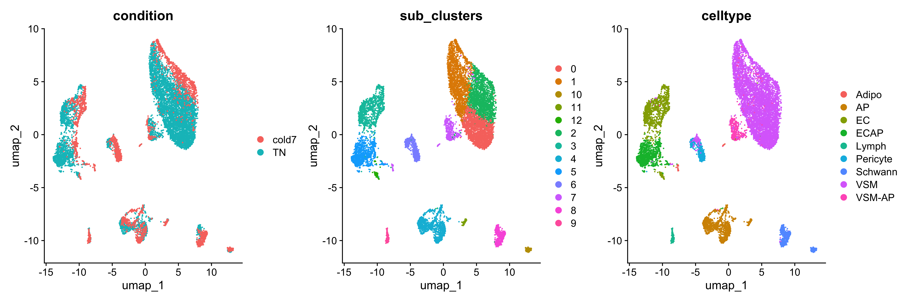
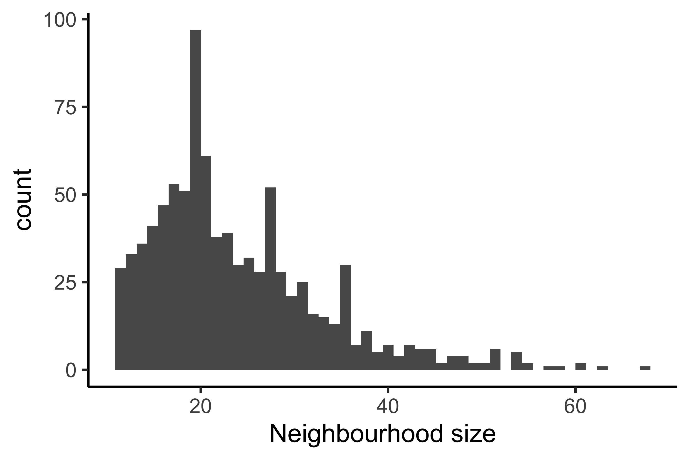
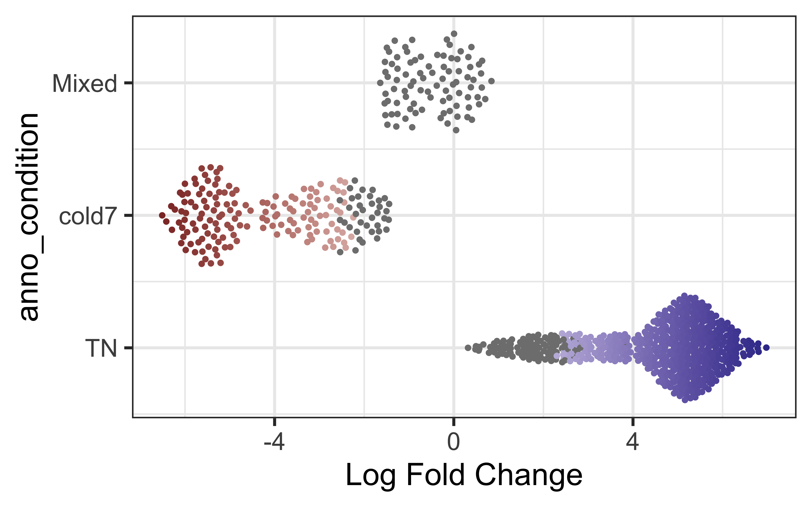
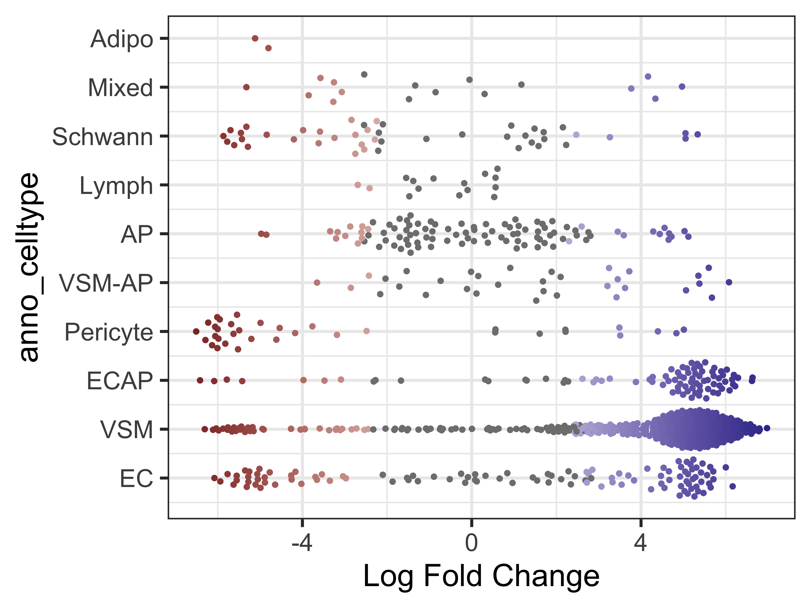
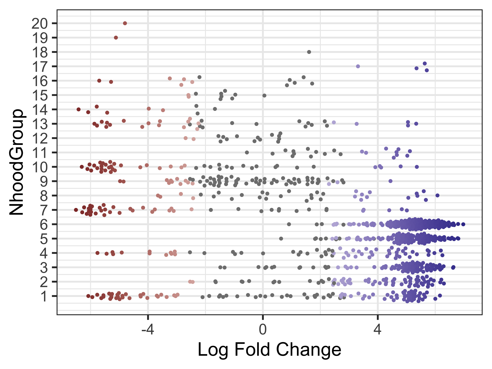
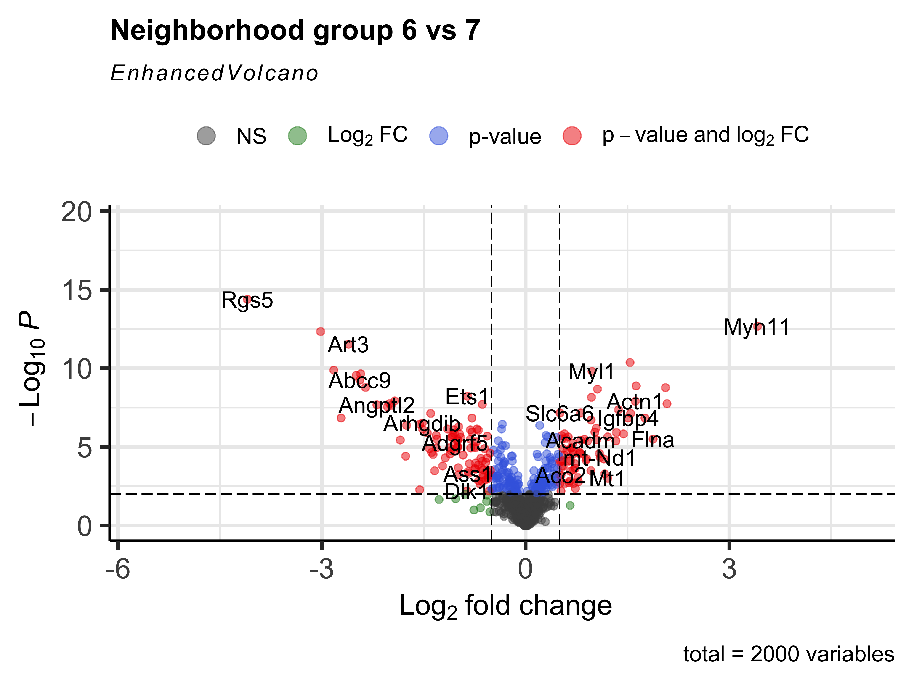

Approximate time: 90 minutes

### Learning Objectives:

* Utilize the MiloR tool to perform differential abundance analysis on a specific cell type cluster


## Differential abundance analysis with MiloR
This approach is a cluster-free method and therefore does not require cells to be separated by celltype. Rather, **we will use the full dataset and subset by the two conditions of interest**.

> NOTE: This dataset is fairly well structured with well defined celltypes, and is not the typical dataset that would be used for miloR. We use the data as an example to run code, but interpretation may not be as intuitive.

### Create new script

To start, open a new Rscript file, and start with some a header line in comment format:

```r
# Single-cell RNA-seq analysis - Differential abundance analysis with MiloR
```

Save the Rscript as `miloR_analysis_scrnaseq.R`.


### Load libraries

As usual, let us load the libraries needed at the beginning of our script.

```r
library(Seurat)
library(tidyverse)
library(SingleCellExperiment)
library(dplyr)
library(miloR)
library(EnhancedVolcano)
```

### Loading the data 

Here, we take the full dataset Seurat object and subset to keep only cells from the `TN` and `cold7` conditions. Here we are also going to set our seed so that we are all introducing the same randomness values in later steps.

```r
set.seed(1234)

# Subset to condition of interest
# seurat <- readRDS("data/BAT_GSE160585_final.rds") # This dataset was loaded in at the beginning of the workshop
seurat_sub <- subset(seurat, subset = (condition %in% c("TN", "cold7")))
```

MiloR generates the neighborhoods based upon the UMAP coordinates supplied, so we will **re-run** the steps from our **Seurat pipeline on this new subset**. Since we have fewer cells than the larger datset, will use 30 PCA dimensions calculated from 2,000 highly variable genes (HVG).

```r
# Re-running the Seurat workflow on subset
seurat_sub <- FindVariableFeatures(seurat_sub, verbose=FALSE, nfeatures=2000)
seurat_sub <- ScaleData(seurat_sub, verbose=FALSE)
seurat_sub <- RunPCA(seurat_sub, verbose = FALSE)
```

We then calculate UMAP coordinates, and cluster the data (at a resolution of 0.4) for later comparisons. We are supplying specific names as arguments for the graphs ('FindNeighbors`) and cluster names (`FindClusters`) to avoid overwriting the previous metadata.

```r
# Run UMAP, neighborhoods, calculate clusters
seurat_sub <- RunUMAP(seurat_sub, dims = 1:30, verbose=FALSE)
seurat_sub <- FindNeighbors(seurat_sub, dims = 1:30,
                            graph.name="sub_graph", verbose=FALSE)

# Determine the clusters at resolution 0.4
seurat_sub <- FindClusters(seurat_sub, cluster.name="sub_clusters",
                           resolution=0.4, graph.name="sub_graph",
                           verbose=FALSE)
```

Let's take a quick **look at the UMAP**, with data points colored by condition, clusters, and celltype annotations:

```r
DimPlot(seurat_sub, group.by=c("condition", "sub_clusters", "celltype"))
```

<p align="center">
  
</p>

We see that cells primarily cluster by celltype, but within each cluster there is a distinct separation of cells based upon the condition. This will allow us to clearly identify changes in our dataset by condition with the use of MiloR.

### Creating single cell experiment

In order to make use of the MiloR package, we must **format our datset in the correct way**. There is another data structure known as `SingleCellExperiment` that is commonly used to analyze single-cell experiments. We will first convert our Seurat object and investigate the underlying structure so that we can easily use and modify the object according to our needs.

```r
# Create SingleCellExperiment object
DefaultAssay(seurat_sub) <- "RNA"
sce <- as.SingleCellExperiment(seurat_sub)
```

A SingleCellExperiment stores metadata, counts matrix, and reductions in the following way:

<p align="center">
  
</p>

_Image credit: [Amezquita, R.A., Lun, A.T.L., Becht, E. et al, 2019](https://doi-org.ezp-prod1.hul.harvard.edu/10.1038/s41592-019-0654-x)_

We can use the functions from the SingleCellExperiment package to extract the different components. Let’s **explore the counts and metadata** for the experimental data.

```r
## Explore the raw counts for the dataset

# Check the assays present
assays(sce)

# Explore the raw counts for the dataset
dim(counts(sce))

# Access the first 6 genes and cells in the counts matrix
counts(sce)[1:6, 1:6]
```

```
6 x 6 sparse Matrix of class "dgCMatrix"
       AAACCCACAGCTATTG_1 AAACCCAGTCGGTAAG_1 AAACCCAGTTCCGGTG_1 AAACGAAAGGGCGAAG_1 AAACGAACATTCGATG_1 AAACGAAGTAGCTCGC_1
Xkr4                    .                  .                  .                  .                  .                  .
Gm1992                  .                  .                  .                  .                  .                  .
Rp1                     .                  .                  .                  .                  .                  .
Sox17                   .                  1                  .                  .                  .                  .
Mrpl15                  2                  1                  .                  2                  .                  1
Lypla1                  .                  .                  .                  .                  .                  .
```

We see the raw counts data is a cell by gene sparse matrix with the same genes (rows) and columns (cells) as in our Seurat object.

Next, we can get an idea of how to access the metadata in our SCE object by using the `colData()` function:

```r
# Explore the cellular metadata for the dataset
dim(colData(sce))

head(colData(sce))
```

### Creating a Milo object

Now that we better understand how to use a SingleCellExperiment, we can convert it to a Milo object. While there are slight differences in this object, the basic idea of how to access metadata and counts information is consistent with a SingleCellExperiment. To avoid re-computing PCA and UMAP coordinates, we are going to store the Seurat generated values in the `Embeddings` slot of our Milo object.

```r
# Create miloR object
milo <- Milo(sce)

# Store previously computed PCA and UMAP values
reducedDim(milo, "PCA") <- Embeddings(seurat_sub, reduction="pca")
reducedDim(milo, "UMAP") <- Embeddings(seurat_sub, reduction="umap")

milo
```

```
class: Milo 
dim: 19771 11148 
metadata(0):
assays(2): counts logcounts
rownames(19771): Xkr4 Gm1992 ... CAAA01118383.1 CAAA01147332.1
rowData names(0):
colnames(11148): AAACCCACAGCTATTG_1 AAACCCAGTCGGTAAG_1 ... TTTGACTAGGCTTCCG_16 TTTGTTGAGGGACAGG_16
colData names(18): orig.ident nCount_RNA ... sub_clusters ident
reducedDimNames(2): PCA UMAP
mainExpName: RNA
altExpNames(0):
nhoods dimensions(2): 1 1
nhoodCounts dimensions(2): 1 1
nhoodDistances dimension(1): 0
graph names(0):
nhoodIndex names(1): 0
nhoodExpression dimension(2): 1 1
nhoodReducedDim names(0):
nhoodGraph names(0):
nhoodAdjacency dimension(2): 1 1
```

The major differences between Milo and a SingleCellExperiment comes from the slots where the `nhood` values are stored, as this is information that is uniquely stored in our Milo object. These values will be automatically populated as we use the various function built into the package.  

## Milo workflow

Now that we have our dataset in the correct format, we can begin the Milo workflow.


### Creating neighborhoods

Step one is to generate the k-nearest neighborhood graph with the `buildGraph()` function. The parameters include selecting `k` neighbors and `d` dimensions (PCs):

- `k`: An integer scalar that specifies the number of nearest-neighbours to consider for the graph building. Default is 10.
- `d`: The number of dimensions to use if the input is a matrix of cells. Default is 50.


```r
# Build the graph
traj_milo <- buildGraph(milo, k = 10, d = 30)
```

Now we use the `makeNhoods()` function to define the neighborhoods based upon the graph calculated before. These neighborhoods are then refined further by evaluating the median PC values and vetrices to generate a minimal, but informative graph of the data. The **values assigned to the parameters for this function should be consistent with the ones that were chosen when the graph was built in the previous step**:

- `prop`: A double scalar that defines what proportion of graph vertices to randomly sample. Must be 0 < `prop` < 1. Default is 0.1.
- `k`: An integer scalar - the same k used to construct the input graph. Default is 21.
- `d`: The number of dimensions to use if the input is a matrix of cells X reduced dimensions. Default is 30.

Once we generate these neighborhoods, we can visualize the number of cells that belong to each neighborhood as a histogram. **If the number of cells in each neighborhood are too small for our given dataset, this could be an indication that we need to select a different value for `k`.** 

**GIVE INTERPREATION OF OUR HISTOGRAM**

```r
traj_milo <- makeNhoods(traj_milo, prop = 0.1, k = 10, d = 30, refined = TRUE)

plotNhoodSizeHist(traj_milo)
```

<p align="center">
  
</p>


### Creating metadata

Now that we have identified which cells belong to which neighborhoods, we can quantify how many cells from each `sample` belong to each neighborhood. 

```r
# Count number of cells per neighborhood
traj_milo <- countCells(traj_milo,
                        meta.data = colData(traj_milo),
                        sample="sample")

nhoodCounts(traj_milo) %>% head()
```

```
6 x 8 sparse Matrix of class "dgCMatrix"
  Sample_1 Sample_2 Sample_9 Sample_10 Sample_7 Sample_8 Sample_15 Sample_16
1        8        6        .         4        .        .         .         .
2        6        .        9        11        .        .         .         .
3        .        2       17        10        .        .         .         .
4        .        1        .         .       10       11         .         1
5        6        2       10        29        1        .         .         .
6        1        3        2         9        .        1         .         2
```

With this sample-level information, we can account for technical variability across replicates. To define which samples belong to which condition, we next create a metadata dataframe. This table will contain all of the relevant pieces of information for the comparisons we want to run, including the sample names. In the case of this experiment, we need the columns `sample` and `condition`. 

```r
# Create metadata
# Subset to columns of importance
# Get distinct/unique values
# Set sample as the rownames
traj_design <- colData(traj_milo) %>%
                  data.frame() %>%
                  select(sample, condition) %>%
                  distinct() %>%
                  remove_rownames() %>%
                  column_to_rownames("sample")

# Reorder rownames to match columns of nhoodCounts()
order_rows <- colnames(nhoodCounts(traj_milo))
traj_design <- traj_design[order_rows, , drop=FALSE]

traj_design
```

```
          condition
Sample_1         TN
Sample_2         TN
Sample_9         TN
Sample_10        TN
Sample_7      cold7
Sample_8      cold7
Sample_15     cold7
Sample_16     cold7
```

Now we have all the relevant information to begin testing differential abundance!

### Run differential abundance

To test the differences in neighborhoods, we **first calculate the Euclidean distances between nearest neighborhoods using the PCs** that the graph was first constructed on with the `calcNhoods()` function.

> Note: This step may take some time to run for a large dataset.


```r
# Calculate differential abundance
# This may take some time to run!!
traj_milo <- calcNhoodDistance(traj_milo, d=30) 
```

With the distances computed for each neighborhood in our dataset, we can begin **assessing the overlap in neighborhoods**. This is accomplished with the Spatial FDR correction where each hypothesis test p-values are adjusted based upon the nearest neighbor distances. We use the `testNhoods()` function and specify the `design`, or the model we want to use in the comparison. The columns used in `design` must be found within the `design.df` metadata dataframe. 

```r
da_results <- testNhoods(traj_milo, 
                         design = ~ condition, 
                         design.df = traj_design)


```

This **results in a dataframe** with the following [columns](https://rdrr.io/github/MarioniLab/miloR/man/testNhoods.html):

- `logFC`: Numeric, the log fold change between conditions or, for an ordered/continous variable, the per-unit change in (normalized) cell counts per unit-change in experimental variable.
- `logCPM`: Numeric, the log counts per million (CPM), which equates to the average log normalized cell counts across all samples.
- `F`: Numeric, the F-test  statistic from the quali-likelihood F-test implemented in edgeR.
- `PValue`: Numeric, the unadjusted p-value from the quasi-likelihood F-test.
- `FDR`: Numeric, the Benjamini & Hochberg false discovery weight computed from p.adjust.
- `Nhood`: Numeric, a unique identifier corresponding to the specific graph neighbourhood.
- `SpatialFDR`: Numeric, the weighted FDR, computed to adjust for spatial graph overlaps between neighbourhoods. 


Now that we have our neighborhoods, we can add extra metadata to these results. For example, we can **annotate these groups by the percentage of cells in the neighborhood that belong to each condition** using the `annotateNhoods()` function. Bear in mind that the `coldata_col` variable must be a column found in `colData()` of the milo object. This will create two new columns where `condition` represents what condition the majority of cells belong to, while `condition_fraction` represent the percent of cells annotated with that condition.

> Note: The label "Mixed" is used for neighborhoods of cells where there is a mix of two conditions as recommended in [the vignette](https://rawcdn.githack.com/MarioniLab/miloR/7c7f906b94a73e62e36e095ddb3e3567b414144e/vignettes/milo_gastrulation.html#5_Finding_markers_of_DA_populations).


```r
# Annotate neighborhoods by condition
da_results <- annotateNhoods(traj_milo, da_results, coldata_col = "condition")
# Categorize neighborhoods with < 70% of one condition as mixed
da_results$anno_condition <- ifelse(da_results$condition_fraction < 0.7,
                                    "Mixed",
                                    da_results$condition)

# Annotate neighborhoods by celltype
da_results <- annotateNhoods(traj_milo, da_results, coldata_col = "celltype")
# Categorize neighborhoods with < 70% of one celltype as mixed
da_results$anno_celltype <- ifelse(da_results$celltype_fraction < 0.7,
                                    "Mixed",
                                    da_results$celltype)


# Annotate neighborhoods by cluster
da_results <- annotateNhoods(traj_milo, da_results, coldata_col = "sub_clusters")
```

```r
da_results %>% head()
```

```
      logFC   logCPM         F      PValue         FDR Nhood  SpatialFDR condition condition_fraction
1  5.077949 10.92841  8.328449 0.003918351 0.010144926     1 0.008677397        TN          1.0000000
2  5.595769 11.22084  9.946825 0.001620099 0.006318517     2 0.005170829        TN          1.0000000
3  6.026816 11.49294 10.713690 0.001070141 0.006318517     3 0.005170829        TN          1.0000000
4 -3.946278 11.23250  6.741285 0.009446174 0.019465082     4 0.016947029     cold7          0.9565217
5  4.703667 11.82490  7.968536 0.004777138 0.011760113     5 0.010144964        TN          0.9791667
6  1.874743 11.02911  1.997329 0.157634216 0.197811182     6 0.181707364        TN          0.8333333
```

The final piece of information to add to the results, is group structure of the neighborhoods. The `groupNhoods()` function will run the louvain clustering algorithm to **identify neighborhoods that are overlapping and similar to one another**. The `max.lfc.delta` argument specifies a cutoff of fold change difference whereby two neighborhoods would not be considered a part of the same group. We are setting a value of 5, which is quite high in order to minimize the number of neighborhood groups (similar to the resolution we set for louvain clustering).

> Note that the exact number of groups may vary due to randomness in the model. Even if the results are not identical to what is displayed here, the general trends of the data should be similar. 

```r
# Find group structure of neighborhoods
da_results <- groupNhoods(traj_milo, da_results, max.lfc.delta = 5)

da_results %>% head()
```

```
      logFC   logCPM         F      PValue         FDR Nhood  SpatialFDR condition condition_fraction anno_condition sub_clusters sub_clusters_fraction celltype celltype_fraction anno_celltype NhoodGroup
1  5.077949 10.92841  8.328449 0.003918351 0.010144926     1 0.008677397        TN          1.0000000             TN            3             1.0000000       EC         1.0000000            EC          1
2  5.595769 11.22084  9.946825 0.001620099 0.006318517     2 0.005170829        TN          1.0000000             TN            2             0.8076923      VSM         0.9615385           VSM          2
3  6.026816 11.49294 10.713690 0.001070141 0.006318517     3 0.005170829        TN          1.0000000             TN            5             1.0000000     ECAP         1.0000000          ECAP          3
4 -3.946278 11.23250  6.741285 0.009446174 0.019465082     4 0.016947029     cold7          0.9565217          cold7            1             1.0000000      VSM         1.0000000           VSM          4
5  4.703667 11.82490  7.968536 0.004777138 0.011760113     5 0.010144964        TN          0.9791667             TN            1             1.0000000      VSM         0.9791667           VSM          5
6  1.874743 11.02911  1.997329 0.157634216 0.197811182     6 0.181707364        TN          0.8333333             TN            0             0.8333333      VSM         1.0000000           VSM          6
```

## Visualization

### Neighborhood-level UMAP
Here, we will use the UMAP coordinates stored earlier (associated with each cell) and use that to visualize the differntial abundance results at the neighborhood level.

```r
traj_milo <- buildNhoodGraph(traj_milo)
p1 <- plotNhoodGraphDA(traj_milo, da_results, alpha=0.1)
p2 <- plotNhoodGroups(traj_milo, da_results) 

p1 + p2 
```

For the **plot on the left**:
* Each circle in UMAP the represents a different neighborhood
* The size of the circle represents how many cells belong to that neighborhood
* The color of the circle represents the log-fold change for that neighborhood, from the `da_results` object
* Circles that do not contain any color indicates that the FDR value did not meet that `alpha` value supplied (non-significant result)

**NOT CLEAR WHAT THE FOLD CHANGE MEANS - THAT NEIGHBORHOOD OF CELLS IS HAS DIFFERENT PROPORTIONS IN TN AND COLD7?**

For the **plot on the right** colors neighborhood by group structure. Here, we see that the groups tend to exibit a trending fold change across many but not all neighborhoods in the group. - ** Is ths right????? EXPLAIN WHY WE HAVE THIS HERE AND HOW THIS HELPS WITH INTERPRETATION.**

<p align="center">
  
</p>


### Bee swarm plots

Another built in visualization can be accessed with the `plotDAbeeswarm()` function. In these visualizations, neighborhoods are separated out on the y-axis by their annotation, using the `group.by` parameter. Along the x-axis, each neighborhood is placed according to its log fold change score. This clearly shows the distribution of significant fold changes across different groups. The color scale issimialr to that used on the previous plot. 

To begin, let's look at the change in neighborhood expression across our two conditions. **What can we infer from this? Can we color points by celltype instead?** As expected, we see a clear FDR divide based upon condition as that was the `design` variable we computed the different neighborhoods on.??


```r
plotDAbeeswarm(da_results, group.by = "anno_condition")
```

<p align="center">
  
</p>


**Where do htese annotations come from? Neighborhoods are made up of more than once cell - what of they are differing celltypes?** We can additionally take a look at the annotated celltypes to see how the neighborhoods distribute across the celltypes.

```r
plotDAbeeswarm(da_results, group.by = "anno_celltype")
```

<p align="center">
  
</p>

Note that in most celltypes, there appears to be a mix of both cold7 and TN neighborhoods (as indicated by the fold change values). This is an indication that these celltypes are shared across both conditions.

Finally, we can make the same visualization for the neighborhood groups. This will help us identify two different groups we may be interested in running a DGE analysis in the next step.

```r
plotDAbeeswarm(da_results, group.by = "NhoodGroup")
```

<p align="center">
  
</p>


## Neighborhood differential genes 

Within the Milo package, we can even run a DGE analysis between different groups in our `DA_results` dataframe. We can test one group vs. rest of cells (similar to the `FindAllMarkers()` function within Seurat) with the `findNhoodGroupMarkers()` function. Ultimately this function makes use of the `limma` package. In doing so, we will have a `LogFC_{group}` and `adj.P.Val_{group}` for every single gene we specifiy. For simplicity, we will use the 2,000 highly variable genes. Additionally, to take into account variability across replicates, we set the `aggregate.samples` parameter to be true and specify which metadata column (in `colData`) indicates which cell comes from which sample.

```r
# Use variable genes
hvgs <- VariableFeatures(seurat_sub)
nhood_markers <- findNhoodGroupMarkers(traj_milo,
                                       da_results,
                                       subset.row = hvgs, 
                                       aggregate.samples = TRUE,
                                       sample_col = "sample")
```

If there are two neighborhoods groups of interest, instead we can run DE on just those two subsets with the `subset.nhoods` argument. As an example, let us look at neighborhood groups 6 and 7.

> You may have different groups due to the randomness that is introduced during neighborhood grouping. Pick two groups that appear quite different in your bee swarm plots.

```r
# Compare group 6 and 7
nhood_markers <- findNhoodGroupMarkers(traj_milo,
                                       da_results,
                                       subset.row = hvgs,
                                       subset.nhoods = da_results$NhoodGroup %in% c('6', '7'),
                                       aggregate.samples = TRUE, sample_col = "sample")


nhood_markers %>% arrange(abs(logFC_6)) %>% tail()
```

```
     GeneID   logFC_6  adj.P.Val_6   logFC_7  adj.P.Val_7
1995   Art3 -2.607195 2.897275e-12  2.607195 2.897275e-12
1996    Mgp -2.715875 1.439939e-07  2.715875 1.439939e-07
1997  Kcnj8 -2.824452 1.312572e-10  2.824452 1.312572e-10
1998   Meg3 -3.018706 4.580461e-13  3.018706 4.580461e-13
1999  Myh11  3.414083 2.113784e-13 -3.414083 2.113784e-13
2000   Rgs5 -4.097856 4.053591e-15  4.097856 4.053591e-15
```

Same as we have been doing throughout the workshop, we can then create a volcano plot of the DGE results.

```r
EnhancedVolcano(nhood_markers,
                nhood_markers$GeneID,
                x = "logFC_6",
                y = "adj.P.Val_6",
                FCcutoff = 0.5,
                pCutoff = 0.01,
                title="Neighborhood group 6 vs 7")
```

<p align="center">
  
</p>

We can even generate a heatmap of expression per-neighborhood with the `plotNhoodExpressionGroups()` function. First, we can identify the top 10 genes in neighborhood group 6 based upon the log-fold change value. We can then supply those genes into our function and again subset the groups to 6 and 7.

This visualization represents the averaged expression of each gene among the cells in each each neighborhood.

```r
# Make sure marker gene is in dataset
# P-value < 0.01
# Select LFC > 1
# Sort genes by LFC score
markers <- nhood_markers %>% 
  subset(GeneID %in% rownames(traj_milo)) %>%
  subset(adj.P.Val_6 < 0.01) %>%
  subset(logFC_6 > 0.5) %>%
  arrange(logFC_6)

# Top markers
genes <- markers$GeneID[1:10]
genes <- genes[!is.na(genes)]

# Heatmap of top marker genes for groups 6 and 7
plotNhoodExpressionGroups(traj_milo,
                          da_results,
                          features=genes,
                          subset.nhoods = da_results$NhoodGroup %in% c('6','7'), 
                          scale=TRUE,
                          grid.space = "fixed",
                          cluster_features = TRUE)
```

<p align="center">
  
</p>


As we would expect, these genes are much more highly expressed in group 6 compared to group 7. This provides us with another, cluster-free alternative to looking at more subtle shifts in gene expression across smaller groups.

---

Now that you have reached the end of your analysis, make sure to output the versions of all tools used in the DE analysis:

```r
sessionInfo()
```


For better reproducibility, it can help to create RMarkdown reports, which save all code, results, and visualizations as nicely formatted html reports. We have a very basic example of a [report](https://www.dropbox.com/s/4bq0chxze6dogba/workshop-example.html?dl=0) linked here. To create these reports we have [additional materials](https://hbctraining.github.io/Training-modules/Rmarkdown/) available.
