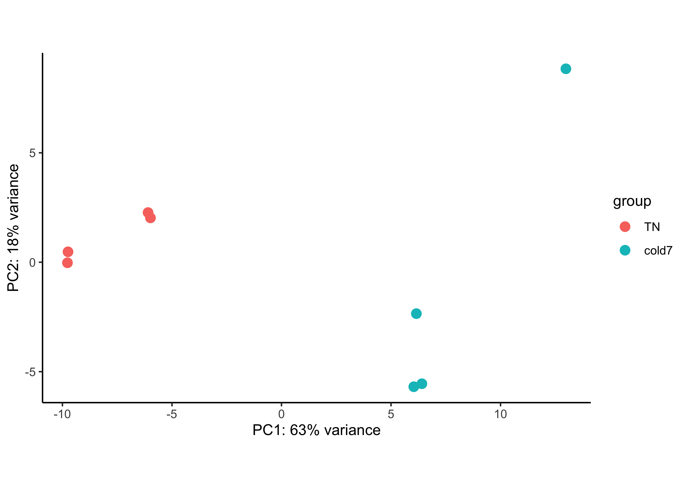
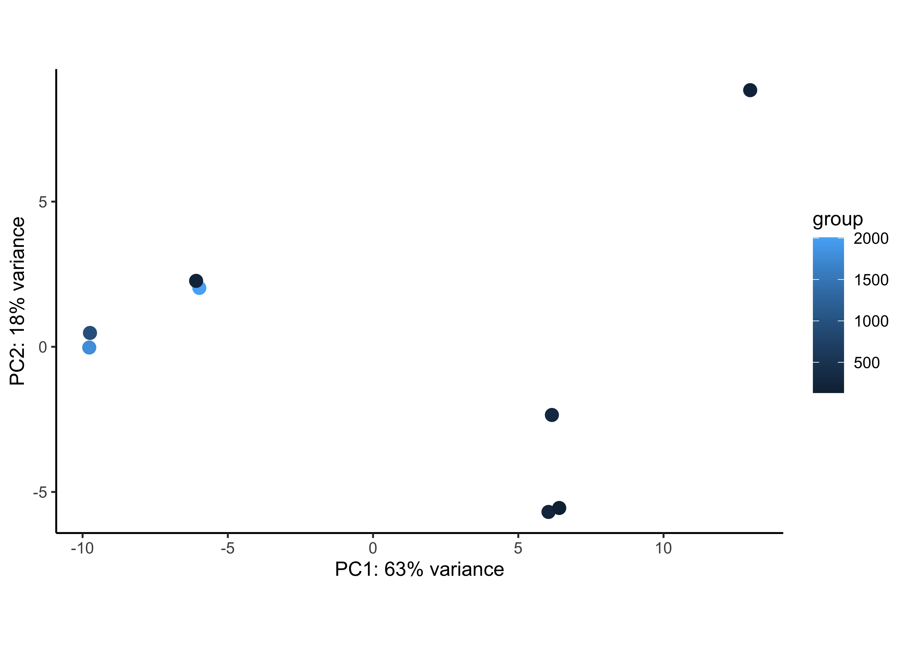
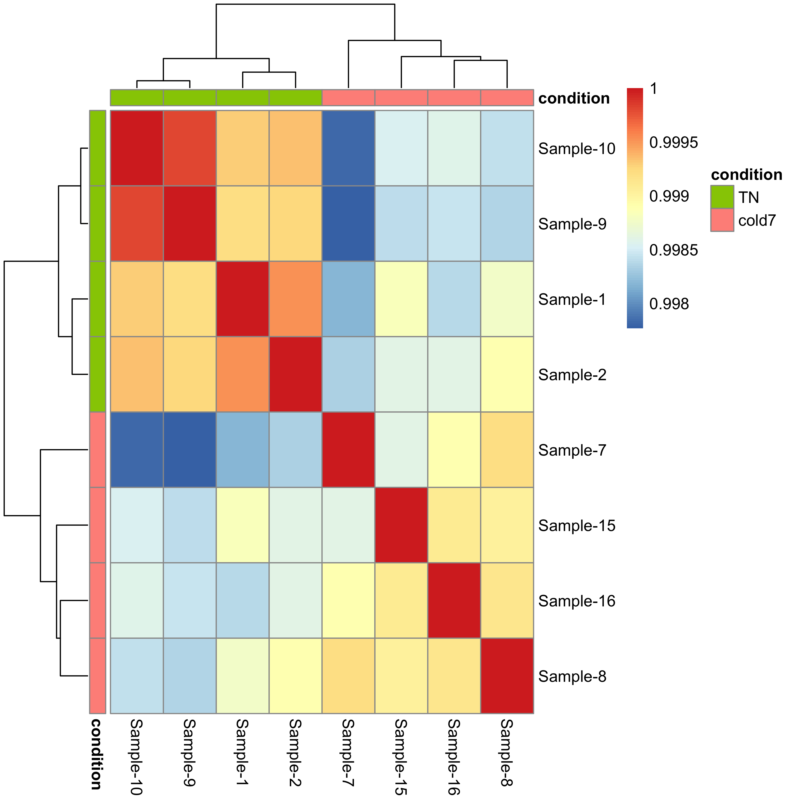
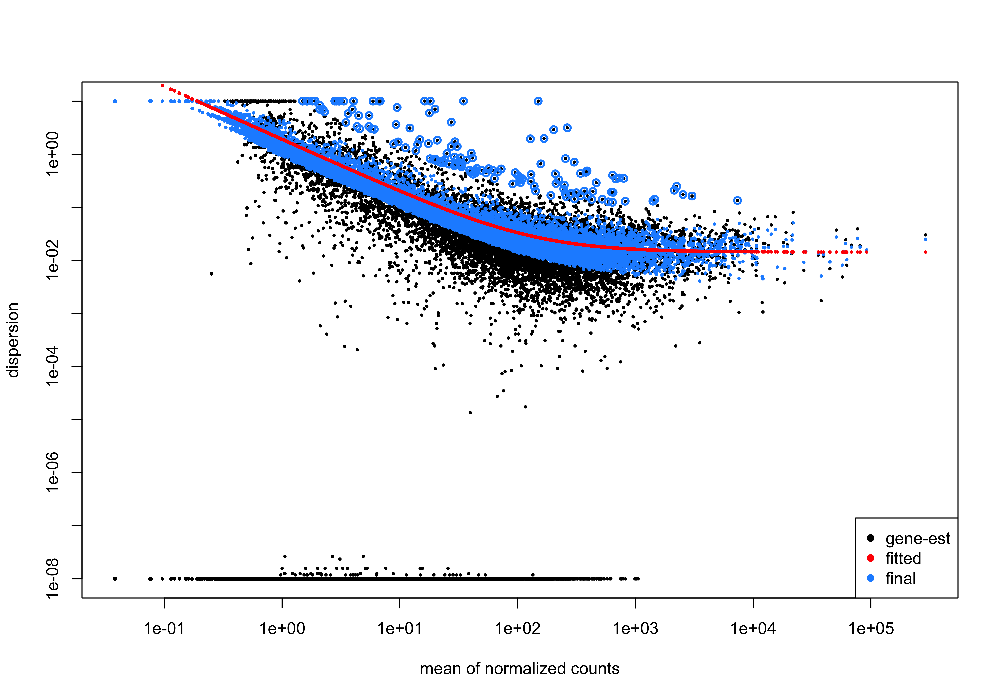

Approximate time: 90 minutes

### Learning Objectives:

* Understand how to prepare single-cell RNA-seq raw count data for pseudobulk differential expression analysis
* Utilize the DESeq2 tool to perform pseudobulk differential expression analysis on a specific cell type cluster


* * *

# Differential expression analysis with DESeq2

<p align="center">

</p>

After determining the cell type identities of the scRNA-seq clusters, we often would like to perform a differential expression (DE) analysis between conditions within particular cell types. While functions exist within Seurat to perform DE analysis, the p-values from these analyses are often inflated as each cell is treated as an independent sample. This is problematic, since we know that single cells isolated from the same biological sample (whether the same mouse, same human sample or same cell culture, etc.) are *not* independent of each other. If we treat cells as independent samples, then we are not truly investigating the variation across a population, but the variation across an individual/organism. Therefore, we could only make conclusions at the level of this individual, not the population. 

Usually, we want to infer which genes might be important for a condition at the population level, so we need the samples contrasted in our DE analysis to originate from different organisms/samples, not different cells. To do this, the current best practice is using a pseudobulk approach, which involves the following steps:

1. Subsetting to the cells for the cell type(s) of interest to perform the DE analysis;
2. Extracting the raw counts after QC filtering of cells to be used for the DE analysis;
3. Aggregating the counts and metadata to the sample level; 
4. Performing the DE analysis (Need at least two biological replicates per condition to perform the analysis, but more replicates are recommended).

# Data wrangling to get pseudobulk counts

## Create new script

Next, open a new Rscript file, and start with some comments to indicate what this file is going to contain:

```r
# Single-cell RNA-seq analysis - Pseudobulk DE analysis with DESeq2
```

Save the Rscript as `DE_analysis_scrnaseq.R`.


## Load libraries

After bringing in the raw counts data for our experiment, we will use tools from various packages to wrangle our data to the format needed, followed by aggregation of the raw counts across the single cells to the sample level. Then, we will use DESeq2 to perform the differential expression analysis across conditions of interest. To learn more about the DESeq2 method and deconstruction of the steps in the analysis, we have [additional materials available](https://hbctraining.github.io/DGE_workshop_salmon_online/schedule/links-to-lessons.html).

Let's load the libraries that we will be using for the analysis.

```r
# Load libraries
library(Seurat)
library(tidyverse)
library(DESeq2)
library(pheatmap)
library(EnhancedVolcano)
library(RColorBrewer)
library(cowplot)
library(dplyr)
```

## Create metadata

To make the most of our analysis, we want to create a dataframe with all of the  sample-level metadata to make use of later

> _**NOTE:** Other relevant metadata for a pseudobulk differential expression analysis include information about the individuals that will be contrasted (age, sex, clinical presentation, etc.). The more information you can collect about your study samples, the better!_


```r
meta_columns <- c("sample", "condition")
meta <- seurat@meta.data %>%
            select(meta_columns) %>%
            unique() %>%
            remove_rownames()

meta
```

```
      sample condition
1   Sample_1        TN
2   Sample_2        TN
3   Sample_9        TN
4  Sample_10        TN
5   Sample_3        RT
6   Sample_4        RT
7  Sample_11        RT
8  Sample_12        RT
9   Sample_6     cold2
10 Sample_13     cold2
11 Sample_14     cold2
12  Sample_7     cold7
13  Sample_8     cold7
14 Sample_15     cold7
15 Sample_16     cold7
```

Next we need ask ourselves, how are we going to group our data? We know we want to run the analysis on a per-celltype basis and aggregate at the sample level. As a result, we want to:

group counts by sample:

```r
identity <- sort(unique(seurat@meta.data[["sample"]]))
identity
```

```
 [1] "Sample_1"  "Sample_10" "Sample_11" "Sample_12" "Sample_13" "Sample_14"
 [7] "Sample_15" "Sample_16" "Sample_2"  "Sample_3"  "Sample_4"  "Sample_6" 
[13] "Sample_7"  "Sample_8"  "Sample_9" 
```

within each celltype:

```r
groups <- sort(unique(seurat@meta.data[["celltype"]]))
groups
```

```
[1] "Adipo"    "AP"       "EC"       "ECAP"     "Lymph"    "Pericyte" "Schwann" 
[8] "VSM"      "VSM-AP"  
```

and do comparisons between the different conditions:

```r
comparisons <- sort(unique(seurat@meta.data[["condition"]]))
comparisons
```

```
[1] "cold2" "cold7" "RT"    "TN" 
```

Now, we are ready for aggregation of counts to the sample level. Essentially, we are taking the sum of counts for each sample within each cell type.


## Aggregate counts for pseudobulk analysis

To enable pseudobulk differential expression (DE) analysis, we need to transform our single-cell level dataset into one sample-level dataset per cell type (cluster) that we want to study using DE analysis.

To create the actual pseudo-bulked seurat object where we aggregated on the raw RNA counts, we use the `AggregateExpression()` function. In this newly create seurat object, the columns are sample (not cells anymore) and rownames are features (genes).


```r
bulk <- AggregateExpression(
            seurat,
            return.seurat = T,
            assays = "RNA",
            group.by = c("celltype", "sample", "condition")
)
```

Based on how we grouped the seurat object, we will see that the samples have the a name "{celltype}_{sample}_{condition}" to show that we are grouping together counts based on sample, celltype, and condition. The metadata columns that were used as input are included in this new seurat object as well.

If there were other pieces of sample-level metadata, this would the time to include those columns in the new seurat object. For example, adding the number of cells we aggregated on is useful information to include.

```r
# Number of cells by sample and celltype
n_cells <- seurat@meta.data %>% 
              dplyr::count(sample, celltype) %>% 
              rename("n"="n_cells")
n_cells$sample <- str_replace(n_cells$sample, "_", "-")

meta_bulk <- left_join(bulk@meta.data, n_cells)
rownames(meta_bulk) <- meta_bulk$orig.ident
bulk@meta.data <- meta_bulk

# Turn condition into a factor
bulk$condition <- factor(bulk$condition, levels=c("TN", "RT", "cold2", "cold7"))

bulk@meta.data %>% head()
```


```
                                 orig.ident celltype    sample condition  n_cells
Adipo_Sample-1_TN         Adipo_Sample-1_TN    Adipo  Sample-1        TN       5
Adipo_Sample-11_RT       Adipo_Sample-11_RT    Adipo Sample-11        RT       7
Adipo_Sample-12_RT       Adipo_Sample-12_RT    Adipo Sample-12        RT      43
Adipo_Sample-13_cold2 Adipo_Sample-13_cold2    Adipo Sample-13     cold2      28
Adipo_Sample-14_cold2 Adipo_Sample-14_cold2    Adipo Sample-14     cold2     491
Adipo_Sample-15_cold7 Adipo_Sample-15_cold7    Adipo Sample-15     cold7      15
```

The output of this aggregation is a sparse matrix, and when we take a quick look, we can see that it is a gene by cell type-sample matrix.

```r
bulk[["RNA"]]$counts[1:5, 1:5]
```

```
5 x 5 sparse Matrix of class "dgCMatrix"
       Adipo_Sample-1_TN Adipo_Sample-11_RT Adipo_Sample-12_RT
Xkr4                   1                  .                  .
Gm1992                 .                  .                  .
Rp1                    .                  .                  .
Sox17                  .                  .                  .
Mrpl15                 5                 23                106
       Adipo_Sample-13_cold2 Adipo_Sample-14_cold2
Xkr4                       .                     .
Gm1992                     .                     .
Rp1                        .                     .
Sox17                      .                     .
Mrpl15                   135                  2037
```


* * *

# Differential gene expression with DESeq2

**We will be using [DESeq2](https://genomebiology.biomedcentral.com/articles/10.1186/s13059-014-0550-8) for the pseudobulk DE analysis, and the analysis steps with DESeq2 are shown in the flowchart below in green and blue**. DESeq2 first normalizes the count data to account for differences in library sizes and RNA composition between samples. Then, we will use the normalized counts to make some plots for QC at the gene and sample level. The final step is to use the appropriate functions from the DESeq2 package to perform the differential expression analysis. We will go into each of these steps briefly, but additional details and helpful suggestions regarding DESeq2 can be found in [our materials](https://hbctraining.github.io/DGE_workshop_salmon_online/schedule/links-to-lessons.html) detailing the workflow for bulk RNA-seq analysis, as well as in the [DESeq2 vignette](http://bioconductor.org/packages/devel/bioc/vignettes/DESeq2/inst/doc/DESeq2.html).

<p align="center">
  
</p>


# Creating a DESeq2 object

From the bulked seurat object, we can readily create a DESeq2 object using any element of the lists. All we need to do is decide which cell type we wish to focus on, and retrieve the corresponding data from our lists.

This bulked seurat object constains the aggregated counts for every celltype. Here we are going to run DESeq2 DGE between `TN` and `cold7` condition for the `VSM` cells.


```r
bulk_vsm <- subset(bulk, subset= (celltype == "VSM") & (condition %in% c("TN", "cold7")))
seurat_vsm <- subset(seurat, subset= (celltype == "VSM") & (condition %in% c("TN", "cold7")))
```


## Number of cells

Before moving on to a pseudobulk DGE analysis, it is important to identify how many cells we are able to pseudobulk on. Remember that for DESeq2 we will be aggregating on a per-sample basis so we need to make sure that we have enough cells per sample after subsetting to one celltype.


```r
ggplot(bulk_vsm@meta.data) +
    geom_bar(aes(x=sample, y=n_cells, fill=condition), stat="identity", color="black") +
    theme_classic() +
    theme(axis.text.x = element_text(angle = 45, vjust = 1, hjust = 1)) +
    labs(x="Sample name", y="Number of cells") +
    geom_text(aes(label=n_cells), vjust=-0.5)
```

<p align="center">
  
</p>


## Creating DESeq2 object

Now we can create our DESeq2 object to prepare to run the DE analysis. We need to include the counts, metadata, and design formula for our comparison of interest. In the design formula we should also include any other columns in the metadata for which we want to regress out the variation (e.g. batch, sex, age, etc.). We only have our comparison of interest, which is stored as the `condition` in our metadata data frame.

More information about the DESeq2 workflow and design formulas can be found in our [DESeq2 materials](https://hbctraining.github.io/DGE_workshop_salmon_online/schedule/links-to-lessons.html).

```r
# Get pseudo-bulked matrix
cluster_counts <- FetchData(bulk_vsm, layer="counts", vars=rownames(bulk_vsm))

# Create DESeq2 object
dds <- DESeqDataSetFromMatrix(t(cluster_counts),
                                colData = bulk_vsm@meta.data,
                                design = ~ condition)

dds
```

```
class: DESeqDataSet 
dim: 19771 8 
metadata(1): version
assays(1): counts
rownames(19771): Xkr4 Gm1992 ... CAAA01118383.1 CAAA01147332.1
rowData names(0):
colnames(8): VSM_Sample-1_TN VSM_Sample-10_TN ... VSM_Sample-8_cold7
  VSM_Sample-9_TN
colData names(5): orig.ident celltype sample condition n_cells
```

## Sample quality

A useful initial step in an RNA-seq analysis is to assess overall similarity between samples:

- Which samples are similar to each other, which are different?
- Does this fit the expectation from the experiment’s design?
- What are the major sources of variation in the dataset?

To explore the similarity of our samples, we will be performing sample-level QC using Principal Component Analysis (PCA) and hierarchical clustering methods. Sample-level QC allows us to see how well our replicates cluster together, as well as, observe whether our experimental condition represents the major source of variation in the data. Performing sample-level QC can also identify any sample outliers, which may need to be explored further to determine whether they need to be removed prior to DE analysis.

When using these unsupervised clustering methods, normalization and log2-transformation of the counts improves the distances/clustering for visualization. DESeq2 uses median of ratios method for count normalization and a regularized log transform (rlog) of the normalized counts for sample-level QC as it moderates the variance across the mean, improving the clustering.


### PCA

Principal Component Analysis (PCA) is a dimensionality reduction technique used to emphasize variation and bring out strong patterns in a dataset. Details regarding PCA are given in our [additional materials](https://hbctraining.github.io/DGE_workshop_salmon_online/lessons/03_DGE_QC_analysis.html).

We can run the `rlog()` function from DESeq2 to normalize and rlog transform the raw counts. Then, we can use the `plotPCA()` function to plot the first two principal components. By default, the `plotPCA()` function uses the top 500 most variable genes to compute principal components, but this parameter can be adjusted.

```r
# Transform counts for data visualization
rld <- rlog(dds, blind=TRUE)
plotPCA(rld, intgroup=c("condition")) + theme_classic()
```

<p align="center">
  
</p>


In this example, we see a nice separation between our samples on PC1 by our condition of interest, which is great; this suggests that our condition of interest is the largest source of variation in our dataset.


It is also useful to check whether the number of cells from which the aggregated counts were derived influences the separation of the samples in the PCA plot. This is particularly useful if you notice an outlier sample, which may be explained by its very low (or very large) cell count compared to others.

```r
plotPCA(rld, intgroup=c("n_cells")) + theme_classic()
```

<p align="center">
  
</p>


### Sample correlation

Similar to PCA, hierarchical clustering is another, complementary method for identifying strong patterns in a dataset and potential outliers. The heatmap displays the correlation of gene expression for all pairwise combinations of samples in the dataset. Since the majority of genes are not differentially expressed, samples generally have high correlations with each other (values higher than 0.80). Samples below 0.80 may indicate an outlier in your data and/or sample contamination.

The hierarchical tree can indicate which samples are more similar to each other based on the normalized gene expression values. The color blocks indicate substructure in the data, and you would expect to see your replicates cluster together as a block for each sample group. Additionally, we expect to see samples clustered similar to the groupings observed in a PCA plot.

```r
# Calculate sample correlation
rld_mat <- assay(rld)
rld_cor <- cor(rld_mat)

# Change sample names to original values
# For nicer plots
rename_samples <- bulk_vsm$sample
colnames(rld_cor) <- str_replace_all(colnames(rld_cor), rename_samples)
rownames(rld_cor) <- str_replace_all(rownames(rld_cor), rename_samples)

# Plot heatmap
anno <- bulk_vsm@meta.data %>%
            select(sample, condition) %>% 
            remove_rownames() %>% 
            column_to_rownames("sample")
pheatmap(rld_cor, annotation_col=anno, annotation_row=anno)
```

<p align="center">
  
</p>


Now we determine whether we have any outliers that need removing or additional sources of variation that we might want to regress out in our design formula. Since we detected no outliers by PCA or hierarchical clustering, nor do we have any additional sources of variation to regress, we can proceed with running the differential expression analysis.

## Running DESeq2 


Differential expression analysis with DESeq2 involves multiple steps as displayed in the flowchart below in blue. Briefly, DESeq2 will model the **raw counts**, using normalization factors (size factors) to account for differences in library depth. Then, it will estimate the gene-wise dispersions and shrink these estimates to generate more accurate estimates of dispersion to model the counts. Finally, DESeq2 will fit the negative binomial model and perform hypothesis testing using the Wald test or Likelihood Ratio test. All of these steps are explained in detail in our [additional materials](https://hbctraining.github.io/DGE_workshop_salmon_online/schedule/links-to-lessons.html#part-iii-deseq2).

<p align="center">

</p>


All of the steps described above are conveniently performed by running the single `DESeq()` function on the DESeq2 object (`dds`) we created earlier.

```r
# Run DESeq2 differential expression analysis
dds <- DESeq(dds)
```

We can check the fit of the model to our data by looking at the plot of dispersion estimates.

```r
plotDispEsts(dds)
```

<p align="center">

</p>

The plot is encouraging, since we expect our dispersions to decrease with increasing mean and follow the line of best fit.

Now we need to select which comparison we want to make when running DESeq2 by using the `resultsNames()` function.

```r
resultsNames(dds)
```

```
[1] "Intercept"             "condition_cold7_vs_TN"
```

## Results

Now that we have performed the differential expression analysis, we can explore our results for a particular comparison. To denote our comparison of interest, we need to specify the contrasted groups (here, `cold7` vs. `TN). 

Then, we need to perform shrinkage of the log2 fold changes to correct for the fact that the baseline expression level of a gene affects its estimated fold change (for a given gene, a difference in the average read counts between the 2 contrasted groups of 10 will have a greater impact if the baseline expression level of this gene is 20 than if it is 500; therefore, lowly expressed genes are more likely to show inflated log2 fold change values). Here, we use the apeglm method ([Zhu et al., 2018](https://doi.org/10.1093/bioinformatics/bty895)) for shrinkage estimator calculations. Alternative options for shrinkage estimation and the papers to cite if you use them are further described in the [DESeq2 vignette](http://bioconductor.org/packages/devel/bioc/vignettes/DESeq2/inst/doc/DESeq2.html#altshrink).

```r
contrast <- c("condition", "cold7", "TN")

# Results of Wald test
res <- results(dds, 
            contrast=contrast,
            alpha = 0.05)

# Shrink the log2 fold changes to be more appropriate using the apeglm method - should cite [paper]() when using this method
res <- lfcShrink(dds, 
                coef = "condition_cold7_vs_TN",
                res=res,
                type = "apeglm")

res %>% head()
```

```
        baseMean log2FoldChange     lfcSE     pvalue      padj
       <numeric>      <numeric> <numeric>  <numeric> <numeric>
Xkr4     2.80496     -0.0119983  0.258923 0.86291417 0.9487990
Gm1992   0.00000             NA        NA         NA        NA
Rp1      0.00000             NA        NA         NA        NA
Sox17    6.30657      0.0509278  0.256791 0.57599002 0.8147941
Mrpl15 267.61120     -0.0334181  0.147426 0.78522621 0.9185463
Lypla1 152.10108      0.4480539  0.159921 0.00120728 0.0133217
```

This is a great spot to store the results of the comparison

```r
write.csv(res, "results/VSM_cold7_vs_TN.csv")
```

# Significant genes and visualization

Next, we can filter our table for only the significant genes using a p-adjusted threshold of 0.05

```r
# Set thresholds
padj.cutoff <- 0.05

# Turn the results object into a tibble for use with tidyverse functions
res_tbl <- res %>%
            data.frame() %>%
            rownames_to_column(var="gene") %>% 
            as_tibble()

# Subset the significant results
sig_res <- dplyr::filter(res_tbl, 
        padj < padj.cutoff)

sig_res %>% head()
```

```
  gene   baseMean log2FoldChange lfcSE        pvalue        padj
  <chr>     <dbl>          <dbl> <dbl>         <dbl>       <dbl>
1 Lypla1   152.            0.448 0.160 0.00121       0.0133     
2 Rrs1      68.3          -0.479 0.221 0.00560       0.0442     
3 Prex2      9.82          2.24  0.578 0.00000500    0.000131   
4 Sulf1     90.8           1.39  0.259 0.00000000531 0.000000295
5 Rpl7    3814.           -0.430 0.115 0.0000468     0.000906   
6 Mcm3      19.9           1.20  0.494 0.000682      0.00835    
```

With these results we can use a few different visualization techniques to explore our results:

- Volcano plot of significant genes
- Heatmap of expression for all significant genes
- Scatterplot of normalized expression of top genes

## Volcano plot 

```r
EnhancedVolcano(sig_res,
        sig_res$gene,
        x="log2FoldChange",
        y="padj"
    )
```

<p align="center">

</p>


## Pseudobulk normalized counts heatmap

```r
# Extract normalized expression for significant genes from the samples
normalized_counts <- counts(dds, normalized=T) %>% as.data.frame()
norm_sig <- normalized_counts %>% 
              dplyr::filter(row.names(normalized_counts) %in% sig_res$gene)

# Set a color palette
heat_colors <- brewer.pal(6, "YlOrRd")

anno <- colData(dds) %>% 
            as.data.frame() %>% 
            select(condition, celltype)

# Run pheatmap using the metadata data frame for the annotation
pheatmap(norm_sig,
    color = heat_colors,
    cluster_rows = T,
    show_rownames = F,
    annotation = anno,
    border_color = NA,
    fontsize = 10,
    scale = "row", 
    fontsize_row = 10, 
    height = 20)
```

<p align="center">

</p>


## Single-cell normalized counts heatmap

TODO fix

```r
# df <- t(FetchData(seurat_vsm, sig_res$gene, assay="RNA", layer="data"))
# anno <- FetchData(seurat_vsm, c("condition", "celltype"))

# pheatmap(df, 
#     color = heat_colors,
#     cluster_cols = F,
#     cluster_rows = T, 
#     show_rownames = F,
#     show_colnames = F,
#     annotation = anno, 
#     border_color = NA, 
#     fontsize = 10, 
#     scale = "row", 
#     fontsize_row = 10, 
#     height = 20)
```

# Top 6 genes

It is important to take a look at some of the top genes that show up. In particular, it is important to evaluate why these genes showed up in the pseudobulked results and contrast it against the gene expression levels at a single-cell level as well.

We may also be interested in determining the total number of significantly upregulated or downregulated genes above a certain fold change threshold (for example log2 fold change (in absolute value) >0.58, which corresponds to a ~50% increase (or ~30% decrease) in gene expression.


```r
genes <- sig_res %>% 
            arrange(padj) %>% 
            subset(abs(log2FoldChange) > 0.6) %>% 
            head()
genes <- genes$gene
genes
```

```
[1] "Rgs5"  "Mt1"   "Emd"   "Nr4a2" "Cwc25" "Cebpb"
```

## Pseudobulked normalized expression scatterplot

Now that we have identified the significant genes, we can plot a scatterplot of the top 6 significant genes. This plot is a good check to make sure that we are interpreting our fold change values correctly, as well.

```r
plot_list <- list()

for (gene in genes) {
    # Save plotcounts to a data frame object
    d <- plotCounts(dds, gene=gene, intgroup="condition", returnData=TRUE)
    d <- d %>% subset(condition %in% c("cold7", "TN"))

    # Plot the normalized counts for each sample
    p <- ggplot(d, aes(x = condition, y = count, color = condition)) + 
            geom_point(position=position_jitter(w = 0.1,h = 0)) +
            theme_bw() +
            ggtitle(gene) +
            theme(plot.title = element_text(hjust = 0.5)) +
            NoLegend()
    plot_list[[gene]] <- p
}

plot_grid(plotlist=plot_list)
```

<p align="center">

</p>


## Single-cell normalized expression violin plot

Ultimately, we are evaluating the gene expression at a single-cell level. Therefore it is prudent to go back to the cellular level to see what these same results look like for each individual cell.

```r
DefaultAssay(seurat_vsm) <- "RNA"
Idents(seurat_vsm) <- "condition"
VlnPlot(seurat_vsm, genes, idents=c("cold7", "TN"))
```

<p align="center">

</p>

## UMAP

```r
# Grab the umap coordinates and condition information for each cell
df <- FetchData(seurat_vsm, c("umap_1", "umap_2", "condition"))
df_tn <- df %>% subset(condition == "TN")
df_cold7 <- df %>% subset(condition == "cold7")

p_tn <- ggplot() +
        geom_point(data=df, aes(x=umap_1, y=umap_2), color="lightgray", alpha=0.5) +
        geom_point(data=df_tn, aes(x=umap_1, y=umap_2), color="#F8766D") +
        theme_classic() +
        ggtitle("VSM: TN cells")

p_cold7 <- ggplot() +
        geom_point(data=df, aes(x=umap_1, y=umap_2), color="lightgray", alpha=0.5) +
        geom_point(data=df_cold7, aes(x=umap_1, y=umap_2), color="#00B8E7") +
        theme_classic() +
        ggtitle("VSM: cold7 cells")

p_tn + p_cold7
```

<p align="center">

</p>

```r
FeaturePlot(seurat_vsm, genes, ncol=3)
```

<p align="center">

</p>

***

*This lesson has been developed by members of the teaching team at the [Harvard Chan Bioinformatics Core (HBC)](http://bioinformatics.sph.harvard.edu/). These are open access materials distributed under the terms of the [Creative Commons Attribution license](https://creativecommons.org/licenses/by/4.0/) (CC BY 4.0), which permits unrestricted use, distribution, and reproduction in any medium, provided the original author and source are credited.*

